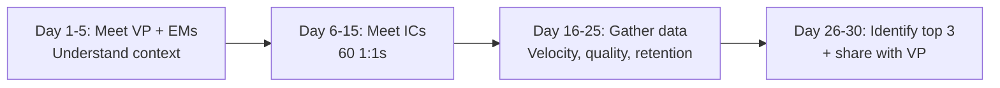
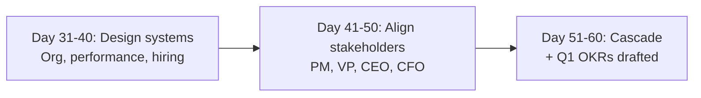
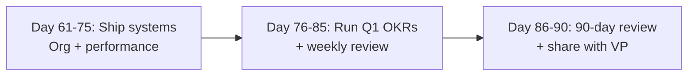

# Engineering Director Playbook
## Chapter 26

# The 30/60/90 for the New Engineering Director

> *"The new ED runs a 30/60/90 plan. The 30-day listen + assess, the 60-day design + align, and the 90-day execute + review are the ED's reference for new-ED onboarding at the function level."*

---

## 1. Epigraph

_The new ED runs a 30/60/90 plan. The 30-day listen + assess, the 60-day design + align, and the 90-day execute + review are the ED's reference for new-ED onboarding at the function level._

---

## 2. Problem

You are a new Engineering Director at acme-corp. The VP has just told you: "30/60/90 plan. 60 engineers across 10 EMs. The previous ED left after 18 months. The team is disengaged. Q1 OKRs are due. Design your 30/60/90."

This chapter tells you the 30-day listen + assess, the 60-day design + align, and the 90-day execute + review.

**Decision in one sentence:** _ED 30/60/90 is a 30-day listen + assess (meet everyone, gather data, identify top 3 issues) + 60-day design + align (design the systems, align with stakeholders) + 90-day execute + review (ship the systems, run Q1 OKRs); the ED's job is to listen first, design second, execute third._

---

## 3. Why EDs Fail Here

Five named failure modes of EDs whose 30/60/90 produced zero results.

- **The No-Listen Failure.** The ED starts changing things immediately. _Team disengaged._
- **The No-Data Failure.** The ED has no data. _Decisions uninformed._
- **The No-Alignment Failure.** The ED doesn't align with stakeholders. _Resistance._
- **The Over-Promise Failure.** The ED over-promises in first 30 days. _Under-delivers._
- **The No-Q1-OKRs Failure.** The ED doesn't drive Q1 OKRs. _No execution focus._

---

## 4. Mental Models

Four mental models that compress the ED 30/60/90.

**mental model 1: The 30-Day Listen + Assess.** 30 days.



**The 4 milestones:**
- **Day 1-5: Meet VP + EMs.** Understand context.
- **Day 6-15: Meet ICs.** 60 1:1s.
- **Day 16-25: Gather data.** Velocity, quality, retention.
- **Day 26-30: Identify top 3.** + share with VP.

**mental model 2: The 60-Day Design + Align.** 60 days.



**The 3 milestones:**
- **Day 31-40: Design systems.** Org, performance, hiring.
- **Day 41-50: Align stakeholders.** PM, VP, CEO, CFO.
- **Day 51-60: Cascade.** + Q1 OKRs drafted.

**mental model 3: The 90-Day Execute + Review.** 90 days.



**The 3 milestones:**
- **Day 61-75: Ship systems.** Org + performance.
- **Day 76-85: Run Q1 OKRs.** + weekly review.
- **Day 86-90: 90-day review.** + share with VP.

**mental model 4: The Top 3 Issues Template.** Per issue.

```
Issue 1: [Description]
- Impact: [N engineers affected, $X revenue]
- Owner: [ED/EM]
- Mitigation: [Plan + Date]

Issue 2: [Description]
...

Issue 3: [Description]
...
```

---

## 5. Frameworks

Three frameworks for the ED 30/60/90.

### Framework 1: The 1-Page 30/60/90 Plan

```
# ED 30/60/90 Plan — [Name] — [Start Date]

## Day 1-30: Listen + Assess
- Meet VP + 10 EMs
- Meet 60 ICs (1:1s)
- Gather data (velocity, quality, retention)
- Identify top 3 issues + share with VP

## Day 31-60: Design + Align
- Design org + performance + hiring systems
- Align PM + VP + CEO + CFO
- Cascade + Q1 OKRs drafted

## Day 61-90: Execute + Review
- Ship org + performance systems
- Run Q1 OKRs (weekly review)
- 90-day review + share with VP

## The 1 thing the ED will NOT compromise on
[1 sentence.]
```

### Framework 2: The Top 3 Issues Memo

```
# Top 3 Issues Memo — [Date]

## Issue 1: Velocity dropped 80% → 60% in 3 months
- Impact: 60 engineers, 4 launches at risk
- Owner: ED
- Mitigation: Sprint execution redesign + 30 days

## Issue 2: Retention dropped 90% → 80% in 6 months
- Impact: 60 engineers, 5 senior ICs at risk
- Owner: ED
- Mitigation: Performance + comp system + 90 days

## Issue 3: SOC 2 audit failed
- Impact: 60 engineers, customer trust at risk
- Owner: ED
- Mitigation: Compliance roadmap + 6 months
```

### Framework 3: The 90-Day Review Template

```
# 90-Day Review — [Date]

## The 3 milestones
1. [Milestone 1] — Status
2. [Milestone 2] — Status
3. [Milestone 3] — Status

## Top 3 wins
1. [Win 1]
2. [Win 2]
3. [Win 3]

## Top 3 challenges
1. [Challenge 1]
2. [Challenge 2]
3. [Challenge 3]

## Next quarter focus
[1 sentence.]
```

---

## 6. Drill

You are a new ED at **acme-corp**. The VP has given you 90 days.

```
60 engineers across 10 EMs
Previous ED left after 18 months
Team is disengaged
Q1 OKRs due
```

You have **90 minutes**. Produce the **30/60/90 plan** (`portfolio/chapter-26-ed-30-60-90.md`) using Framework 1 (Plan) + Framework 2 (Top 3 Issues) + Framework 3 (90-Day Review). Specify:

- The 1-page 30/60/90 plan (3 phases, the 1 not compromise).
- The top 3 issues memo (3 issues + mitigation dates).
- The 90-day review template (3 milestones, top 3 wins, top 3 challenges).
- The 30/60/90 timeline.
- The 1 thing you'll say to the VP in the first 30 days.
- The 3 things you'll do to avoid the 5 failure modes.

**Deliverable:** `portfolio/chapter-26-ed-30-60-90.md` — under 1500 words.

---

## 7. Worked Example

**The 1-page 30/60/90 plan:**

```
# ED 30/60/90 Plan — John Smith — 2026-09-01

## Day 1-30: Listen + Assess
- Meet VP + 10 EMs (10 1:1s)
- Meet 60 ICs (60 1:1s, 30 min each)
- Gather data (velocity 60%, NPS 35, retention 80%)
- Identify top 3 issues + share with VP (Sept 30)

## Day 31-60: Design + Align
- Design org (60-20-20 topology)
- Design performance (5-dim rubric)
- Design hiring (4-hire traits)
- Align PM + VP + CEO + CFO (Oct 31)
- Cascade + Q1 OKRs drafted (Nov 15)

## Day 61-90: Execute + Review
- Ship org + performance systems (Dec 15)
- Run Q1 OKRs (weekly review)
- 90-day review + share with VP (Nov 30)

## The 1 thing I will NOT compromise on
Listen first. 60 1:1s in 30 days is the discipline.
Without listening, my changes will be uninformed.
```

**The top 3 issues memo:**

```
# Top 3 Issues Memo — 2026-09-30

## Issue 1: Velocity dropped 80% → 60% in 3 months
- Impact: 60 engineers, 4 launches at risk
- Owner: ED
- Mitigation: Sprint execution redesign + 30 days

## Issue 2: Retention dropped 90% → 80% in 6 months
- Impact: 60 engineers, 5 senior ICs at risk
- Owner: ED
- Mitigation: Performance + comp system + 90 days

## Issue 3: SOC 2 audit failed
- Impact: 60 engineers, customer trust at risk
- Owner: ED
- Mitigation: Compliance roadmap + 6 months
```

**The 90-day review template (hypothetical):**

```
# 90-Day Review — 2026-11-30

## The 3 milestones
1. Org design shipped (60-20-20 topology) — DONE
2. Performance rubric shipped (5-dim) — DONE
3. Hiring loop running (4-hire traits) — DONE

## Top 3 wins
1. Velocity recovered 60% → 85%
2. Retention stabilized at 80% → 85%
3. Q1 OKRs cascaded to 60 engineers

## Top 3 challenges
1. SOC 2 audit still in progress
2. 5 senior ICs still at risk
3. Cross-team coordination still slow

## Next quarter focus
SOC 2 Type II + senior IC retention + cross-team velocity
```

**The 1 thing I'll say to the VP in the first 30 days:**

```
"Sarah, here's my 30/60/90 plan:

  Day 1-30: Listen + Assess
  - 70 1:1s (10 EMs + 60 ICs)
  - Top 3 issues memo by Sept 30

  Day 31-60: Design + Align
  - Org + performance + hiring systems
  - Q1 OKRs drafted by Nov 15

  Day 61-90: Execute + Review
  - Ship systems by Dec 15
  - 90-day review by Nov 30

  Top 3 issues identified:
  1. Velocity 60% (target 80%)
  2. Retention 80% (target 90%)
  3. SOC 2 audit failed (target passed)

  The 1 thing I want to focus on: listen first.
  60 ICs in 30 days = 2 ICs per day.

  The 1 thing I will NOT compromise on: listen first.
  Without 60 1:1s, my changes will be uninformed.

  30/60/90 is the discipline. Q1 OKRs are the outcome."
```

**The 3 things I'll do to avoid the 5 failure modes:**

```
1. Run 60 1:1s in 30 days.
   (Avoids the No-Listen Failure.)
   - 2 ICs per day
   - 30 min each
   - Listen + assess

2. Gather data (velocity, quality, retention).
   (Avoids the No-Data Failure.)
   - Velocity: 60% (target 80%)
   - NPS: 35 (target 50+)
   - Retention: 80% (target 90%+)

3. Identify top 3 issues + share with VP.
   (Avoids the Over-Promise Failure.)
   - Velocity + retention + SOC 2
   - Realistic timeline
   - Share with VP
```

---

## 8. Failure Mode Postmortem

A new ED at a 200-person B2B AI company started changing things immediately. No listening. The team was disengaged. The VP was surprised by the changes. The Q1 OKRs missed by 50%.

The replacement ED did 3 things:
1. Ran 60 1:1s in 30 days (2 ICs per day, listen first).
2. Gathered data (velocity 60%, retention 80%, SOC 2 failed).
3. Identified top 3 issues + shared with VP (realistic timeline).

Within 90 days: org + performance + hiring systems shipped. Velocity recovered to 85%. Retention stabilized at 85%. The 30-60-90 + listen-first + top-3 system was the discipline.

What the first ED missed: 30/60/90 is a system. The first ED skipped listening. The second ED listened first. The listening is the leverage.

The lesson: the new ED who listens first has informed decisions. The new ED who skips listening has disengaged teams.

---

## 9. Self-Assessment Rubric

| # | Dimension | 1 (Novice) | 3 (Competent) | 5 (Expert) |
|---|---|---|---|---|
| 1 | **30-day listen + assess** | No listening | Partial listening | 60 1:1s in 30 days |
| 2 | **60-day design + align** | No design | Partial design | Org + performance + hiring systems |
| 3 | **90-day execute + review** | No execution | Partial execution | Systems shipped + Q1 OKRs run |
| 4 | **Top 3 issues** | 0-1 issues | 2 issues | 3 issues + mitigation dates |
| 5 | **Stakeholder alignment** | No alignment | Partial | PM + VP + CEO + CFO aligned |

**Disqualifier:** any 1 on dimension 1 or 2. An ED who skips listening or has no design is in the No-Listen or No-Design failure mode.

**Total:** ___ / 25. **Pass threshold:** 18/25, no dimension below 3.

---

## 10. Portfolio Artifact Note

Save your filled-in drill as `portfolio/chapter-26-ed-30-60-90.md` — interview evidence for "Walk me through your 30/60/90 as a new ED" (see Portfolio Map in Chapter 27).

---

## 11. Interview Questions

1. **Walk me through your 30/60/90 as a new ED.**
2. **The team is disengaged. What do you do in the first 30 days?**
3. **The VP expects changes in week 1. What do you do?**
4. **Q1 OKRs are due. What do you do?**
5. **Walk me through a 30/60/90 you've run.**
