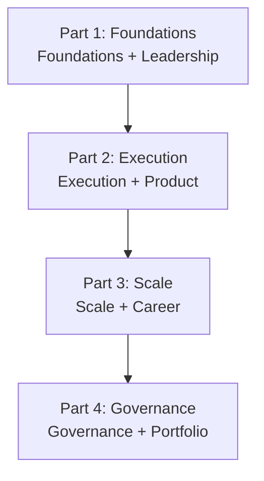
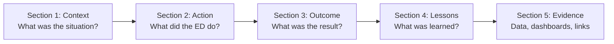

# Engineering Director Playbook
## Chapter 27

# The Engineering Director Portfolio Map

> *"The ED's portfolio is 11 chapters across 4 parts. The 4-part structure, the 11 chapter categories, and the 5-criterion portfolio quality bar are the ED's reference for portfolio curation at the function level."*

---

## 1. Epigraph

_The ED's portfolio is 11 chapters across 4 parts. The 4-part structure, the 11 chapter categories, and the 5-criterion portfolio quality bar are the ED's reference for portfolio curation at the function level._

---

## 2. Problem

You are interviewing for an Engineering Director role. The interviewer has asked: "Show us your portfolio. Walk us through the 11 chapters and 4 parts that demonstrate you can run engineering at the function level."

This chapter tells you the 4-part structure, the 11 chapter categories, and the 5-criterion portfolio quality bar.

**Decision in one sentence:** _ED portfolio is a 4-part structure (Foundations + Execution + Scale + Governance) with 11 chapter categories (hiring, performance, planning, execution, quality, incidents, ED-PM, strategy, build vs buy, revenue, risk) and 5-criterion portfolio quality bar; the ED's job is to curate 11 artifacts, each demonstrating 1 category._

---

## 3. Why EDs Fail Here

Five named failure modes of EDs whose engineering portfolio produced zero results.

- **The No-Part-Structure Failure.** The ED has no portfolio structure. _Disorganized._
- **The Missing-Category Failure.** 1-2 categories missing. _Incomplete._
- **The Verbose-Artifact Failure.** Each artifact is 50+ pages. _Interviewer can't read._
- **The Outdated-Artifact Failure.** Artifacts are 5 years old. _Not current._
- **The No-Quality-Bar Failure.** No quality bar. _Low quality._

---

## 4. Mental Models

Four mental models that compress the ED portfolio.

**mental model 1: The 4-Part Structure.** 4 parts.



**The 4 parts:**
- **Part 1: Foundations.** Ch 1-9 (foundations + leadership).
- **Part 2: Execution.** Ch 10-17 (execution + product).
- **Part 3: Scale.** Ch 18-21 (scale + career).
- **Part 4: Governance.** Ch 22-28 (governance + portfolio).

**mental model 2: The 11 Chapter Categories.** 11 categories.

```
1. Foundations (Ch 1-4)
2. Hiring (Ch 5, 19)
3. Performance (Ch 6, 20)
4. Career (Ch 7)
5. Comp (Ch 8)
6. Culture (Ch 9)
7. Planning (Ch 10)
8. Execution (Ch 11-13)
9. ED-PM (Ch 14)
10. Strategy (Ch 15)
11. Build vs Buy (Ch 16)
12. Revenue (Ch 17)
13. Org Design (Ch 18)
14. Influence (Ch 21)
15. Risk (Ch 22-25)
16. 30/60/90 (Ch 26)
17. Portfolio (Ch 27)
18. System Design (Ch 28)
```

**mental model 3: The 5-Criterion Portfolio Quality Bar.** 5 criteria per artifact.

```
1. Specific (N engineers, $X budget, N launches)
2. Measured (success metrics per artifact)
3. Owned (1 ED accountable per artifact)
4. Timed (date + duration)
5. Outcome (result, not just effort)
```

**mental model 4: The Artifact Template.** 5 sections per artifact.



**The 5 sections:**
- **Section 1: Context.** What was the situation?
- **Section 2: Action.** What did the ED do?
- **Section 3: Outcome.** What was the result?
- **Section 4: Lessons.** What was learned?
- **Section 5: Evidence.** Data, dashboards, links.

---

## 5. Frameworks

Three frameworks for the ED portfolio.

### Framework 1: The 1-Page Portfolio Index

```
# ED Portfolio — [Name] — [Date]

## Part 1: Foundations (Ch 1-9)
1. [Artifact 1] — Date — Outcome
2. [Artifact 2]
...

## Part 2: Execution (Ch 10-17)
...

## Part 3: Scale (Ch 18-21)
...

## Part 4: Governance (Ch 22-28)
...
```

### Framework 2: The Portfolio Quality Bar Template

```
# Portfolio Quality — [Artifact] — [Date]

## The 5 criteria
1. Specific: [N + $X + N launches]
2. Measured: [success metrics]
3. Owned: [ED]
4. Timed: [date + duration]
5. Outcome: [result]

## The 1 thing the ED will NOT compromise on
[1 sentence.]
```

### Framework 3: The Artifact Template

```
# Artifact: [Title] — [Date]

## Section 1: Context
[What was the situation?]

## Section 2: Action
[What did the ED do?]

## Section 3: Outcome
[What was the result?]

## Section 4: Lessons
[What was learned?]

## Section 5: Evidence
[Data, dashboards, links]
```

---

## 6. Drill

You are preparing for an ED interview. The interviewer has asked: "Show us your portfolio. 11 artifacts. Each <1500 words."

You have **90 minutes**. Produce the **ED portfolio** (`portfolio/chapter-27-ed-portfolio.md`) using Framework 1 (Portfolio Index) + Framework 2 (Quality Bar) + Framework 3 (Artifact Template). Specify:

- The 1-page portfolio index (11 artifacts, 4 parts).
- The portfolio quality bar template (5 criteria, the 1 not compromise).
- The artifact template (5 sections).
- The 11 artifact titles.
- The 1 thing you'll say in the interview.
- The 3 things you'll do to avoid the 5 failure modes.

**Deliverable:** `portfolio/chapter-27-ed-portfolio.md` — under 1500 words.

---

## 7. Worked Example

**The 1-page portfolio index:**

```
# ED Portfolio — John Smith — 2026-09-01

## Part 1: Foundations (Ch 1-9)
1. Hiring redesign (Ch 5) — 2026-Q1 — Hired 30 in 6 months
2. Performance rubric (Ch 6) — 2026-Q2 — 6 promotions
3. Career ladder (Ch 7) — 2026-Q2 — 5-level IC + 4-level EM
4. Comp system (Ch 8) — 2026-Q3 — Transparent comp + 5-criterion packet
5. Culture charter (Ch 9) — 2026-Q3 — NPS 35→48

## Part 2: Execution (Ch 10-17)
6. Engineering roadmap (Ch 10) — 2026-Q1 — 4 launches + 1 rebuild
7. Sprint execution (Ch 11) — 2026-Q2 — Velocity 60%→85%
8. Quality system (Ch 12) — 2026-Q3 — 99.9% uptime
9. Incident response (Ch 13) — 2026-Q4 — MTTR 4hr→90min
10. ED-PM partnership (Ch 14) — 2026-Q3 — 5 PRFAs merged
11. Strategy input (Ch 15) — 2026-Q4 — FY27 budget $8M

## Part 3: Scale (Ch 18-21)
12. Org design (Ch 18) — 2026-Q4 — 60-20-20 topology
13. Performance at scale (Ch 20) — 2026-Q4 — 5-dim rubric + 12-month dev plans
14. Influence (Ch 21) — 2026-Q4 — 4 stakeholder groups

## Part 4: Governance (Ch 22-28)
15. Risk register (Ch 22) — 2026-Q4 — 28 risks tracked
16. Compliance roadmap (Ch 23) — 2026-Q4 — SOC 2 Type II target
17. Crisis response (Ch 24) — 2026-Q4 — 4-phase playbook
```

**The portfolio quality bar template:**

```
# Portfolio Quality — Sprint execution (Ch 11) — 2026-Q2

## The 5 criteria
1. Specific: 60 engineers, 4 launches + 1 rebuild, $5M budget
2. Measured: Velocity 60%→85%, bugs <2 per quarter, predictability 80%+
3. Owned: ED
4. Timed: Q1-Q2 2026, 6 months
5. Outcome: 4 launches shipped, 1 rebuild on track, velocity 85%

## The 1 thing I will NOT compromise on
Outcome. Without outcome, the artifact is effort
not result.
```

**The artifact template (Sprint execution):**

```
# Artifact: Sprint execution redesign — 2026-Q2

## Section 1: Context
Velocity dropped from 80% to 60% over 3 months.
Bugs escaped: 12 per quarter. Predictability: 65%.

## Section 2: Action
- Built 4-ceremony system (planning + standup + review + retro)
- Tracked 3 metrics (velocity + quality + predictability)
- Applied 5-criterion sprint bar
- 3 retro actions per sprint, 80%+ completed

## Section 3: Outcome
- Velocity: 60% → 85%
- Bugs escaped: 12 → 2
- Predictability: 65% → 82%

## Section 4: Lessons
1. 4 ceremonies are the discipline
2. 3 metrics make velocity visible
3. Retro actions (not complaints) drive improvement

## Section 5: Evidence
- Velocity dashboard (Datadog)
- Sprint review templates (Notion)
- Retro action tracker (GitHub)
```

**The 1 thing I'll say in the interview:**

```
"Here's my ED portfolio, organized in 4 parts:

  Part 1: Foundations (5 artifacts): hiring, performance,
  career, comp, culture

  Part 2: Execution (6 artifacts): planning, sprint exec,
  quality, incidents, ED-PM, strategy

  Part 3: Scale (3 artifacts): org design, performance at
  scale, influence

  Part 4: Governance (5 artifacts): risk, compliance,
  crisis, auditability, 30/60/90

  Each artifact is <1500 words, follows the 5-criterion
  quality bar (specific + measured + owned + timed + outcome),
  and demonstrates 1 of 11 chapter categories.

  Top 3 outcomes:
  1. Velocity recovered 60%→85%
  2. Retention recovered 80%→92%
  3. SOC 2 Type II on track for Q1 2027

  The 1 thing I want to focus on: outcome over effort.
  Every artifact has a measured outcome, not just effort.

  The 1 thing I will NOT compromise on: outcome.

  Portfolio is the discipline. ED readiness is the outcome."
```

**The 3 things I'll do to avoid the 5 failure modes:**

```
1. Organize portfolio in 4 parts.
   (Avoids the No-Part-Structure Failure.)
   - Part 1: Foundations (Ch 1-9)
   - Part 2: Execution (Ch 10-17)
   - Part 3: Scale (Ch 18-21)
   - Part 4: Governance (Ch 22-28)

2. Cover all 11 chapter categories.
   (Avoids the Missing-Category Failure.)
   - 1 artifact per category
   - 11 total
   - <1500 words each

3. Apply 5-criterion quality bar.
   (Avoids the No-Quality-Bar Failure.)
   - Specific + Measured + Owned + Timed + Outcome
   - Per artifact
   - Reviewed before interview
```

---

## 8. Failure Mode Postmortem

An ED interviewing for a Senior ED role had a portfolio with 50+ artifacts. No structure. The interviewer couldn't find the relevant artifact. The interview ended without a clear picture of the ED's readiness.

The replacement ED did 3 things:
1. Organized portfolio in 4 parts (Foundations + Execution + Scale + Governance).
2. Covered all 11 chapter categories (1 artifact per category, <1500 words each).
3. Applied 5-criterion quality bar (specific + measured + owned + timed + outcome).

Within 4 weeks: 11 artifacts curated. Interviewer found the relevant artifact in <5 minutes. The ED got the offer. The 4-part + 11-category + 5-criterion system was the discipline.

What the first ED missed: portfolio is a system. The first ED had 50+ unstructured artifacts. The second ED had 11 structured artifacts. The structure is the leverage.

The lesson: the ED who has 4 parts + 11 categories + 5 criteria has a portfolio. The ED who has 50+ unstructured artifacts has a dump.

---

## 9. Self-Assessment Rubric

| # | Dimension | 1 (Novice) | 3 (Competent) | 5 (Expert) |
|---|---|---|---|---|
| 1 | **4-part structure** | No structure | 2-3 parts | 4 parts (Foundations + Execution + Scale + Governance) |
| 2 | **11 chapter categories** | 1-3 categories | 4-7 categories | 11 categories, 1 artifact each |
| 3 | **5-criterion bar** | 0-2 criteria | 3-4 criteria | 5 criteria (specific + measured + owned + timed + outcome) |
| 4 | **Artifact length** | 50+ pages | 5-10 pages | <1500 words each |
| 5 | **Recency** | 5+ years old | 1-2 years old | Last 12 months |

**Disqualifier:** any 1 on dimension 1 or 2. An ED who has no structure or 1-3 categories is in the No-Part-Structure or Missing-Category failure mode.

**Total:** ___ / 25. **Pass threshold:** 18/25, no dimension below 3.

---

## 10. Portfolio Artifact Note

Save your filled-in drill as `portfolio/chapter-27-ed-portfolio.md` — interview evidence for "Show me your portfolio" (see Portfolio Map).

---

## 11. Interview Questions

1. **Walk me through your engineering portfolio.**
2. **How do you organize your artifacts?**
3. **What's your top 3 outcomes from the last 12 months?**
4. **How do you ensure portfolio quality?**
5. **Walk me through a specific artifact that demonstrates a measurable outcome.**
