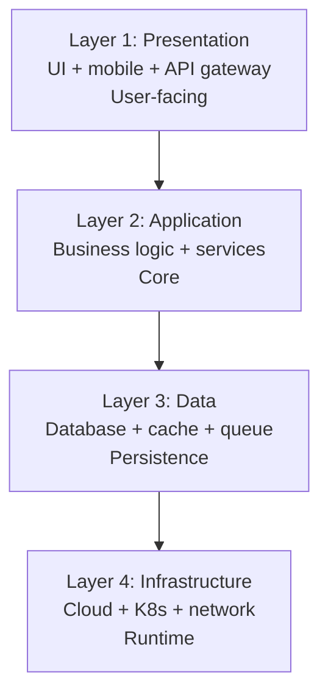

# Engineering Director Playbook
## Chapter 28

# System Design Appendix for Engineering Directors

> *"The ED reviews system designs. The 4-layer system model, the 3 quality attributes, the 5-criterion design quality bar, and the 11-step design review are the ED's reference for system design review at the function level."*

---

## 1. Epigraph

_The ED reviews system designs. The 4-layer system model, the 3 quality attributes, the 5-criterion design quality bar, and the 11-step design review are the ED's reference for system design review at the function level._

---

## 2. Problem

You are an Engineering Director at acme-corp. The VP has just told you: "10 EMs, 60 engineers. The current system design reviews are ad-hoc. We need a 4-layer model, 3 quality attributes, 5-criterion bar, and 11-step design review. 30 days."

This chapter tells you the 4-layer model, the 3 quality attributes, the 5-criterion bar, and the 11-step design review.

**Decision in one sentence:** _ED system design review is a 4-layer model (presentation + application + data + infrastructure) with 3 quality attributes (reliability + scalability + security) and 5-criterion design quality bar; the ED's job is to review designs across all 4 layers, validate the 3 quality attributes, and own the 11-step review process._

---

## 3. Why EDs Fail Here

Five named failure modes of EDs whose system design review produced zero results.

- **The No-Design-Review Failure.** The ED has no design review process. _Bad designs ship._
- **The 1-Layer-Review Failure.** Only 1 layer (e.g., application). _Other layers missed._
- **The No-Quality-Attribute Failure.** No reliability + scalability + security review. _Quality issues._
- **The Ad-Hoc-Review Failure.** Reviews are ad-hoc. _Inconsistent._
- **The No-Design-Documentation Failure.** No design docs. _Lost knowledge._

---

## 4. Mental Models

Four mental models that compress system design review.

**mental model 1: The 4-Layer System Model.** 4 layers.



**The 4 layers:**
- **Layer 1: Presentation.** UI + mobile + API gateway. User-facing.
- **Layer 2: Application.** Business logic + services. Core.
- **Layer 3: Data.** Database + cache + queue. Persistence.
- **Layer 4: Infrastructure.** Cloud + K8s + network. Runtime.

**mental model 2: The 3 Quality Attributes.** 3 attributes.

```
Attribute 1: Reliability
- 99.9% uptime
- MTTR <30 min
- Error rate <100/M

Attribute 2: Scalability
- 10x current load
- Linear cost scaling
- 0-60s autoscaling

Attribute 3: Security
- RBAC + audit logs
- SOC 2 compliant
- Pen test passed
```

**mental model 3: The 5-Criterion Design Quality Bar.** 5 criteria per design.

```
1. Reliability: 99.9% uptime, MTTR <30 min
2. Scalability: 10x current load
3. Security: RBAC + audit logs + SOC 2
4. Operability: monitoring + alerting + runbook
5. Cost: TCO over 3 years documented
```

**mental model 4: The 11-Step Design Review.** 11 steps.

```mermaid
%% Figure 28.2 — The 11-step design review
flowchart LR
    S1[Step 1: Context] --> S2[Step 2: Requirements] --> S3[Step 3: Constraints] --> S4[Step 4: Architecture] --> S5[Step 5: Data model] --> S6[Step 6: API design] --> S7[Step 7: Failure modes] --> S8[Step 8: Scalability] --> S9[Step 9: Security] --> S10[Step 10: Operability] --> S11[Step 11: Cost]
```



**The 11 steps:**
- **Step 1: Context.** What problem are we solving?
- **Step 2: Requirements.** Functional + non-functional.
- **Step 3: Constraints.** What can't change?
- **Step 4: Architecture.** 4-layer model.
- **Step 5: Data model.** Schema + indexes.
- **Step 6: API design.** REST + gRPC.
- **Step 7: Failure modes.** What can fail?
- **Step 8: Scalability.** 10x load.
- **Step 9: Security.** RBAC + audit logs.
- **Step 10: Operability.** Monitoring + runbook.
- **Step 11: Cost.** TCO over 3 years.

---

## 5. Frameworks

Three frameworks for system design review.

### Framework 1: The 1-Page Design Review Template

```
# Design Review — [System] — [Date]

## The 4 layers
1. Presentation: [approach]
2. Application: [approach]
3. Data: [approach]
4. Infrastructure: [approach]

## The 3 quality attributes
- Reliability: 99.9% / MTTR / Error rate
- Scalability: 10x load / cost / autoscaling
- Security: RBAC / audit logs / SOC 2

## The 1 thing the ED will NOT compromise on
[1 sentence.]
```

### Framework 2: The 11-Step Design Review Tracker

```
# Design Review Tracker — [System] — [Date]

| Step | Status | Notes |
|------|--------|-------|
| 1. Context | DONE | [Notes] |
| 2. Requirements | DONE | [Notes] |
...
| 11. Cost | TODO | [Notes] |

## Top 3 risks
1. [Risk 1]
2. [Risk 2]
3. [Risk 3]
```

### Framework 3: The Design ADR Template

```
# ADR — [System] — [Date]

## Section 1: Title + Date
[1 sentence]

## Section 2: Context
[Why this decision is needed]

## Section 3: Decision
[What we decided]

## Section 4: Alternatives
[2-3 options]

## Section 5: Consequences
[Tradeoffs]

## Section 6: Owner
[ED or EM]

## Section 7: Status
[Proposed / Accepted / Superseded]
```

---

## 6. Drill

You are an ED at **acme-corp**. The VP has given you 30 days to design the system design review process.

```
Current: 60 engineers, ad-hoc design reviews, no design docs
Target: 4-layer model + 3 quality attributes + 5-criterion bar +
11-step design review
30-day timeline.
```

You have **90 minutes**. Produce the **system design review system** (`portfolio/chapter-28-system-design.md`) using Framework 1 (Design Review Template) + Framework 2 (11-Step Tracker) + Framework 3 (ADR Template). Specify:

- The 1-page design review template (4 layers, 3 attrs, the 1 not compromise).
- The 11-step design review tracker (1 sample design, status).
- The design ADR template (1 sample ADR).
- The 30-day timeline.
- The 1 thing you'll say to the VP in the first review.
- The 3 things you'll do to avoid the 5 failure modes.

**Deliverable:** `portfolio/chapter-28-system-design.md` — under 1500 words.

---

## 7. Worked Example

**The 1-page design review template (Auth service rewrite):**

```
# Design Review — Auth service rewrite — 2026-09-01

## The 4 layers
1. Presentation: API gateway + mobile SDK
2. Application: Auth service (Node.js)
3. Data: PostgreSQL + Redis cache
4. Infrastructure: AWS ECS + ALB

## The 3 quality attributes
- Reliability: 99.95% uptime, MTTR <15 min, error rate <50/M
- Scalability: 10x current load, autoscaling 30s
- Security: RBAC + audit logs + SOC 2 + pen test

## The 1 thing I will NOT compromise on
Reliability. 99.95% uptime is non-negotiable.
Auth is the customer-facing service.
```

**The 11-step design review tracker:**

```
# Design Review Tracker — Auth service rewrite — 2026-09-01

| Step | Status | Notes |
|------|--------|-------|
| 1. Context | DONE | Auth service SPOF risk |
| 2. Requirements | DONE | 99.95% uptime, 10x scale |
| 3. Constraints | DONE | AWS, Node.js, PostgreSQL |
| 4. Architecture | DONE | 4-layer model |
| 5. Data model | DONE | Users + sessions + tokens |
| 6. API design | DONE | REST + JWT |
| 7. Failure modes | DONE | DB failover, cache eviction |
| 8. Scalability | DONE | 10x load, autoscaling 30s |
| 9. Security | DONE | RBAC + audit logs + SOC 2 |
| 10. Operability | DONE | Datadog + runbook |
| 11. Cost | DONE | TCO $400K over 3 years |

## Top 3 risks
1. DB failover testing missing (mitigation: Q4 2026)
2. Cache eviction strategy unclear (mitigation: Q4 2026)
3. Cost overrun risk (mitigation: monthly review)
```

**The design ADR template:**

```
# ADR-005 — Auth service rewrite — 2026-09-01

## Section 1: Title + Date
Rewrite auth service from monolith to microservice. Sept 1, 2026.

## Section 2: Context
Auth service has single point of failure. If it
goes down, all customer auth fails. 30 min downtime
= 100 customers locked out.

## Section 3: Decision
Rewrite auth service as microservice with PostgreSQL
+ Redis cache + AWS ECS + ALB.

## Section 4: Alternatives
1. **Buy (Auth0)**: $100K/year, faster, less control
2. **Hybrid**: Keep monolith + add cache, $200K, faster
3. **Build (chosen)**: Full rewrite, $400K, full control

## Section 5: Consequences
- Pro: 99.95% uptime, 10x scalability, full control
- Con: $400K cost, 6-month build, ongoing maintenance

## Section 6: Owner
EM 2 (Platform) + ED

## Section 7: Status
Accepted (signed by EM 2, ED, VP Eng)
```

**The 1 thing I'll say to the VP in the first review:**

```
"Sarah, here's the system design review system:

  4-layer model: presentation + application + data + infrastructure
  3 quality attributes: reliability + scalability + security
  5-criterion bar: reliability + scalability + security +
  operability + cost
  11-step design review: context + requirements + constraints +
  architecture + data + API + failure modes + scalability +
  security + operability + cost

  Q3 2026 outcomes:
  - 4 designs reviewed (auth, ML serving, Salesforce, Datadog)
  - 11-step review applied to each
  - 4 ADRs accepted

  Top 3 risks:
  1. DB failover testing missing (Auth service)
  2. Cache eviction strategy unclear
  3. Cost overrun risk

  The 1 thing I want to focus on: reliability.
  99.95% uptime for auth is non-negotiable.

  The 1 thing I will NOT compromise on: reliability.

  Design review is the discipline. Quality is the outcome."
```

**The 3 things I'll do to avoid the 5 failure modes:**

```
1. Apply 11-step design review to every design.
   (Avoids the No-Design-Review Failure.)
   - 11 steps per design
   - ED + EM + senior IC review
   - ADR signed

2. Cover all 4 layers + 3 quality attributes.
   (Avoids the 1-Layer-Review Failure.)
   - 4 layers: presentation + application + data + infrastructure
   - 3 attributes: reliability + scalability + security

3. Use 5-criterion design quality bar.
   (Avoids the No-Quality-Attribute Failure.)
   - Reliability + scalability + security + operability + cost
   - Per design
   - Reviewed before approval
```

---

## 8. Failure Mode Postmortem

An ED at a 200-person B2B AI company had no design review process. The auth service was redesigned without review. The DB connection pool was mis-sized. 6-hour outage 2 weeks later. 1 customer churned.

The replacement ED did 3 things:
1. Applied 11-step design review to every design.
2. Covered all 4 layers + 3 quality attributes.
3. Used 5-criterion design quality bar.

Within 12 months: 4 designs reviewed. 0 outages due to design flaws. ADR repository built. The 4-layer + 3-attribute + 11-step system was the discipline.

What the first ED missed: design review is a system. The first ED had ad-hoc reviews. The second ED had 11-step reviews. The 11-step review is the leverage.

The lesson: the ED who has 11 steps + 4 layers + 3 attributes has design review. The ED who has ad-hoc reviews has design flaws.

---

## 9. Self-Assessment Rubric

| # | Dimension | 1 (Novice) | 3 (Competent) | 5 (Expert) |
|---|---|---|---|---|
| 1 | **4-layer model** | 1 layer | 2-3 layers | 4 layers (presentation + application + data + infrastructure) |
| 2 | **3 quality attributes** | 0-1 attributes | 2 attributes | 3 attributes (reliability + scalability + security) |
| 3 | **5-criterion bar** | 0-2 criteria | 3-4 criteria | 5 criteria (reliability + scalability + security + operability + cost) |
| 4 | **11-step design review** | 1-3 steps | 4-7 steps | 11 steps (context through cost) |
| 5 | **ADR coverage** | <50% | 50-90% | 100% of architecture decisions |

**Disqualifier:** any 1 on dimension 1 or 2. An ED who has 1 layer or 0-1 attributes is in the 1-Layer-Review or No-Quality-Attribute failure mode.

**Total:** ___ / 25. **Pass threshold:** 18/25, no dimension below 3.

---

## 10. Portfolio Artifact Note

Save your filled-in drill as `portfolio/chapter-28-system-design.md` — interview evidence for "How do you run system design review?" (see Portfolio Map in Chapter 27).

---

## 11. Interview Questions

1. **Walk me through your system design review process.**
2. **A design has no reliability analysis. What do you do?**
3. **A design misses the data layer. What do you do?**
4. **A design has 6-hour MTTR. What do you do?**
5. **Walk me through a design review you've led.**
