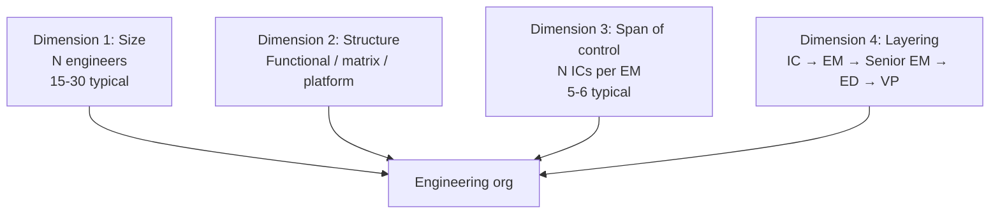
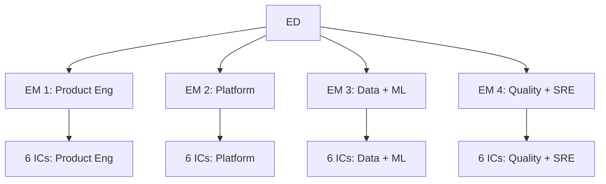

# Engineering Director Playbook
## Chapter 3

# Engineering Org Design Basics

> *"The ED designs the engineering org. The 4 org design dimensions (size, structure, span of control, layering), the 3 org structures (functional, matrix, platform), the 5 org design principles, and the 4-team org template are the ED's reference for engineering org design."*

---

## 1. Epigraph

_The ED designs the engineering org. The 4 org design dimensions (size, structure, span of control, layering), the 3 org structures (functional, matrix, platform), the 5 org design principles, and the 4-team org template are the ED's reference for engineering org design._

---

## 2. Problem

You are a new ED at acme-corp. The VP has just told you: "You have 30 engineers, no clear org structure, 5 EMs but overlapping responsibilities. Design the org. 4 product launches + 1 platform rebuild. 90 days."

This chapter tells you the 4 dimensions, the 3 structures, the 5 principles, and the 4-team template.

**Decision in one sentence:** _Engineering org design is a 4-dimension system (size, structure, span of control, layering) using 3 structures (functional, matrix, platform) and 5 principles (clarity, accountability, leverage, autonomy, alignment); the ED's job is to design the org for the 4 launches + 1 rebuild, document the design, and own the org chart._

---

## 3. Why EDs Fail Here

Five named failure modes of EDs whose org design produced zero results.

- **The No-Org-Design Failure.** The ED doesn't design the org. _Teams overlap, accountability is unclear._
- **The 1-Structure Failure.** The ED uses 1 structure (e.g., functional) for everything. _Mismatch with team requirements._
- **The No-Span-of-Control Failure.** The ED doesn't consider span. _EMs are overloaded or underutilized._
- **The No-Layering Failure.** The ED doesn't layer. _Career paths are unclear._
- **The 1-Year-Rework Failure.** The ED redesigns the org every year. _No stability._

---

## 4. Mental Models

Four mental models that compress engineering org design.

**mental model 1: The 4 Org Design Dimensions.** 4 dimensions.



**The 4 dimensions:**
- **Dimension 1: Size.** N engineers. 15-30 typical.
- **Dimension 2: Structure.** Functional / matrix / platform.
- **Dimension 3: Span of control.** N ICs per EM. 5-6 typical.
- **Dimension 4: Layering.** IC → EM → Senior EM → ED → VP.

**mental model 2: The 3 Org Structures.** 3 structures.

```
Structure 1: Functional
- 1 team per function (Product Eng, Platform, Data, ML)
- Strong specialization
- Weak cross-functional work
- Best for: 15-30 engineers, clear functional boundaries

Structure 2: Matrix
- ICs belong to functions + projects
- Strong cross-functional work
- Weak IC identity (which function is mine?)
- Best for: 30-60 engineers, multiple product areas

Structure 3: Platform
- 1 platform team + N product teams
- Platform team owns shared infra
- Product teams own features
- Best for: 60+ engineers, multiple product surfaces

The 3 structures are progressive. Functional
(15-30) → Matrix (30-60) → Platform (60+).
```

**mental model 3: The 5 Org Design Principles.** 5 principles.

```
Principle 1: Clarity
- Every team has a clear charter (1 page)
- Every IC has a clear manager
- No overlapping responsibilities

Principle 2: Accountability
- Every team owns a measurable outcome
- Every EM owns their team's delivery
- Every IC owns their work

Principle 3: Leverage
- Managers manage managers (EMs develop ICs)
- Senior ICs lead projects (without managing people)
- Platform teams serve product teams

Principle 4: Autonomy
- Teams have decision-making authority
- EMs approve team-level decisions
- ICs approve IC-level decisions

Principle 5: Alignment
- All teams share OKRs
- Cross-functional syncs (weekly)
- Quarterly all-hands
```

**mental model 4: The 4-Team Org Template.** 4 teams, 30 engineers.



**The 4 teams:**
- **EM 1: Product Eng (6 ICs).** Owns product features.
- **EM 2: Platform (6 ICs).** Owns shared infrastructure.
- **EM 3: Data + ML (6 ICs).** Owns data pipeline + ML serving.
- **EM 4: Quality + SRE (6 ICs).** Owns quality + reliability.

---

## 5. Frameworks

Three frameworks for engineering org design.

### Framework 1: The 1-Page Org Design

```
# Engineering Org Design — [Date]

## The 4 dimensions
1. Size: 30 engineers
2. Structure: Functional (4 teams)
3. Span of control: 6 ICs per EM
4. Layering: IC → EM → ED (3 layers)

## The 4 teams
1. Product Eng (EM 1, 6 ICs)
2. Platform (EM 2, 6 ICs)
3. Data + ML (EM 3, 6 ICs)
4. Quality + SRE (EM 4, 6 ICs)

## The 5 principles applied
- Clarity: Each team has a 1-page charter
- Accountability: Each team owns a measurable outcome
- Leverage: EMs develop ICs, not write code
- Autonomy: Teams have decision-making authority
- Alignment: Quarterly OKRs across all teams

## The 1 thing the ED will focus on
[1 sentence.]
```

### Framework 2: The Org Design Decision Matrix

```
# Org Design Decision — [Date]

| Decision | Option 1 | Option 2 | Recommendation |
|----------|----------|----------|----------------|
| Structure | Functional | Matrix | Functional (15-30 range) |
| Span of control | 4 ICs | 8 ICs | 6 ICs (sweet spot) |
| Layering | Flat (2) | Hierarchical (4) | Hierarchical (3) |
| Team count | 3 teams | 6 teams | 4 teams (sweet spot) |

## The 1 thing the ED will NOT do
[1 sentence.]
```

### Framework 3: The 12-Month Org Stability Tracker

```
# Org Stability — [Quarter]

| Quarter | Org changes | Reason | Status |
|---------|-------------|--------|--------|
| Q1 | [Changes] | [Reason] | OK / Not OK |
| Q2 | [Changes] | [Reason] | OK / Not OK |
| Q3 | [Changes] | [Reason] | OK / Not OK |
| Q4 | [Changes] | [Reason] | OK / Not OK |

## Top 3 changes this year
1. [Change 1] — [Reason]
2. [Change 2]
3. [Change 3]

## The 1 thing the ED will NOT change next year
[1 sentence.]
```

---

## 6. Drill

You are a new ED at **acme-corp**. The VP has given you 30 engineers and 90 days to design the org.

```
Constraints:
- 30 engineers, 5 EMs (overlapping responsibilities)
- 4 product launches + 1 platform rebuild
- 90 days
```

You have **90 minutes**. Produce the **org design** (`portfolio/chapter-03-org-design.md`) using Framework 1 (Org Design) + Framework 2 (Decision Matrix) + Framework 3 (Stability Tracker). Specify:

- The 1-page org design (4 dimensions, 4 teams, 5 principles, the 1 focus).
- The org design decision matrix (4 decisions, options, recommendation).
- The 12-month org stability tracker (quarter-by-quarter, top 3 changes, the 1 not change).
- The 1 thing you'll say to the VP in the first review.
- The 3 things you'll do to avoid the 5 failure modes.

**Deliverable:** `portfolio/chapter-03-org-design.md` — under 1500 words.

---

## 7. Worked Example

**The 1-page org design:**

```
# Engineering Org Design — 2026-09-01

## The 4 dimensions
1. Size: 30 engineers
2. Structure: Functional (4 teams)
3. Span of control: 6 ICs per EM
4. Layering: IC → EM → ED (3 layers)

## The 4 teams
1. Product Eng (EM 1, 6 ICs) — Product features
2. Platform (EM 2, 6 ICs) — Shared infra
3. Data + ML (EM 3, 6 ICs) — Data pipeline + ML serving
4. Quality + SRE (EM 4, 6 ICs) — Quality + reliability

## The 5 principles applied
- Clarity: 1-page charter per team
- Accountability: Each team owns measurable outcome
- Leverage: EMs develop ICs, not write code
- Autonomy: Teams have decision-making authority
- Alignment: Quarterly OKRs across all teams

## The 1 thing I'll focus on first
Clarity. Each team gets a 1-page charter in week 1.
Without charters, accountability is unclear.
```

**The org design decision matrix:**

```
# Org Design Decision — 2026-09-01

| Decision | Option 1 | Option 2 | Recommendation |
|----------|----------|----------|----------------|
| Structure | Functional | Matrix | Functional (30 engineers is in 15-30 range) |
| Span of control | 4 ICs | 8 ICs | 6 ICs (sweet spot for EM development) |
| Layering | Flat (IC → ED) | Hierarchical (4) | 3 layers (IC → EM → ED) |
| Team count | 3 teams | 6 teams | 4 teams (Product + Platform + Data/ML + Quality/SRE) |

## The 1 thing I'll NOT do
Add a 5th team. 4 teams × 6 ICs = 24 ICs + 4 EMs
= 28. The remaining 2 are floaters (special projects).
Adding a 5th team splits the span and reduces EM leverage.
```

**The 12-month org stability tracker:**

```
# Org Stability — 2026-09-01

| Quarter | Org changes | Reason | Status |
|---------|-------------|--------|--------|
| Q4 2026 | Charter refresh (4 teams) | Clarity principle | OK |
| Q1 2027 | Hire 2 ICs into Product Eng | 4 launches need capacity | OK |
| Q2 2027 | None | Org stable | OK |
| Q3 2027 | None | Org stable | OK |

## Top 3 changes this year
1. Charter refresh (Q4 2026) — Clarity principle
2. Hire 2 ICs into Product Eng (Q1 2027) — Capacity
3. None (Q2-Q3 2027) — Stability

## The 1 thing I'll NOT change
The team count (4 teams). Adding a 5th team splits
span and reduces leverage. The 4-team structure is
stable for the year.
```

**The 1 thing I'll say to the VP in the first review:**

```
"Here's the org design for FY26:

  4 dimensions:
  - Size: 30 engineers
  - Structure: Functional (4 teams)
  - Span: 6 ICs per EM
  - Layering: IC → EM → ED (3 layers)

  4 teams:
  - Product Eng (EM 1, 6 ICs)
  - Platform (EM 2, 6 ICs)
  - Data + ML (EM 3, 6 ICs)
  - Quality + SRE (EM 4, 6 ICs)

  5 principles applied: clarity + accountability +
  leverage + autonomy + alignment.

  Top 3 changes this year:
  - Charter refresh (Q4 2026)
  - Hire 2 ICs into Product Eng (Q1 2027)
  - Stable Q2-Q3 2027

  The 1 thing I will NOT change: the team count (4).
  Adding a 5th team splits span and reduces leverage.

  The 1 thing I want to focus on: clarity. Each team
  gets a 1-page charter in week 1.

  Org design is the discipline. Stability is the outcome."
```

**The 3 things I'll do to avoid the 5 failure modes:**

```
1. Design the org in week 1.
   (Avoids the No-Org-Design Failure.)
   - 4 teams, 6 ICs each, 3 layers
   - 1-page charter per team
   - Quarterly OKRs

2. Use functional structure (not matrix).
   (Avoids the 1-Structure Failure.)
   - 30 engineers = functional range
   - Matrix at 30-60 range
   - Platform at 60+ range

3. Don't redesign every year.
   (Avoids the 1-Year-Rework Failure.)
   - 12-month org stability tracker
   - Top 3 changes per year
   - The 1 thing NOT changed
```

---

## 8. Failure Mode Postmortem

An ED at a 200-person B2B AI company had 30 engineers and 5 EMs but no clear org structure. Teams overlapped. Accountability was unclear. The ED was asked to redesign the org every 6 months. Engineers churned.

The replacement ED did 3 things:
1. Designed the org in week 1 (4 teams, 6 ICs each, 3 layers).
2. Used functional structure (not matrix) for 30 engineers.
3. Tracked org stability quarterly (top 3 changes, the 1 not changed).

Within 12 months: 4 teams with clear charters. 0 churn due to org confusion. The 4-dimension design + 3 structures + 5 principles was the discipline.

What the first ED missed: org design is a system. The first ED had no design. The second ED had 4 dimensions + 5 principles. The system is the leverage.

The lesson: the ED who has 4 dimensions + 3 structures + 5 principles has a designed org. The ED who has no design has an org that needs redesign every 6 months.

---

## 9. Self-Assessment Rubric

| # | Dimension | 1 (Novice) | 3 (Competent) | 5 (Expert) |
|---|---|---|---|---|
| 1 | **4 org design dimensions** | 0-1 dimensions | 2-3 dimensions | 4 dimensions (size, structure, span, layering) |
| 2 | **3 org structures** | 1 structure | 2 structures | 3 structures (functional, matrix, platform), progressive |
| 3 | **5 org design principles** | 0-2 principles | 3-4 principles | 5 principles (clarity, accountability, leverage, autonomy, alignment) |
| 4 | **4-team org template** | 0-2 teams | 3 teams | 4 teams (Product + Platform + Data/ML + Quality/SRE) |
| 5 | **12-month stability** | Redesigns monthly | Redesigns quarterly | Stable 12 months, top 3 changes, the 1 not changed |

**Disqualifier:** any 1 on dimension 1 or 2. An ED who has 0-1 dimensions or 1 structure is in the No-Org-Design or 1-Structure failure mode.

**Total:** ___ / 25. **Pass threshold:** 18/25, no dimension below 3.

---

## 10. Portfolio Artifact Note

Save your filled-in drill as `portfolio/chapter-03-org-design.md` — interview evidence for "How do you design an engineering org?" (see Portfolio Map in Chapter 27).

---

## 11. Interview Questions

1. **Walk me through your engineering org design.**
2. **You have 30 engineers. What structure do you use?**
3. **The EMs are overloaded. What do you do?**
4. **You redesign the org every 6 months. What do you do?**
5. **Walk me through an org design you've shipped.**
