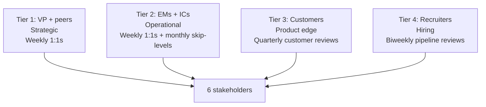
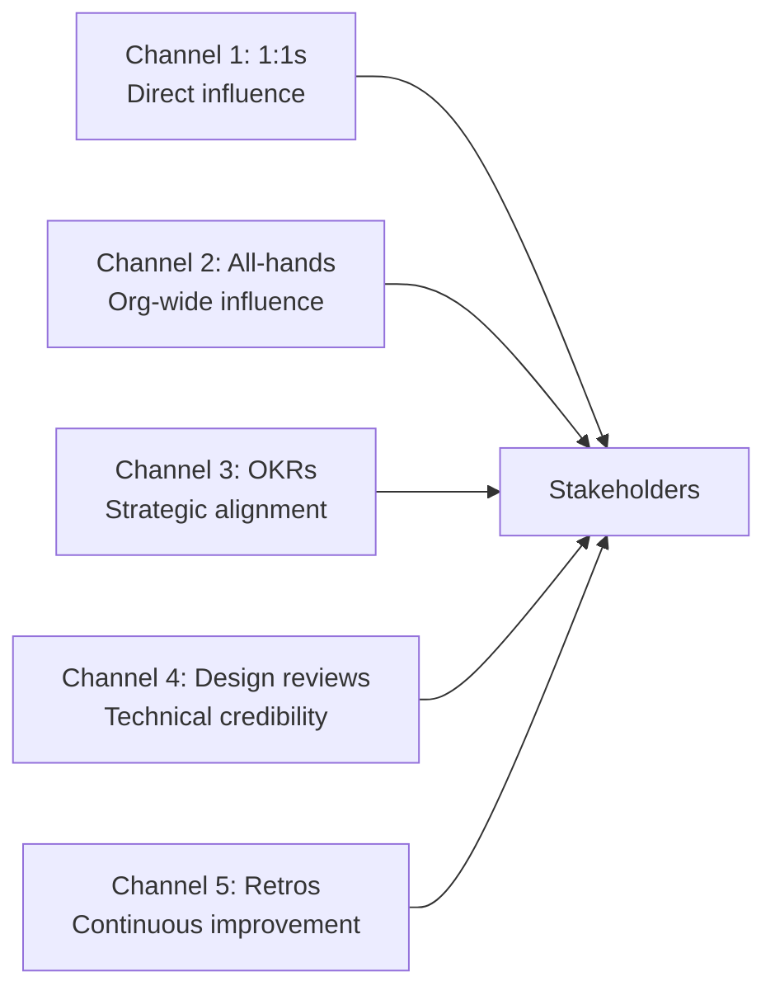

# Engineering Director Playbook
## Chapter 4

# Engineering Stakeholder Management

> *"The ED manages 6 stakeholders: VP, peers, EMs, ICs, customers, and recruiters. The 4 stakeholder tiers, the 3 communication cadences, the 5-stakeholder influence map, and the 6-week stakeholder cadence are the ED's reference for engineering stakeholder management."*

---

## 1. Epigraph

_The ED manages 6 stakeholders: VP, peers, EMs, ICs, customers, and recruiters. The 4 stakeholder tiers, the 3 communication cadences, the 5-stakeholder influence map, and the 6-week stakeholder cadence are the ED's reference for engineering stakeholder management._

---

## 2. Problem

You are a new ED at acme-corp. The VP has just told you: "You have 6 stakeholders to manage (VP, peers, EMs, ICs, customers, recruiters). Each has different needs. You have 90 days to design the stakeholder cadence."

This chapter tells you the 4 tiers, the 3 cadences, the 5-stakeholder influence map, and the 6-week cadence.

**Decision in one sentence:** _Engineering stakeholder management is a 4-tier system (VP + peers, EMs + ICs, customers, recruiters) with 3 cadences (weekly + biweekly + monthly) and 5 influence channels (1:1s, all-hands, OKRs, design reviews, retros); the ED's job is to design the cadence, run it on schedule, and own the stakeholder relationships._

---

## 3. Why EDs Fail Here

Five named failure modes of EDs whose stakeholder management produced zero results.

- **The 1-Stakeholder-Tier Failure.** The ED only manages 1 tier (e.g., EMs). _Other stakeholders are ignored._
- **The No-Cadence Failure.** The ED has no regular cadence. _Stakeholders drift._
- **The No-Customer-Channel Failure.** The ED doesn't talk to customers. _Engineering loses customer focus._
- **The No-Recruiter-Channel Failure.** The ED doesn't invest in recruiters. _Hiring pipeline dries up._
- **The Over-Communication Failure.** The ED over-communicates. _Stakeholders tune out._

---

## 4. Mental Models

Four mental models that compress stakeholder management.

**mental model 1: The 4 Stakeholder Tiers.** 4 tiers.



**The 4 tiers:**
- **Tier 1: VP + peers.** Strategic. Weekly 1:1s.
- **Tier 2: EMs + ICs.** Operational. Weekly 1:1s + monthly skip-levels.
- **Tier 3: Customers.** Product edge. Quarterly customer reviews.
- **Tier 4: Recruiters.** Hiring. Biweekly pipeline reviews.

**mental model 2: The 3 Communication Cadences.** 3 cadences.

```
Cadence 1: Weekly
- VP 1:1 (30 min)
- Each EM 1:1 (30 min × 5 = 150 min)
- Sprint review (60 min)

Cadence 2: Biweekly
- Peer 1:1s (PM, Design, CS) (60 min each)
- Recruiter pipeline review (30 min)
- Cross-functional sync (60 min)

Cadence 3: Monthly
- Skip-levels with 5-6 ICs (15 min each = 75-90 min)
- Customer review (60 min)
- All-hands (60 min)

The 3 cadences cover all 6 stakeholders.
```

**mental model 3: The 5-Stakeholder Influence Map.** 5 channels.



**The 5 channels:**
- **Channel 1: 1:1s.** Direct influence.
- **Channel 2: All-hands.** Org-wide influence.
- **Channel 3: OKRs.** Strategic alignment.
- **Channel 4: Design reviews.** Technical credibility.
- **Channel 5: Retros.** Continuous improvement.

**mental model 4: The 6-Week Stakeholder Cadence.** 6 weeks, all stakeholders.

```
Week 1: VP 1:1 + EM 1:1s (all 3-5) + sprint review
Week 2: VP 1:1 + EM 1:1s + peer 1:1s + recruiter pipeline
Week 3: VP 1:1 + EM 1:1s + sprint review + skip-level (1 IC)
Week 4: VP 1:1 + EM 1:1s + peer 1:1s + cross-functional sync
Week 5: VP 1:1 + EM 1:1s + sprint review + customer review
Week 6: VP 1:1 + EM 1:1s + peer 1:1s + all-hands + skip-level (1 IC)
```

---

## 5. Frameworks

Three frameworks for stakeholder management.

### Framework 1: The 1-Page Stakeholder Cadence

```
# Stakeholder Cadence — [Date]

## The 4 tiers
- Tier 1 (VP + peers): Weekly 1:1s
- Tier 2 (EMs + ICs): Weekly + monthly
- Tier 3 (Customers): Quarterly reviews
- Tier 4 (Recruiters): Biweekly pipeline

## The 6 stakeholders
1. VP: Weekly Monday 1:1 (30 min)
2. Peers (PM + Design + CS): Biweekly 1:1s (60 min each)
3. EMs (3-5): Weekly 1:1s (30 min each)
4. ICs: Monthly skip-levels (15 min × 5-6 = 75-90 min)
5. Customers: Quarterly review (60 min)
6. Recruiters: Biweekly pipeline review (30 min)

## The 1 thing the ED will focus on
[1 sentence.]
```

### Framework 2: The Stakeholder Influence Plan

```
# Stakeholder Influence Plan — [Date]

| Stakeholder | Cadence | Channel | Current state | Influence strength |
|-------------|---------|---------|---------------|---------------------|
| VP | Weekly 1:1 | 1:1 + OKRs | Strong | 5/5 |
| Peers | Biweekly | 1:1 + cross-functional | Strong | 4/5 |
| EMs | Weekly | 1:1 + design reviews | Strong | 5/5 |
| ICs | Monthly | Skip-levels | Strong | 4/5 |
| Customers | Quarterly | Customer review | Medium | 3/5 |
| Recruiters | Biweekly | Pipeline review | Medium | 3/5 |

## The 1 thing the ED will invest in
[1 sentence on the weakest influence.]
```

### Framework 3: The 6-Week Stakeholder Tracker

```
# 6-Week Stakeholder Tracker — [Date]

| Week | VP | Peers | EMs | ICs | Customers | Recruiters |
|------|-----|-------|-----|-----|-----------|------------|
| 1 | ✓ | - | ✓ | - | - | - |
| 2 | ✓ | ✓ | ✓ | - | - | ✓ |
| 3 | ✓ | - | ✓ | ✓ | - | - |
| 4 | ✓ | ✓ | ✓ | - | - | ✓ |
| 5 | ✓ | - | ✓ | - | ✓ | - |
| 6 | ✓ | ✓ | ✓ | ✓ | - | - |

## Coverage
- VP: 6/6 weeks ✓
- EMs: 6/6 weeks ✓
- Peers: 3/6 weeks ✓
- Recruiters: 2/6 weeks ✓
- ICs: 2/6 weeks ✓
- Customers: 1/6 weeks ✓

## The 1 thing the ED will NOT skip
[1 sentence.]
```

---

## 6. Drill

You are a new ED at **acme-corp**. The VP has given you 90 days to design the stakeholder cadence.

```
Stakeholders: VP, peers (3), EMs (3-5), ICs (15-30),
customers, recruiters (2)

90 days.
```

You have **90 minutes**. Produce the **stakeholder cadence** (`portfolio/chapter-04-stakeholder-mgmt.md`) using Framework 1 (Stakeholder Cadence) + Framework 2 (Influence Plan) + Framework 3 (6-Week Tracker). Specify:

- The 1-page stakeholder cadence (4 tiers, 6 stakeholders, the 1 focus).
- The stakeholder influence plan (6 stakeholders, cadence, channel, influence strength).
- The 6-week stakeholder tracker (week-by-week, coverage, the 1 not skip).
- The 1 thing you'll say to the VP in the first review.
- The 3 things you'll do to avoid the 5 failure modes.

**Deliverable:** `portfolio/chapter-04-stakeholder-mgmt.md` — under 1500 words.

---

## 7. Worked Example

**The 1-page stakeholder cadence:**

```
# Stakeholder Cadence — 2026-09-01

## The 4 tiers
- Tier 1 (VP + peers): Weekly 1:1s
- Tier 2 (EMs + ICs): Weekly + monthly
- Tier 3 (Customers): Quarterly reviews
- Tier 4 (Recruiters): Biweekly pipeline

## The 6 stakeholders
1. VP: Weekly Monday 1:1 (30 min)
2. Peers (PM + Design + CS): Biweekly 1:1s (60 min each)
3. EMs (5): Weekly 1:1s (30 min each = 150 min)
4. ICs (30): Monthly skip-levels (15 min × 6 = 90 min)
5. Customers: Quarterly review (60 min)
6. Recruiters (2): Biweekly pipeline review (30 min)

## The 1 thing I'll focus on first
Customer review. Customers are the weakest influence
(3/5). The ED who doesn't talk to customers loses
product focus.
```

**The stakeholder influence plan:**

```
# Stakeholder Influence Plan — 2026-09-01

| Stakeholder | Cadence | Channel | Influence strength |
|-------------|---------|---------|---------------------|
| VP | Weekly 1:1 | 1:1 + OKRs | 5/5 |
| Peers | Biweekly | 1:1 + cross-functional | 4/5 |
| EMs | Weekly | 1:1 + design reviews | 5/5 |
| ICs | Monthly | Skip-levels | 4/5 |
| Customers | Quarterly | Customer review | 3/5 (medium) |
| Recruiters | Biweekly | Pipeline review | 3/5 (medium) |

## Top 3 weaknesses
1. Customers (3/5) — quarterly review, not enough
2. Recruiters (3/5) — biweekly, but need more visibility
3. ICs (4/5) — monthly skip-level, but only 6 of 30

## The 1 thing I'll invest in this quarter
Customer review. Move from quarterly to monthly for
top 5 customers. The ED's product edge is the leverage.
```

**The 6-week stakeholder tracker:**

```
# 6-Week Stakeholder Tracker — 2026-09-01

| Week | VP | Peers | EMs | ICs | Customers | Recruiters |
|------|-----|-------|-----|-----|-----------|------------|
| 1 | ✓ | - | ✓ | - | - | - |
| 2 | ✓ | ✓ | ✓ | - | - | ✓ |
| 3 | ✓ | - | ✓ | ✓ (skip) | - | - |
| 4 | ✓ | ✓ | ✓ | - | - | ✓ |
| 5 | ✓ | - | ✓ | - | ✓ (monthly) | - |
| 6 | ✓ | ✓ | ✓ | ✓ (skip) | - | - |

## Coverage
- VP: 6/6 weeks ✓
- EMs: 6/6 weeks ✓
- Peers: 3/6 weeks ✓
- Recruiters: 2/6 weeks ✓
- ICs: 2/6 weeks ✓ (skip-levels)
- Customers: 1/6 weeks ✓ (monthly for top 5)

## The 1 thing I'll NOT skip
VP 1:1. The ED who skips the VP 1:1 loses strategic
alignment. The weekly Monday 1:1 is non-negotiable.
```

**The 1 thing I'll say to the VP in the first review:**

```
"Here's my stakeholder cadence:

  4 tiers:
  - Tier 1 (VP + peers): Weekly + biweekly
  - Tier 2 (EMs + ICs): Weekly + monthly
  - Tier 3 (Customers): Monthly (top 5) + quarterly
  - Tier 4 (Recruiters): Biweekly

  6 stakeholders:
  - VP: Weekly Monday 30 min
  - Peers: Biweekly 60 min each
  - EMs (5): Weekly 30 min each
  - ICs (30): Monthly skip-levels (6 ICs)
  - Customers: Monthly (top 5) + quarterly
  - Recruiters (2): Biweekly 30 min

  Top 3 weaknesses:
  1. Customers (3/5) — moving to monthly for top 5
  2. Recruiters (3/5) — biweekly, more visibility
  3. ICs (4/5) — monthly skip-level, 6 of 30

  The 1 thing I want to focus on: customer review.
  Customers are the weakest influence (3/5). Moving
  to monthly for top 5 customers.

  The 1 thing I will NOT skip: VP 1:1. Weekly Monday
  30 min is non-negotiable.

  Stakeholder cadence is the discipline. Strategic
  alignment is the outcome."
```

**The 3 things I'll do to avoid the 5 failure modes:**

```
1. Manage all 4 tiers (not just 1).
   (Avoids the 1-Stakeholder-Tier Failure.)
   - VP + peers (Tier 1)
   - EMs + ICs (Tier 2)
   - Customers (Tier 3)
   - Recruiters (Tier 4)

2. Run all 3 cadences (weekly + biweekly + monthly).
   (Avoids the No-Cadence Failure.)
   - Weekly: VP + EMs
   - Biweekly: Peers + Recruiters
   - Monthly: ICs + Customers

3. Talk to customers (not just internal).
   (Avoids the No-Customer-Channel Failure.)
   - Monthly customer reviews (top 5)
   - Quarterly customer reviews (all customers)
   - Customer feedback in OKR planning
```

---

## 8. Failure Mode Postmortem

An ED at a 200-person B2B AI company only managed EMs (Tier 2). The VP and peers were managed informally. Customers were ignored. Recruiters had biweekly syncs but no visibility into hiring plan. Within 12 months: 3 EMs left (no VP support), 0 customers interviewed (lost product focus), 5 hiring pipeline dried up (recruiters disengaged).

The replacement ED did 3 things:
1. Managed all 4 tiers (VP + peers, EMs + ICs, customers, recruiters).
2. Ran all 3 cadences (weekly + biweekly + monthly) on schedule.
3. Talked to customers monthly (not just internal).

Within 12 months: 5 EMs retained (VP support), 5 customer reviews/month (product focus), 10 hires/quarter (recruiter engagement). The 4-tier + 3-cadence + 5-channel system was the discipline.

What the first ED missed: stakeholder management is a system. The first ED only managed 1 tier. The second ED managed all 4. The 4-tier system is the leverage.

The lesson: the ED who has 4 tiers + 3 cadences + 5 channels has stakeholder alignment. The ED who has 1 tier has stakeholder drift.

---

## 9. Self-Assessment Rubric

| # | Dimension | 1 (Novice) | 3 (Competent) | 5 (Expert) |
|---|---|---|---|---|
| 1 | **4 stakeholder tiers** | 1 tier | 2-3 tiers | 4 tiers (VP+peers, EMs+ICs, customers, recruiters) |
| 2 | **3 communication cadences** | 1 cadence | 2 cadences | 3 cadences (weekly, biweekly, monthly) |
| 3 | **5 influence channels** | 1-2 channels | 3-4 channels | 5 channels (1:1s, all-hands, OKRs, design reviews, retros) |
| 4 | **6 stakeholders managed** | 1-2 stakeholders | 3-4 stakeholders | 6 stakeholders (VP, peers, EMs, ICs, customers, recruiters) |
| 5 | **6-week stakeholder tracker** | No tracker | Tracker exists | 6/6 weeks for VP+EMs, 1-3/6 for others |

**Disqualifier:** any 1 on dimension 1 or 4. An ED who has 1 tier or 1-2 stakeholders is in the 1-Stakeholder-Tier or No-Customer-Channel failure mode.

**Total:** ___ / 25. **Pass threshold:** 18/25, no dimension below 3.

---

## 10. Portfolio Artifact Note

Save your filled-in drill as `portfolio/chapter-04-stakeholder-mgmt.md` — interview evidence for "How do you manage engineering stakeholders?" (see Portfolio Map in Chapter 27).

---

## 11. Interview Questions

1. **Walk me through your engineering stakeholder management.**
2. **You have 6 stakeholders and 90 days. What do you do?**
3. **Customers are the weakest influence. What do you do?**
4. **You skip the VP 1:1. What happens?**
5. **Walk me through a stakeholder cadence you've designed.**
