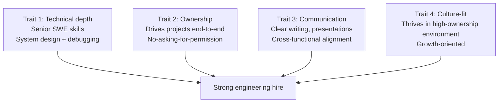
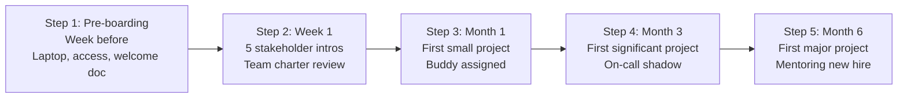

# Engineering Director Playbook
## Chapter 5

# Engineering Hiring and Onboarding

> *"The ED hires 5-7 engineers per quarter. The 4-hire traits, the 3-stage loop, the 5-step onboarding, and the 30-day ramp are the ED's reference for engineering hiring at the function level."*

---

## 1. Epigraph

_The ED hires 5-7 engineers per quarter. The 4-hire traits, the 3-stage loop, the 5-step onboarding, and the 30-day ramp are the ED's reference for engineering hiring at the function level._

---

## 2. Problem

You are an Engineering Director at acme-corp. The VP has just told you: "We need to hire 5-7 engineers this quarter across 5 EMs. The current loop is too slow (60-day average time-to-hire). The onboarding is inconsistent (3-month ramp to productivity). The retention rate is 80% (industry standard is 90%+). Design the hiring + onboarding system. 90 days."

This chapter tells you the 4-hire traits, the 3-stage loop, the 5-step onboarding, and the 30-day ramp.

**Decision in one sentence:** _ED engineering hiring is a 4-trait profile (technical depth, ownership, communication, culture-fit) + 3-stage loop (screen + onsite + reference) + 5-step onboarding (pre-boarding → week 1 → month 1 → month 3 → month 6) with 30-day ramp to productivity; the ED's job is to design the loop, run it on cadence, and own the onboarding._

---

## 3. Why EDs Fail Here

Five named failure modes of EDs whose engineering hiring produced zero results.

- **The SWE-Hire-Profile Failure.** The ED hires like a SWE. _Ownership + culture-fit are not tested._
- **The 60-Day-Time-to-Hire Failure.** The loop takes 60+ days. _Top candidates accept other offers._
- **The No-Onboarding-System Failure.** The ED hires but doesn't onboard. _3-month ramp to productivity._
- **The 80%-Retention Failure.** The retention is below industry standard. _Compensation + career growth are off._
- **The No-Reference-Check Failure.** The ED skips reference checks. _Bad hires ship 6 months later._

---

## 4. Mental Models

Four mental models that compress engineering hiring.

**mental model 1: The 4 Hire Traits.** 4 traits, not 1.



**The 4 traits:**
- **Trait 1: Technical depth.** Senior SWE skills. System design + debugging.
- **Trait 2: Ownership.** Drives projects end-to-end. No asking for permission.
- **Trait 3: Communication.** Clear writing, presentations. Cross-functional alignment.
- **Trait 4: Culture-fit.** Thrives in high-ownership environment. Growth-oriented.

**mental model 2: The 3-Stage Interview Loop.** 3 stages, ownership tested.

```
Stage 1: Screen (60 min, video call)
- 30 min: technical depth (system design + coding)
- 30 min: ownership (past projects, end-to-end)

Stage 2: Onsite (4 hours, half-day)
- 1 hour: technical depth (system design or live coding)
- 1 hour: ownership (case study or past-project deep dive)
- 1 hour: communication (cross-functional scenario)
- 1 hour: culture-fit (hiring manager + skip-level)

Stage 3: Reference (45 min)
- 2 references from past managers
- 1 reference from past peer
```

**mental model 3: The 5-Step Onboarding.** 5 steps, 6 months.



**The 5 steps:**
- **Step 1: Pre-boarding (week before).** Laptop, access, welcome doc.
- **Step 2: Week 1.** 5 stakeholder intros. Team charter review.
- **Step 3: Month 1.** First small project. Buddy assigned.
- **Step 4: Month 3.** First significant project. On-call shadow.
- **Step 5: Month 6.** First major project. Mentoring new hire.

**mental model 4: The 30-Day Ramp to Productivity.** 30 days.

```
Day 1-7: Orientation
- 5 stakeholder intros (EM, peers, PM, design, CS)
- Team charter review
- Architecture overview

Day 8-14: Setup
- Dev environment up
- First PR shipped (small fix)
- Code review on 5 PRs from team

Day 15-21: First small project
- Bug fix or small feature (1-3 days)
- Demo to team
- Code review on 10+ PRs

Day 22-30: First significant project
- Multi-week project assigned
- Design doc reviewed
- Implementation in progress
```

---

## 5. Frameworks

Three frameworks for engineering hiring.

### Framework 1: The 1-Page Hire Profile

```
# Engineering Hire Profile — [Quarter] — [Date]

## The 4 traits
| Trait | Must-have | Nice-to-have |
|-------|-----------|---------------|
| 1. Technical depth | Senior SWE (IC3+) | System design experience |
| 2. Ownership | Past end-to-end projects | Side projects |
| 3. Communication | Clear writing | Public speaking |
| 4. Culture-fit | High-ownership | Growth-oriented |

## The 3-stage loop
- Stage 1 (60 min): technical + ownership screen
- Stage 2 (4 hours): technical + ownership + communication + culture-fit
- Stage 3 (45 min): 3 references

## The 1 thing the ED will NOT compromise on
[1 sentence.]
```

### Framework 2: The Hiring Pipeline Tracker

```
# Hiring Pipeline — [Quarter] — [Date]

| Stage | Target | Current | Status |
|-------|--------|---------|--------|
| Sourced | 50 | [N] | [Status] |
| Screened | 25 | [N] | [Status] |
| Onsite | 12 | [N] | [Status] |
| Offers | 7 | [N] | [Status] |
| Accepted | 5-7 | [N] | [Status] |

## Time-to-hire
- Target: 30 days (screen to offer)
- Current: [N] days

## Top 3 risks
1. [Risk 1]
2. [Risk 2]
3. [Risk 3]
```

### Framework 3: The 5-Step Onboarding Checklist

```
# Onboarding Checklist — [New Hire] — [Start Date]

## Step 1: Pre-boarding (week before)
- [ ] Laptop shipped
- [ ] Tool access granted (GitHub, Slack, AWS, Datadog)
- [ ] Welcome doc sent
- [ ] Buddy assigned

## Step 2: Week 1
- [ ] 5 stakeholder intros scheduled
- [ ] Team charter reviewed
- [ ] Architecture overview
- [ ] First PR shipped (small fix)

## Step 3: Month 1
- [ ] First small project completed
- [ ] Code review on 10+ PRs
- [ ] 30-day check-in with EM

## Step 4: Month 3
- [ ] First significant project completed
- [ ] On-call shadow rotation
- [ ] 60-day check-in with EM

## Step 5: Month 6
- [ ] First major project completed
- [ ] Mentoring next new hire
- [ ] 90-day + 6-month check-in with EM
```

---

## 6. Drill

You are an ED at **acme-corp**. The VP has given you 90 days to fix the hiring system.

```
Current state:
- 5-7 hires/quarter target
- 60-day time-to-hire (too slow)
- 80% retention (below 90% target)
- 3-month ramp to productivity

5 EMs across 4 teams (Product + Platform + Data/ML + Quality/SRE).
```

You have **90 minutes**. Produce the **hiring system redesign** (`portfolio/chapter-05-engineering-hiring.md`) using Framework 1 (Hire Profile) + Framework 2 (Pipeline Tracker) + Framework 3 (Onboarding Checklist). Specify:

- The 1-page hire profile (4 traits, 3-stage loop, the 1 not compromise).
- The hiring pipeline tracker (5 stages, target vs current, top 3 risks).
- The 5-step onboarding checklist (per new hire, 6-month plan).
- The 90-day timeline.
- The 1 thing you'll say to the VP in the first review.
- The 3 things you'll do to avoid the 5 failure modes.

**Deliverable:** `portfolio/chapter-05-engineering-hiring.md` — under 1500 words.

---

## 7. Worked Example

**The 1-page hire profile:**

```
# Engineering Hire Profile — Q4 2026 — 2026-09-01

## The 4 traits
| Trait | Must-have | Nice-to-have |
|-------|-----------|---------------|
| 1. Technical depth | Senior SWE (IC3+) | System design experience |
| 2. Ownership | Past end-to-end projects | Side projects, OSS |
| 3. Communication | Clear writing | Public speaking, tech talks |
| 4. Culture-fit | High-ownership environment | Growth-oriented |

## The 3-stage loop
- Stage 1 (60 min): technical screen (30m) + ownership screen (30m)
- Stage 2 (4 hours): system design (1h) + ownership case (1h) + comms (1h) + culture-fit (1h)
- Stage 3 (45 min): 3 references (2 managers + 1 peer)

## The 1 thing the ED will NOT compromise on
Ownership. A SWE without ownership will plateau at
IC3 and become a management problem in 18 months.
Ownership is non-negotiable.
```

**The hiring pipeline tracker:**

```
# Hiring Pipeline — Q4 2026 — 2026-09-01

| Stage | Target | Current | Status |
|-------|--------|---------|--------|
| Sourced | 50 | 30 | YELLOW |
| Screened | 25 | 15 | YELLOW |
| Onsite | 12 | 5 | RED |
| Offers | 7 | 2 | RED |
| Accepted | 5-7 | 1 | RED |

## Time-to-hire
- Target: 30 days
- Current: 60 days

## Top 3 risks
1. Onsite pipeline too small (5 vs 12 target)
2. Time-to-hire too long (60 vs 30 days)
3. Accepted offers too low (1 vs 5-7 target)

## The 1 thing to fix first
Onsite pipeline. Without 12 onsites, we can't make
7 offers. Without 7 offers, we can't accept 5-7.
```

**The 5-step onboarding checklist:**

```
# Onboarding Checklist — New Hire — Start: 2026-10-01

## Step 1: Pre-boarding (week of Sept 24)
- [x] Laptop shipped (MacBook Pro M3)
- [x] Tool access granted (GitHub, Slack, AWS, Datadog, PagerDuty)
- [x] Welcome doc sent (team charter + 30-day plan)
- [x] Buddy assigned (Sarah, IC3 on Platform team)

## Step 2: Week 1 (Sept 30 - Oct 4)
- [ ] 5 stakeholder intros: EM, peers (3), PM, Design, CS
- [ ] Team charter reviewed
- [ ] Architecture overview
- [ ] First PR shipped (typo fix in docs)

## Step 3: Month 1 (October)
- [ ] First small project: bug fix (1-3 days)
- [ ] Code review on 10+ PRs from team
- [ ] 30-day check-in with EM

## Step 4: Month 3 (December)
- [ ] First significant project: feature (2-3 weeks)
- [ ] On-call shadow rotation
- [ ] 60-day check-in with EM

## Step 5: Month 6 (March 2027)
- [ ] First major project: cross-team initiative
- [ ] Mentoring next new hire
- [ ] 90-day + 6-month check-in with EM
```

**The 90-day timeline:**

```
# 90-Day Hiring System Timeline — 2026-09-01

## Week 1-2: Diagnose
- [x] Current pipeline analyzed
- [x] Top 3 risks identified
- [x] Hire profile redrafted

## Week 3-6: Loop redesign
- [ ] Stage 1 redesigned (60 min)
- [ ] Stage 2 redesigned (4 hours)
- [ ] Stage 3 redesigned (45 min)

## Week 7-10: Onboarding redesign
- [ ] 5-step onboarding documented
- [ ] Buddy program established
- [ ] Welcome doc template

## Week 11-12: Rollout
- [ ] Loop + onboarding launched
- [ ] 5 EMs trained
- [ ] First hires through new system (target: 2 hires)
```

**The 1 thing I'll say to the VP in the first review:**

```
"Here's the hiring system redesign:

  4 traits: technical depth + ownership + communication
  + culture-fit

  3-stage loop: 60-min screen + 4-hour onsite +
  45-min reference

  5-step onboarding: pre-boarding → week 1 → month 1
  → month 3 → month 6

  Current state:
  - Time-to-hire: 60 days (target: 30)
  - Retention: 80% (target: 90%+)
  - Ramp to productivity: 3 months (target: 1 month)

  Top 3 risks:
  1. Onsite pipeline too small (5 vs 12 target)
  2. Time-to-hire too long (60 vs 30 days)
  3. Accepted offers too low (1 vs 5-7 target)

  The 1 thing I want to fix first: onsite pipeline.
  Without 12 onsites, we can't make 7 offers.

  The 1 thing I will NOT compromise on: ownership.
  A SWE without ownership will plateau at IC3.

  90-day plan: week 1-2 diagnose, week 3-6 loop
  redesign, week 7-10 onboarding redesign, week 11-12
  rollout. Target: 2 hires through new system."
```

**The 3 things I'll do to avoid the 5 failure modes:**

```
1. Hire for ownership, not just technical depth.
   (Avoids the SWE-Hire-Profile Failure.)
   - 30 min of screen dedicated to ownership
   - Past end-to-end projects required
   - Case study on ownership in onsite

2. Compress time-to-hire to 30 days.
   (Avoids the 60-Day-Time-to-Hire Failure.)
   - Stage 1 + 2 + 3 in 30 days
   - Same-week decisions after onsite
   - Offer in 48 hours after reference check

3. Use the 5-step onboarding system.
   (Avoids the No-Onboarding-System Failure.)
   - Pre-boarding (week before)
   - Week 1 (5 intros + first PR)
   - Month 1 (small project)
   - Month 3 (significant project)
   - Month 6 (major project + mentoring)
```

---

## 8. Failure Mode Postmortem

An ED at a 200-person B2B AI company had 5-7 hires/quarter target. The ED hired like a SWE: technical depth only, no ownership test. Time-to-hire was 60 days. Retention was 80% (below 90% target). 3-month ramp to productivity. The ED hired 4 in Q1, 3 in Q2, 2 in Q3 (below target).

The replacement ED did 3 things:
1. Hired for ownership (4-trait profile, 30 min of screen dedicated to ownership).
2. Compressed time-to-hire to 30 days (3-stage loop, same-week decisions).
3. Built 5-step onboarding (pre-boarding → month 6 with buddy + EM check-ins).

Within 6 months: 5-7 hires/quarter target met. Retention 92%. Ramp to productivity 1 month. The 4-trait + 3-stage + 5-step system was the discipline.

What the first ED missed: hiring is a system. The first ED hired like a SWE. The second ED hired like an ED. The ED-level system is the leverage.

The lesson: the ED who has 4 traits + 3-stage loop + 5-step onboarding has a high-performing engineering org. The ED who hires like a SWE has a SWE-with-ED-title.

---

## 9. Self-Assessment Rubric

| # | Dimension | 1 (Novice) | 3 (Competent) | 5 (Expert) |
|---|---|---|---|---|
| 1 | **4 hire traits** | 1 trait (technical) | 2-3 traits | 4 traits (technical + ownership + communication + culture-fit) |
| 2 | **3-stage loop** | 1 stage | 2 stages | 3 stages (screen + onsite + reference), 30-day time-to-hire |
| 3 | **5-step onboarding** | No onboarding | Onboarding exists | 5 steps (pre-boarding → month 6), 1-month ramp |
| 4 | **Hiring pipeline tracker** | No tracker | Tracker exists | 5 stages (sourced → accepted), 30-day time-to-hire |
| 5 | **Retention rate** | <80% | 80-90% | >90% annual retention |

**Disqualifier:** any 1 on dimension 1 or 3. An ED who hires on 1 trait or has no onboarding is in the SWE-Hire-Profile or No-Onboarding-System failure mode.

**Total:** ___ / 25. **Pass threshold:** 18/25, no dimension below 3.

---

## 10. Portfolio Artifact Note

Save your filled-in drill as `portfolio/chapter-05-engineering-hiring.md` — interview evidence for "How do you hire engineers?" (see Portfolio Map in Chapter 27).

---

## 11. Interview Questions

1. **Walk me through your engineering hiring system.**
2. **A candidate has strong technical skills but no ownership. Hire?**
3. **Your time-to-hire is 60 days. What do you do?**
4. **A new hire is struggling in month 1. What do you do?**
5. **Walk me through a great engineering hire you've made.**
