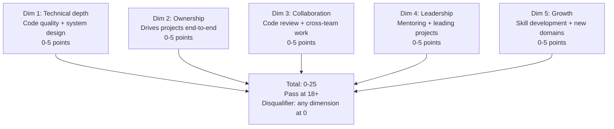
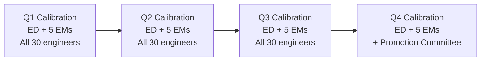

# Engineering Director Playbook
## Chapter 6

# Engineering Performance Management

> *"The ED runs performance reviews for 30+ engineers across 5 EMs. The 5-dimension rubric, the 3-tier calibration, the quarterly cadence, and the 12-month development plan are the ED's reference for engineering performance at the function level."*

---

## 1. Epigraph

_The ED runs performance reviews for 30+ engineers across 5 EMs. The 5-dimension rubric, the 3-tier calibration, the quarterly cadence, and the 12-month development plan are the ED's reference for engineering performance at the function level._

---

## 2. Problem

You are an Engineering Director at acme-corp. The VP has just told you: "Performance reviews in 30 days. 30 engineers across 5 EMs. The current rubric is the SWE rubric (code output only). The retention is dropping (80%). The promotion pipeline is unclear. Design the engineering performance system."

This chapter tells you the 5-dimension rubric, the 3-tier calibration, the quarterly cadence, and the 12-month development plan.

**Decision in one sentence:** _ED engineering performance management is a 5-dimension rubric (technical depth, ownership, collaboration, leadership, growth) + 3-tier calibration (exceeds / meets / below) + quarterly cadence + 12-month development plan per engineer; the ED's job is to design the rubric, calibrate across EMs, and own the development plans._

---

## 3. Why EDs Fail Here

Five named failure modes of EDs whose engineering performance produced zero results.

- **The SWE-Rubric Failure.** The ED uses the SWE rubric. _Collaboration + leadership are invisible._
- **The No-Calibration Failure.** The ED has no cross-EM calibration. _Each EM rates differently._
- **The Annual-Only Failure.** The ED reviews annually. _No course correction._
- **The No-Development-Plan Failure.** The ED has no 12-month plan. _No growth trajectory._
- **The No-Promotion-Pipeline Failure.** The ED has no clear promotion criteria. _Engineers leave for "Senior IC" titles elsewhere._

---

## 4. Mental Models

Four mental models that compress engineering performance.

**mental model 1: The 5-Dimension Engineering Rubric.** 5 dimensions, 0-25 total.



**The 5 dimensions:**
- **Dim 1: Technical depth.** Code quality + system design. 0-5 points.
- **Dim 2: Ownership.** Drives projects end-to-end. 0-5 points.
- **Dim 3: Collaboration.** Code review + cross-team work. 0-5 points.
- **Dim 4: Leadership.** Mentoring + leading projects. 0-5 points.
- **Dim 5: Growth.** Skill development + new domains. 0-5 points.

**mental model 2: The 3-Tier Calibration.** 3 tiers.

```
5 (Exceeds): Far above bar. Promotion candidate.
4 (Strong): Above bar. High performer.
3 (Meets): At bar. Solid contributor.
2 (Below): Below bar. Needs improvement.
1 (Far below): Far below bar. PIP candidate.
0 (Disqualifier): Critical issue (e.g., ethical violation).
```

**mental model 3: The Quarterly Calibration Cadence.** 4 times a year.



**The 4 calibrations:**
- **Q1.** ED + 5 EMs. All 30 engineers.
- **Q2.** Same.
- **Q3.** Same.
- **Q4.** Same + promotion committee.

**mental model 4: The 12-Month Development Plan.** 1 plan per engineer.

```
Quarter 1: Top 1 development area
- [Action 1] — [Date]
- [Action 2] — [Date]

Quarter 2: Top 2 development area
- [Action 1] — [Date]
- [Action 2] — [Date]

Quarter 3: Promotion criteria (if applicable)
- [Action 1] — [Date]
- [Action 2] — [Date]

Quarter 4: Year-end review
- [Action 1] — [Date]
- [Action 2] — [Date]
```

---

## 5. Frameworks

Three frameworks for engineering performance.

### Framework 1: The 5-Dimension Performance Rubric

```
# Engineering Performance Rubric — [Engineer] — [Quarter]

| Dimension | Score (0-5) | Notes |
|-----------|-------------|-------|
| 1. Technical depth | [Score] | [Notes] |
| 2. Ownership | [Score] | [Notes] |
| 3. Collaboration | [Score] | [Notes] |
| 4. Leadership | [Score] | [Notes] |
| 5. Growth | [Score] | [Notes] |
| Total | ___ / 25 | Pass at 18+ |

## Disqualifier check
- Any dimension at 0? Y/N
- Ethical violation? Y/N

## Tier
- Exceeds (22+): Promotion candidate
- Strong (20-21): High performer
- Meets (18-19): Solid contributor
- Below (15-17): Needs improvement
- Far below (<15): PIP candidate
```

### Framework 2: The Quarterly Calibration Memo

```
# Quarterly Calibration — [Quarter] — [Date]

## All 30 engineers
| Engineer | Tech | Owner | Collab | Lead | Growth | Total | Tier |
|----------|------|-------|--------|------|--------|-------|------|
| [Eng 1] | [S] | [S] | [S] | [S] | [S] | [T] | [Tier] |
| [Eng 2] | ... | | | | | | |
...

## Top 3 calibration outcomes
1. [Eng 1] — Promotion candidate
2. [Eng 2] — PIP candidate
3. [Eng 3] — Solid contributor

## The 1 thing the team will focus on next quarter
[1 sentence.]
```

### Framework 3: The 12-Month Development Plan

```
# 12-Month Development Plan — [Engineer] — [Date]

## Current level
[IC2 / IC3 / IC4 / EM]

## Target level (12 months)
[IC3 / IC4 / EM]

## Top 3 development areas
1. [Area 1] — Why: [Reason]
2. [Area 2] — Why: [Reason]
3. [Area 3] — Why: [Reason]

## Quarterly plan
### Q1
- [Action 1] — [Date]
- [Action 2] — [Date]

### Q2
- [Action 1] — [Date]
- [Action 2] — [Date]

### Q3
- [Action 1] — [Date]
- [Action 2] — [Date]

### Q4
- [Action 1] — [Date]
- [Action 2] — [Date]

## The 1 thing the engineer will push back on
[1 sentence.]
```

---

## 6. Drill

You are an ED at **acme-corp**. The VP has given you 30 days to design the performance system.

```
30 engineers across 5 EMs (Product + Platform + Data/ML + Quality/SRE + Tools).
Current rubric: SWE-only (code output).
Retention: 80% (target 90%+).
Promotion pipeline: unclear.

Performance reviews in 30 days.
```

You have **90 minutes**. Produce the **performance system redesign** (`portfolio/chapter-06-engineering-performance.md`) using Framework 1 (Rubric) + Framework 2 (Calibration) + Framework 3 (Development Plan). Specify:

- The 5-dimension rubric applied to 3 sample engineers (exceeds, meets, below).
- The quarterly calibration memo (30 engineers ranked, top 3 outcomes).
- The 12-month development plan for 1 below-bar engineer.
- The 30-day timeline.
- The 1 thing you'll say to the VP in the first review.
- The 3 things you'll do to avoid the 5 failure modes.

**Deliverable:** `portfolio/chapter-06-engineering-performance.md` — under 1500 words.

---

## 7. Worked Example

**The 5-dimension rubric applied to 3 sample engineers:**

```
# Engineering Performance Rubric — Q3 2026 — 2026-09-30

| Engineer | Tech | Owner | Collab | Lead | Growth | Total | Tier |
|----------|------|-------|--------|------|--------|-------|------|
| Eng A (IC3) | 5 | 5 | 4 | 4 | 4 | 22 | Exceeds |
| Eng B (IC3) | 4 | 3 | 3 | 3 | 3 | 16 | Below |
| Eng C (IC2) | 3 | 3 | 4 | 2 | 4 | 16 | Below |

## Tier summary
- Exceeds (22+): Eng A — Promotion candidate
- Strong (20-21): None
- Meets (18-19): None
- Below (15-17): Eng B, Eng C — Need improvement plans
- Far below (<15): None
```

**The quarterly calibration memo:**

```
# Quarterly Calibration — Q3 2026 — 2026-09-30

## All 30 engineers
(ranked by total score)

| Top 5 | Score | Tier |
|-------|-------|------|
| Eng A | 25 | Exceeds |
| Eng D | 23 | Exceeds |
| Eng E | 22 | Exceeds |
| Eng F | 21 | Strong |
| Eng G | 20 | Strong |

| Bottom 5 | Score | Tier |
|----------|-------|------|
| Eng X | 12 | Far below (PIP) |
| Eng Y | 14 | Far below (PIP) |
| Eng Z | 15 | Below |
| Eng B | 16 | Below |
| Eng C | 16 | Below |

## Top 3 calibration outcomes
1. **3 promotion candidates** (Eng A, D, E) — Promotion packets due Q4
2. **2 PIP candidates** (Eng X, Y) — 90-day PIP starting Oct 1
3. **5 below-bar engineers** (Eng B, C, Z, others) — Development plans

## The 1 thing the team will focus on next quarter
2 PIPs + 3 promotions. The promotion packets are
the easy win. The PIPs are the hard decisions.
```

**The 12-month development plan for Eng B (Below):**

```
# 12-Month Development Plan — Eng B — 2026-09-30

## Current level
IC3 (Senior SWE)

## Target level (12 months)
IC3 (stay at level) — focus on improvement

## Top 3 development areas
1. **Ownership** (current 3) — Why: Drives projects to
   80% completion but doesn't push to 100%
2. **Leadership** (current 3) — Why: No mentoring, no
   project leadership
3. **Growth** (current 3) — Why: Stuck in same domain for
   18 months

## Quarterly plan

### Q4 2026
- [ ] Drive 1 project end-to-end (no PM handoff)
- [ ] Mentor 1 junior engineer (biweekly 1:1)
- [ ] Learn 1 new domain (AI/ML infra)

### Q1 2027
- [ ] Drive 2 projects end-to-end
- [ ] Lead 1 cross-team initiative
- [ ] Present at engineering all-hands

### Q2 2027
- [ ] Drive 3 projects end-to-end
- [ ] Mentor 2 junior engineers
- [ ] Ship in 2 domains

### Q3 2027
- [ ] Year-end review (target: meets bar)
- [ ] Promotion packet (if at bar)

## The 1 thing Eng B will push back on
The plan is too aggressive. Eng B will say "I have
a family, I can't take on more." The ED responds:
the plan is achievable in 8 hours/week extra, the
goal is meets bar, not promotion.
```

**The 1 thing I'll say to the VP in the first review:**

```
"Here's the engineering performance system:

  5-dimension rubric: technical depth + ownership +
  collaboration + leadership + growth

  3-tier calibration: exceeds / meets / below

  Quarterly cadence: 4 calibrations per year
  (Q1-Q4), Q4 includes promotion committee

  30 engineers across 5 EMs

  Top 3 outcomes:
  1. 3 promotion candidates (Eng A, D, E)
  2. 2 PIP candidates (Eng X, Y)
  3. 5 below-bar engineers with development plans

  The 1 thing I want to focus on: the 2 PIPs.
  The 90-day PIP is the hardest decision but the
  right one. Eng X and Eng Y are far below bar.

  The 1 thing I will NOT compromise on: collaboration.
  An engineer who is technically strong but doesn't
  collaborate is below bar. The 5-dimension rubric
  catches this.

  Performance management is the discipline. Engineer
  growth is the outcome."
```

**The 3 things I'll do to avoid the 5 failure modes:**

```
1. Use 5 dimensions (not SWE rubric).
   (Avoids the SWE-Rubric Failure.)
   - Technical + ownership + collaboration + leadership + growth
   - Each dim = 0-5 points
   - Total = 0-25

2. Run quarterly calibration (not annual).
   (Avoids the Annual-Only Failure.)
   - Q1, Q2, Q3 quarterly
   - Q4 quarterly + promotion committee
   - Cross-EM calibration

3. Give every engineer a 12-month development plan.
   (Avoids the No-Development-Plan Failure.)
   - Top 3 development areas
   - Quarterly actions
   - Promotion criteria (if applicable)
   - PIP (if applicable)
```

---

## 8. Failure Mode Postmortem

An ED at a 200-person B2B AI company had 30 engineers using the SWE rubric (code output only). Collaboration + leadership were invisible. 3 best engineers left for "Senior IC" titles elsewhere (because they couldn't get promoted under SWE rubric). Retention dropped from 90% to 80%.

The replacement ED did 3 things:
1. Built 5-dimension rubric (technical + ownership + collaboration + leadership + growth).
2. Ran quarterly calibration (cross-EM, promotion committee Q4).
3. Built 12-month development plans for all 30 engineers.

Within 6 months: 3 promotions (Eng A, D, E). 2 PIPs (Eng X, Y). 5 development plans. Retention recovered to 92%. The 5-dim + 3-tier + 12-month system was the discipline.

What the first ED missed: performance is a system. The first ED used SWE rubric. The second ED used 5-dim rubric. The 5-dim rubric is the leverage.

The lesson: the ED who has 5 dimensions + 3 tiers + 12-month plans has a high-performing engineering org. The ED who uses SWE rubric has a SWE-rated engineering org.

---

## 9. Self-Assessment Rubric

| # | Dimension | 1 (Novice) | 3 (Competent) | 5 (Expert) |
|---|---|---|---|---|
| 1 | **5-dim rubric** | 1-2 dims | 3-4 dims | 5 dims (tech + owner + collab + lead + growth) |
| 2 | **3-tier calibration** | 1 tier | 2 tiers | 3 tiers (exceeds / meets / below), with disqualifier |
| 3 | **Quarterly cadence** | Annual review | Semi-annual | Quarterly (Q1-Q4), with promotion committee Q4 |
| 4 | **12-month dev plan** | No plan | Plan exists | 1 plan per engineer, top 3 areas, quarterly actions |
| 5 | **Promotion pipeline** | No pipeline | Pipeline exists | 3 promotions/year target, clear criteria per level |

**Disqualifier:** any 1 on dimension 1 or 2. An ED who uses 1-2 dims or 1 tier is in the SWE-Rubric or No-Calibration failure mode.

**Total:** ___ / 25. **Pass threshold:** 18/25, no dimension below 3.

---

## 10. Portfolio Artifact Note

Save your filled-in drill as `portfolio/chapter-06-engineering-performance.md` — interview evidence for "How do you run engineering performance management?" (see Portfolio Map in Chapter 27).

---

## 11. Interview Questions

1. **Walk me through your engineering performance system.**
2. **An engineer is technically strong but doesn't collaborate. What tier?**
3. **You have 2 PIPs and 3 promotions. How do you prioritize?**
4. **The retention is dropping. What do you do?**
5. **Walk me through a performance review you've run.**
