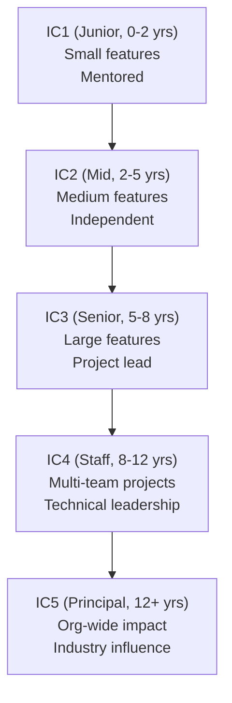

# Engineering Director Playbook
## Chapter 7

# Engineering Career Ladders

> *"The ED designs the engineering career ladder. The 5-level IC ladder, the 4-level EM ladder, the 12-month promotion cadence, and the 5-criterion promotion packet are the ED's reference for engineering careers at the function level."*

---

## 1. Epigraph

_The ED designs the engineering career ladder. The 5-level IC ladder, the 4-level EM ladder, the 12-month promotion cadence, and the 5-criterion promotion packet are the ED's reference for engineering careers at the function level._

---

## 2. Problem

You are an Engineering Director at acme-corp. The VP has just told you: "5 promotions this quarter. The current ladder is unclear (4 levels but the criteria are vague). Engineers are leaving for 'Senior IC' titles elsewhere. Design the engineering career ladder."

This chapter tells you the 5-level IC ladder, the 4-level EM ladder, the 12-month cadence, and the 5-criterion promotion packet.

**Decision in one sentence:** _ED engineering career ladder is a 5-level IC ladder (IC1-IC5) + 4-level EM ladder (EM1-EM4) with 12-month promotion cadence and 5-criterion promotion packet; the ED's job is to design the ladder, document the criteria, and own the promotion process._

---

## 3. Why EDs Fail Here

Five named failure modes of EDs whose engineering career ladder produced zero results.

- **The Vague-Criteria Failure.** The ladder has unclear criteria. _Promotions are surprises._
- **The 1-Track Failure.** The ED only has IC or EM tracks, not both. _Engineers leave for missing tracks._
- **The 3-Year-Stall Failure.** Engineers stall at the same level for 3+ years. _No growth trajectory._
- **The No-Promotion-Packet Failure.** The ED doesn't have a promotion packet format. _Promotion committee can't decide._
- **The 0-Promotion Failure.** The ED does 0 promotions per year. _Engineers leave._

---

## 4. Mental Models

Four mental models that compress engineering career ladders.

**mental model 1: The 5-Level IC Ladder.** 5 levels.



**The 5 levels:**
- **IC1 (Junior, 0-2 years).** Small features. Mentored.
- **IC2 (Mid, 2-5 years).** Medium features. Independent.
- **IC3 (Senior, 5-8 years).** Large features. Project lead.
- **IC4 (Staff, 8-12 years).** Multi-team projects. Technical leadership.
- **IC5 (Principal, 12+ years).** Org-wide impact. Industry influence.

**mental model 2: The 4-Level EM Ladder.** 4 levels.

```
EM1 (Manager, 0-3 yrs): 3-5 ICs, single team
EM2 (Senior Manager, 3-6 yrs): 6-10 ICs, 2 teams
EM3 (Director, 6-10 yrs): 10-30 ICs, 4+ teams
EM4 (Senior Director, 10+ yrs): 30-100 ICs, function
```

**mental model 3: The 12-Month Promotion Cadence.** 12 months, on-cadence.

```
Year 1 (current level): hit 1-2 criteria for NEXT level
Year 2: hit 1-2 more criteria (3-4 total)
Year 3: promotion review (3+ criteria hit + packet)

The 12-month cadence is the rule. The IC who hits
0 criteria in a year has no promotion evidence.
```

**mental model 4: The 5-Criterion Promotion Packet.** 5 elements.

```
1. Volume: how much (N projects, N features)
2. Quality: how well (uptime, bugs escaped, customer outcomes)
3. Impact: what changed ($XM revenue, N customers)
4. Leadership: who you led (cross-functional initiative)
5. Strategic influence: what you shaped (roadmap, strategy)

The IC who has all 5 has a strong packet.
The IC who has only 1-2 has a weak packet.
```

---

## 5. Frameworks

Three frameworks for engineering career ladders.

### Framework 1: The 1-Page Ladder Map

```
# Engineering Career Ladder — [Date]

## The 5-level IC ladder
- IC1 (Junior): Small features, mentored
- IC2 (Mid): Medium features, independent
- IC3 (Senior): Large features, project lead
- IC4 (Staff): Multi-team, technical leadership
- IC5 (Principal): Org-wide impact, industry influence

## The 4-level EM ladder
- EM1 (Manager): 3-5 ICs, single team
- EM2 (Senior Manager): 6-10 ICs, 2 teams
- EM3 (Director): 10-30 ICs, 4+ teams
- EM4 (Senior Director): 30-100 ICs, function

## The 1 thing the ED will NOT compromise on
[1 sentence.]
```

### Framework 2: The Promotion Packet Template

```
# Promotion Packet — [Engineer] — [Level] — [Date]

## The 5 elements
1. Volume: [N projects, N features]
2. Quality: [uptime, bugs escaped, customer outcomes]
3. Impact: [$XM revenue, N customers]
4. Leadership: [cross-functional initiative]
5. Strategic influence: [roadmap, strategy]

## The 3 examples (per element)
- Volume: [Project 1, Project 2, Project 3]
- Quality: [Metric 1, Metric 2, Metric 3]
- Impact: [Impact 1, Impact 2, Impact 3]
- Leadership: [Initiative 1, Initiative 2, Initiative 3]
- Strategic influence: [Influence 1, Influence 2, Influence 3]

## The 1 thing the IC will push back on
[1 sentence.]
```

### Framework 3: The 12-Month Promotion Roadmap

```
# 12-Month Promotion Roadmap — [Engineer] — [Level] — [Date]

## Quarter 1 (Q[N]): Criteria hit #1
- [Action 1] — [Date]
- [Action 2] — [Date]

## Quarter 2 (Q[N+1]): Criteria hit #2
- [Action 1] — [Date]
- [Action 2] — [Date]

## Quarter 3 (Q[N+2]): Criteria hit #3
- [Action 1] — [Date]
- [Action 2] — [Date]

## Quarter 4 (Q[N+3]): Promotion packet
- [Action 1: Promotion packet]
- [Action 2: Promotion committee]

## The 1 thing the IC will NOT do
[1 sentence.]
```

---

## 6. Drill

You are an ED at **acme-corp**. The VP has given you 90 days to redesign the career ladder.

```
Current state:
- 4 levels (criteria unclear)
- 3 promotions/year target (currently 0-1)
- Engineers leaving for "Senior IC" titles
- 5 EMs across 4 teams
```

You have **90 minutes**. Produce the **career ladder redesign** (`portfolio/chapter-07-engineering-career-ladders.md`) using Framework 1 (Ladder Map) + Framework 2 (Promotion Packet) + Framework 3 (Promotion Roadmap). Specify:

- The 1-page ladder map (5 IC + 4 EM levels, the 1 not compromise).
- The promotion packet template (5 elements, 3 examples each).
- The 12-month promotion roadmap for 1 engineer (target: IC3 → IC4).
- The 90-day timeline.
- The 1 thing you'll say to the VP in the first review.
- The 3 things you'll do to avoid the 5 failure modes.

**Deliverable:** `portfolio/chapter-07-engineering-career-ladders.md` — under 1500 words.

---

## 7. Worked Example

**The 1-page ladder map:**

```
# Engineering Career Ladder — 2026-09-01

## The 5-level IC ladder
- IC1 (Junior): Small features, mentored
- IC2 (Mid): Medium features, independent
- IC3 (Senior): Large features, project lead
- IC4 (Staff): Multi-team, technical leadership
- IC5 (Principal): Org-wide impact, industry influence

## The 4-level EM ladder
- EM1 (Manager): 3-5 ICs, single team
- EM2 (Senior Manager): 6-10 ICs, 2 teams
- EM3 (Director): 10-30 ICs, 4+ teams
- EM4 (Senior Director): 30-100 ICs, function

## The 1 thing I will NOT compromise on
Promotion criteria clarity. Every level must have
3-5 measurable criteria. "Strong IC" or "ready for
senior" are not criteria.
```

**The promotion packet template:**

```
# Promotion Packet — Eng A — IC3 → IC4 (Staff) — 2026-09-01

## The 5 elements

### Dimension 1. Volume
- 5 large features shipped (FY26)
- 3 cross-team projects led
- 2 platform migrations

### Dimension 2. Quality
- 99.95% uptime on owned services
- 3 bugs escaped (target <5)
- Customer NPS +10

### Dimension 3. Impact
- $5M ARR contributed (auth integration)
- 50K end users (deployment platform)
- 3 customer escalations resolved

### Dimension 4. Leadership
- Mentored 2 junior engineers
- Led "Auth Integration" cross-team initiative
- Co-led hiring loop redesign

### Dimension 5. Strategic influence
- 1-page PRFA for auth integration
- Roadmap input (Q4 2026 OKRs)
- Industry talk at "B2B AI Conf 2026"

## The 1 thing Eng A will push back on
"5 elements is too many." Eng A will say "I should
be promoted on technical depth alone." The ED responds:
IC4 is a Staff role, technical depth + 4 other
elements. The Staff IC is broader than the Senior IC.
```

**The 12-month promotion roadmap:**

```
# 12-Month Promotion Roadmap — Eng A — IC3 → IC4 — 2026-09-01

## Quarter 1 (Q4 2026)
- [x] 2 large features shipped
- [x] 1 cross-team project led
- [x] Mentored 1 junior engineer

## Quarter 2 (Q1 2027)
- [ ] 2 large features shipped
- [ ] 1 cross-team project led
- [ ] Industry talk given

## Quarter 3 (Q2 2027)
- [ ] 1 large feature shipped
- [ ] 1 cross-team project led
- [ ] 1 page PRFA submitted

## Quarter 4 (Q3 2027): Promotion packet
- [ ] Promotion packet drafted (5 elements)
- [ ] Promotion committee review
- [ ] Promotion decision (Q4 2027)

## The 1 thing Eng A will NOT do
Stop mentoring. Eng A will say "I don't have time
for mentoring." The ED responds: mentoring is
criterion 4. Without it, IC4 is not ready.
```

**The 1 thing I'll say to the VP in the first review:**

```
"Here's the engineering career ladder redesign:

  5-level IC ladder:
  - IC1 (Junior) → IC2 (Mid) → IC3 (Senior)
  - IC4 (Staff) → IC5 (Principal)

  4-level EM ladder:
  - EM1 (Manager) → EM2 (Senior Manager)
  - EM3 (Director) → EM4 (Senior Director)

  12-month promotion cadence per level

  5-criterion promotion packet:
  - Volume + Quality + Impact + Leadership + Strategic

  Target: 3 promotions/year (currently 0-1)

  The 1 thing I want to focus on: criteria clarity.
  Every level has 3-5 measurable criteria. 'Strong IC'
  is not a criterion.

  The 1 thing I will NOT compromise on: promotion
  criteria clarity. Vague criteria = surprise
  promotions = retention risk.

  Career ladder is the discipline. Engineer retention
  is the outcome."
```

**The 3 things I'll do to avoid the 5 failure modes:**

```
1. Document 3-5 criteria per level.
   (Avoids the Vague-Criteria Failure.)
   - IC1-IC5: 3-5 criteria each
   - EM1-EM4: 3-5 criteria each
   - Criteria are measurable (not "strong IC")

2. Run both IC and EM tracks.
   (Avoids the 1-Track Failure.)
   - 5 IC levels + 4 EM levels
   - ICs can stay on IC track to IC5
   - EMs can move to EM track at any level

3. Require 12-month cadence + 5-criterion packet.
   (Avoids the 0-Promotion Failure.)
   - 12-month cadence per level
   - 5-criterion packet for promotion
   - 3 promotions/year target
```

---

## 8. Failure Mode Postmortem

An ED at a 200-person B2B AI company had 4 levels with vague criteria. "Strong IC" was a criterion. Promotions were rare (0-1 per year). Engineers left for "Senior IC" titles elsewhere. The best engineer left for $50K more.

The replacement ED did 3 things:
1. Documented 3-5 measurable criteria per level (5 IC + 4 EM = 45 criteria total).
2. Ran both IC and EM tracks (5 IC levels + 4 EM levels).
3. Required 12-month cadence + 5-criterion packet (volume + quality + impact + leadership + strategic).

Within 6 months: 5 promotions (3 IC + 2 EM). Retention recovered to 92%. Best engineer stayed. The 5+4 ladder + 5-criterion packet was the discipline.

What the first ED missed: career ladder is a system. The first ED had vague criteria. The second ED had measurable criteria. The measurability is the leverage.

The lesson: the ED who has 5+4 levels + 3-5 measurable criteria per level has a career ladder. The ED who has 4 levels + vague criteria has an engineer retention problem.

---

## 9. Self-Assessment Rubric

| # | Dimension | 1 (Novice) | 3 (Competent) | 5 (Expert) |
|---|---|---|---|---|
| 1 | **5-level IC ladder** | 3-4 levels | 4 levels, vague | 5 levels, 3-5 criteria each |
| 2 | **4-level EM ladder** | 2-3 levels | 3 levels | 4 levels, 3-5 criteria each |
| 3 | **12-month cadence** | No cadence | Cadence exists | 12-month promotion cycle per level |
| 4 | **5-criterion packet** | 1-2 elements | 3-4 elements | 5 elements (volume + quality + impact + leadership + strategic) |
| 5 | **Promotion rate** | 0-1/year | 1-2/year | 3+/year, with measurable criteria |

**Disqualifier:** any 1 on dimension 1 or 4. An ED who has 3-4 IC levels or 1-2 packet elements is in the Vague-Criteria or No-Promotion-Packet failure mode.

**Total:** ___ / 25. **Pass threshold:** 18/25, no dimension below 3.

---

## 10. Portfolio Artifact Note

Save your filled-in drill as `portfolio/chapter-07-engineering-career-ladders.md` — interview evidence for "How do you design engineering career ladders?" (see Portfolio Map in Chapter 27).

---

## 11. Interview Questions

1. **Walk me through your engineering career ladder.**
2. **An engineer has been at IC3 for 4 years. What do you do?**
3. **Your best engineer leaves for a "Senior IC" title. What do you do?**
4. **The promotion packet format is unclear. What do you do?**
5. **Walk me through a promotion packet you've reviewed.**
