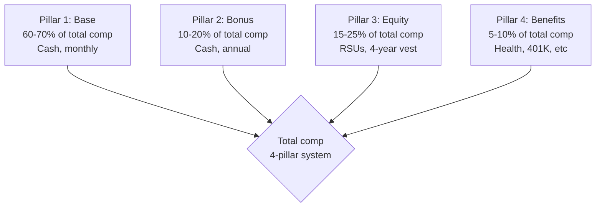
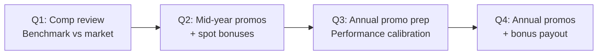

# Engineering Director Playbook
## Chapter 8

# Engineering Compensation and Promotions

> *"The ED owns the engineering comp + promo system. The 4 comp pillars, the 3 promo cycles, the 5-budget-allocation rules, and the 12-month comp planning cycle are the ED's reference for engineering comp at the function level."*

---

## 1. Epigraph

_The ED owns the engineering comp + promo system. The 4 comp pillars, the 3 promo cycles, the 5-budget-allocation rules, and the 12-month comp planning cycle are the ED's reference for engineering comp at the function level._

---

## 2. Problem

You are an Engineering Director at acme-corp. The VP has just told you: "5 promotions + $5M comp budget this quarter. The current comp system is opaque (engineers don't understand their total comp). The promo system is sporadic (0-1 per year, last minute). Design the comp + promo system."

This chapter tells you the 4 comp pillars, the 3 promo cycles, the 5-budget-allocation rules, and the 12-month comp planning cycle.

**Decision in one sentence:** _ED engineering comp + promo is a 4-pillar comp system (base + bonus + equity + benefits) + 3 promo cycles (annual + mid-year + spot) + 5-budget-allocation rules + 12-month comp planning cycle; the ED's job is to design the comp system, allocate the budget, and own the promo process._

---

## 3. Why EDs Fail Here

Five named failure modes of EDs whose engineering comp + promo produced zero results.

- **The Opaque-Comp Failure.** The comp system is a black box. _Engineers don't understand their total comp._
- **The Sporadic-Promo Failure.** Promos are 0-1 per year, last minute. _Engineers leave for clearer paths elsewhere._
- **The No-Budget-Allocation Failure.** The $5M budget is unallocated. _Comp decisions are ad-hoc._
- **The No-Total-Comp-Story Failure.** Engineers see only base. _Equity + benefits are invisible._
- **The Below-Market-Base Failure.** Base is below market. _Engineers leave for $20K more._

---

## 4. Mental Models

Four mental models that compress engineering comp + promo.

**mental model 1: The 4 Comp Pillars.** 4 pillars.



**The 4 pillars:**
- **Pillar 1: Base.** 60-70% of total comp. Cash, monthly.
- **Pillar 2: Bonus.** 10-20% of total comp. Cash, annual.
- **Pillar 3: Equity.** 15-25% of total comp. RSUs, 4-year vest.
- **Pillar 4: Benefits.** 5-10% of total comp. Health, 401K, etc.

**mental model 2: The 3 Promo Cycles.** 3 cycles.

```
Cycle 1: Annual (Q4 each year)
- 80% of promos
- All levels (IC1-IC5 + EM1-EM4)
- Driven by annual performance review

Cycle 2: Mid-year (Q2 each year)
- 15% of promos
- IC2-IC3 (mid-level)
- Driven by 6-month check-in

Cycle 3: Spot (anytime)
- 5% of promos
- IC3+ (high-level)
- Driven by exceptional contribution
```

**mental model 3: The 5-Budget-Allocation Rules.** 5 rules.

```
Rule 1: 70% of budget to base (preserve market)
Rule 2: 15% to bonus (variable comp)
Rule 3: 10% to equity refresh (retention)
Rule 4: 3% to promotion equity (recognition)
Rule 5: 2% to spot bonuses (exceptional contribution)

Total = 100% of $5M = $5M
- $3.5M base
- $750K bonus
- $500K equity refresh
- $150K promo equity
- $100K spot bonuses
```

**mental model 4: The 12-Month Comp Planning Cycle.** 12 months, quarterly cadence.



**The 4 quarters:**
- **Q1: Comp review.** Benchmark vs market.
- **Q2: Mid-year promos + spot bonuses.**
- **Q3: Annual promo prep.** Performance calibration.
- **Q4: Annual promos + bonus payout.**

---

## 5. Frameworks

Three frameworks for engineering comp + promo.

### Framework 1: The 1-Page Comp Plan

```
# Engineering Comp Plan — [Year] — [Date]

## The 4-pillar split
- Base: 70% ($3.5M)
- Bonus: 15% ($750K)
- Equity refresh: 10% ($500K)
- Promo equity: 3% ($150K)
- Spot bonuses: 2% ($100K)

## The 3 promo cycles
- Q4 Annual: 80% of promos
- Q2 Mid-year: 15% of promos
- Spot: 5% of promos

## The 5-budget-allocation rules
1. 70% base
2. 15% bonus
3. 10% equity refresh
4. 3% promo equity
5. 2% spot bonuses

## The 1 thing the ED will NOT compromise on
[1 sentence.]
```

### Framework 2: The Total Comp Calculator

```
# Total Comp Calculator — [Engineer] — [Level]

## Base
- Monthly: $[X]
- Annual: $[X × 12]

## Bonus
- Target: [% of base]
- Annual: $[base × %]

## Equity (RSUs)
- Grant: [N shares × $X/share]
- 4-year vest: 25%/year
- Annual value: $[total / 4]

## Benefits
- Health: $[X]
- 401K match: [$X]
- Other: $[X]
- Total: $[sum]

## Total Comp
- Base + Bonus + Equity + Benefits
- $[total]

## Compa-ratio (vs market)
- Total / market median: [ratio]
- Target: 0.95-1.05

## The 1 thing the engineer will push back on
[1 sentence.]
```

### Framework 3: The Promotion Equity Calculator

```
# Promotion Equity — [Engineer] — [From Level] → [To Level]

## Equity delta
- Current level: [N shares × $X]
- New level: [M shares × $X]
- Delta: [M - N] shares × $X = $[total]

## Vest schedule
- New grant: 25% / year × 4 years
- Refresh on promotion: [yes/no]

## Total comp impact
- New base: $[X]
- New bonus target: [% of base]
- New equity (annual): $[Y]

## The 1 thing the ED will NOT skip
[1 sentence.]
```

---

## 6. Drill

You are an ED at **acme-corp**. The VP has given you 90 days to redesign the comp + promo system.

```
Current state:
- $5M comp budget
- 5 promotions this quarter (currently 0-1 per year)
- 30 engineers across 5 EMs
- Comp is opaque (engineers don't see total comp)

You have 90 days.
```

You have **90 minutes**. Produce the **comp + promo system redesign** (`portfolio/chapter-08-engineering-comp.md`) using Framework 1 (Comp Plan) + Framework 2 (Total Comp Calculator) + Framework 3 (Promotion Equity Calculator). Specify:

- The 1-page comp plan (4-pillar split, 3 promo cycles, the 1 not compromise).
- The total comp calculator (1 sample engineer at IC3, full breakdown).
- The promotion equity calculator (1 IC3 → IC4 promotion, equity delta).
- The 90-day timeline.
- The 1 thing you'll say to the VP in the first review.
- The 3 things you'll do to avoid the 5 failure modes.

**Deliverable:** `portfolio/chapter-08-engineering-comp.md` — under 1500 words.

---

## 7. Worked Example

**The 1-page comp plan:**

```
# Engineering Comp Plan — 2026 — 2026-09-01

## The 4-pillar split ($5M total)
- Base: 70% ($3.5M)
- Bonus: 15% ($750K)
- Equity refresh: 10% ($500K)
- Promo equity: 3% ($150K)
- Spot bonuses: 2% ($100K)

## The 3 promo cycles
- Q4 Annual: 80% (4 promos/year target)
- Q2 Mid-year: 15% (1 promo/year)
- Spot: 5% (1 spot promo/year)

## The 5-budget-allocation rules
1. 70% base
2. 15% bonus
3. 10% equity refresh
4. 3% promo equity
5. 2% spot bonuses

## The 1 thing I will NOT compromise on
Comp transparency. Every engineer gets a total comp
statement quarterly. Black-box comp = retention risk.
```

**The total comp calculator (Eng A, IC3):**

```
# Total Comp Calculator — Eng A — IC3

## Base
- Monthly: $16,667
- Annual: $200,000

## Bonus
- Target: 15% of base
- Annual: $30,000

## Equity (RSUs)
- Grant: 4,000 shares × $50/share = $200,000
- 4-year vest: 25%/year
- Annual value: $50,000

## Benefits
- Health: $15,000
- 401K match: $10,000
- Other: $5,000
- Total: $30,000

## Total Comp
- Base + Bonus + Equity + Benefits
- $200K + $30K + $50K + $30K = $310,000

## Compa-ratio (vs market)
- IC3 market median: $295K
- $310K / $295K = 1.05 (top of band)

## The 1 thing Eng A will push back on
"The equity is mostly unvested." Eng A will say
"base is what matters." The ED responds: equity is
25% of total comp and aligns long-term incentives.
```

**The promotion equity calculator (Eng A, IC3 → IC4):**

```
# Promotion Equity — Eng A — IC3 → IC4

## Equity delta
- Current (IC3): 4,000 shares × $50 = $200K
- New (IC4): 8,000 shares × $50 = $400K
- Delta: 4,000 shares × $50 = $200K

## Vest schedule
- New grant: 25% / year × 4 years = $50K/year
- Refresh on promotion: yes

## Total comp impact (IC4)
- New base: $230,000
- New bonus target: 15% = $34,500
- New equity (annual): $100,000
- Total comp: $394,500

## The 1 thing I will NOT skip
Refresh equity on promotion. The IC3 → IC4 jump
without equity refresh is a retention risk.
```

**The 1 thing I'll say to the VP in the first review:**

```
"Here's the engineering comp + promo system:

  4-pillar split ($5M):
  - Base: 70% ($3.5M)
  - Bonus: 15% ($750K)
  - Equity refresh: 10% ($500K)
  - Promo equity: 3% ($150K)
  - Spot bonuses: 2% ($100K)

  3 promo cycles:
  - Q4 Annual: 80% (4 promos/year)
  - Q2 Mid-year: 15% (1 promo/year)
  - Spot: 5% (1 spot promo/year)

  5-budget-allocation rules applied

  Top 3 outcomes:
  1. Comp transparency (quarterly total comp statements)
  2. 5 promotions/year (vs 0-1 currently)
  3. Compete-ratio 0.95-1.05 for all engineers

  The 1 thing I want to focus on: comp transparency.
  Every engineer gets a total comp statement quarterly.

  The 1 thing I will NOT compromise on: comp transparency.
  Black-box comp = retention risk.

  Comp + promo is the discipline. Retention is the outcome."
```

**The 3 things I'll do to avoid the 5 failure modes:**

```
1. Make comp transparent (quarterly statements).
   (Avoids the Opaque-Comp Failure.)
   - Quarterly total comp statements
   - Total comp calculator per engineer
   - Compa-ratio 0.95-1.05

2. Run 3 promo cycles per year.
   (Avoids the Sporadic-Promo Failure.)
   - Q4 Annual: 4 promos
   - Q2 Mid-year: 1 promo
   - Spot: 1 promo
   - Total: 5-6 promos/year

3. Refresh equity on promotion.
   (Avoids the No-Total-Comp-Story Failure.)
   - IC3 → IC4: 4,000 shares delta
   - Refresh on every promotion
   - 4-year vest
```

---

## 8. Failure Mode Postmortem

An ED at a 200-person B2B AI company had a $5M comp budget but opaque comp system. Engineers saw only base. Equity was invisible. 0-1 promos/year, sporadic. 3 best engineers left for $30K more elsewhere.

The replacement ED did 3 things:
1. Made comp transparent (quarterly total comp statements).
2. Ran 3 promo cycles per year (Q2 + Q4 + spot).
3. Refreshed equity on promotion (4,000 share delta on IC3 → IC4).

Within 6 months: 5-6 promos/year. Retention recovered to 92%. Compete-ratio 0.95-1.05. The 4-pillar + 3-cycle + 5-rule system was the discipline.

What the first ED missed: comp + promo is a system. The first ED had opaque comp. The second ED had transparent comp. The transparency is the leverage.

The lesson: the ED who has 4 pillars + 3 cycles + 5 rules has a transparent comp system. The ED who has opaque comp has an engineer retention problem.

---

## 9. Self-Assessment Rubric

| # | Dimension | 1 (Novice) | 3 (Competent) | 5 (Expert) |
|---|---|---|---|---|
| 1 | **4-pillar comp split** | 1 pillar | 2-3 pillars | 4 pillars (base + bonus + equity + benefits), %-based |
| 2 | **3 promo cycles** | 1 cycle (annual) | 2 cycles | 3 cycles (annual + mid-year + spot) |
| 3 | **5-budget-allocation rules** | No rules | 1-2 rules | 5 rules applied, $5M allocated |
| 4 | **Total comp transparency** | Opaque | Partial | Quarterly statements, compa-ratio 0.95-1.05 |
| 5 | **Equity refresh on promo** | No refresh | Sometimes | Always (4,000 share delta on IC3→IC4) |

**Disqualifier:** any 1 on dimension 1 or 4. An ED who has 1 pillar or opaque comp is in the Opaque-Comp or No-Total-Comp-Story failure mode.

**Total:** ___ / 25. **Pass threshold:** 18/25, no dimension below 3.

---

## 10. Portfolio Artifact Note

Save your filled-in drill as `portfolio/chapter-08-engineering-comp.md` — interview evidence for "How do you design engineering comp + promo?" (see Portfolio Map in Chapter 27).

---

## 11. Interview Questions

1. **Walk me through your engineering comp + promo system.**
2. **An engineer leaves for $30K more elsewhere. What do you do?**
3. **The $5M budget is unallocated. What do you do?**
4. **Engineers don't see their total comp. What do you do?**
5. **Walk me through a comp decision you've made.**
