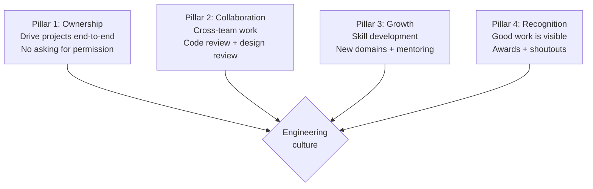

# Engineering Director Playbook
## Chapter 9

# Engineering Team Health and Culture

> *"The ED owns engineering culture. The 4 culture pillars, the 3 health metrics, and the 5-criterion culture bar are the ED's reference for engineering team health at the function level."*

---

## 1. Epigraph

_The ED owns engineering culture. The 4 culture pillars, the 3 health metrics, and the 5-criterion culture bar are the ED's reference for engineering team health at the function level._

---

## 2. Problem

You are an Engineering Director at acme-corp. The VP has just told you: "NPS dropped from 50 to 35. The team is unhealthy. 5 senior engineers resigned in 6 months. Retention is 80% (vs 90% target). Design the culture + health system."

This chapter tells you the 4 culture pillars, the 3 health metrics, and the 5-criterion culture bar.

**Decision in one sentence:** _ED engineering culture is a 4-pillar system (ownership + collaboration + growth + recognition) with 3 health metrics (NPS + retention + engagement) and 5-criterion culture bar; the ED's job is to design the culture system, measure the health metrics, and own the retention._

---

## 3. Why EDs Fail Here

Five named failure modes of EDs whose engineering culture produced zero results.

- **The No-Culture-System Failure.** The ED has no defined culture. _Toxic behaviors emerge._
- **The Low-NPS Failure.** NPS dropped to 35. _Engineers are unhappy._
- **The High-Attrition Failure.** 5 senior engineers left. _Knowledge drain._
- **The No-Recognition Failure.** Good work is invisible. _Engineers disengage._
- **The No-Growth-Path Failure.** No clear growth. _Engineers plateau and leave._

---

## 4. Mental Models

Four mental models that compress engineering culture.

**mental model 1: The 4 Culture Pillars.** 4 pillars.



**The 4 pillars:**
- **Pillar 1: Ownership.** Drive projects end-to-end. No asking for permission.
- **Pillar 2: Collaboration.** Cross-team work. Code review + design review.
- **Pillar 3: Growth.** Skill development. New domains + mentoring.
- **Pillar 4: Recognition.** Good work is visible. Awards + shoutouts.

**mental model 2: The 3 Health Metrics.** 3 metrics.

```
1. NPS (engineer satisfaction): quarterly survey, target 50+
2. Retention (annual): target 90%+
3. Engagement (1:1 quality): target 80%+ (1:1s productive)

The 3 metrics are tracked quarterly. NPS dropped = 
warning. Retention drops = crisis.
```

**mental model 3: The 5-Criterion Culture Bar.** 5 criteria.

```
1. Ownership: every IC owns 1+ project end-to-end
2. Collaboration: every IC does 5+ code reviews/week
3. Growth: every IC has 12-month dev plan
4. Recognition: every EM does 1+ shoutout/week
5. Psychological safety: every IC can disagree in 1:1s

The 5-criterion bar is the discipline.
```

---

## 5. Frameworks

Three frameworks for engineering culture.

### Framework 1: The 1-Page Culture Charter

```
# Engineering Culture Charter — [Date]

## The 4 pillars
1. Ownership: Drive projects end-to-end
2. Collaboration: Cross-team work
3. Growth: Skill development
4. Recognition: Good work is visible

## The 3 health metrics
- NPS: 50+ (target)
- Retention: 90%+ (target)
- Engagement: 80%+ (target)

## The 5-criterion bar
1. Ownership: 1+ project per IC
2. Collaboration: 5+ reviews/week per IC
3. Growth: 12-month dev plan per IC
4. Recognition: 1+ shoutout/week per EM
5. Psychological safety: disagree in 1:1s

## The 1 thing the ED will NOT compromise on
[1 sentence.]
```

### Framework 2: The Quarterly Health Scorecard

```
# Engineering Health Scorecard — [Quarter]

| Metric | Target | Current | Status |
|--------|--------|---------|--------|
| NPS | 50+ | [Score] | [Status] |
| Retention | 90%+ | [%] | [Status] |
| Engagement | 80%+ | [%] | [Status] |

## Top 3 risks
1. [Risk 1]
2. [Risk 2]
3. [Risk 3]
```

### Framework 3: The 4-Pillar Action Plan

```
# Culture Action Plan — [Quarter]

## Pillar 1: Ownership
- [Action 1] — [Date]
- [Action 2] — [Date]

## Pillar 2: Collaboration
- [Action 1] — [Date]
- [Action 2] — [Date]

## Pillar 3: Growth
- [Action 1] — [Date]
- [Action 2] — [Date]

## Pillar 4: Recognition
- [Action 1] — [Date]
- [Action 2] — [Date]
```

---

## 6. Drill

You are an ED at **acme-corp**. The VP has given you 90 days to fix the culture.

```
Current state:
- NPS: 35 (target 50+)
- Retention: 80% (target 90%+)
- 5 senior engineers resigned in 6 months

30 engineers across 5 EMs.
```

You have **90 minutes**. Produce the **culture system redesign** (`portfolio/chapter-09-engineering-culture.md`) using Framework 1 (Charter) + Framework 2 (Scorecard) + Framework 3 (Action Plan). Specify:

- The 1-page culture charter (4 pillars, 3 metrics, the 1 not compromise).
- The quarterly health scorecard (3 metrics, current state, top 3 risks).
- The 4-pillar action plan (per pillar, 2 actions).
- The 90-day timeline.
- The 1 thing you'll say to the VP in the first review.
- The 3 things you'll do to avoid the 5 failure modes.

**Deliverable:** `portfolio/chapter-09-engineering-culture.md` — under 1500 words.

---

## 7. Worked Example

**The 1-page culture charter:**

```
# Engineering Culture Charter — 2026-09-01

## The 4 pillars
1. Ownership: Drive projects end-to-end
2. Collaboration: Cross-team work
3. Growth: Skill development
4. Recognition: Good work is visible

## The 3 health metrics
- NPS: 50+ (current: 35)
- Retention: 90%+ (current: 80%)
- Engagement: 80%+ (current: 70%)

## The 5-criterion bar
1. Ownership: 1+ project per IC
2. Collaboration: 5+ reviews/week per IC
3. Growth: 12-month dev plan per IC
4. Recognition: 1+ shoutout/week per EM
5. Psychological safety: disagree in 1:1s

## The 1 thing I will NOT compromise on
Psychological safety. An engineer who can\'t
disagree in 1:1s will disengage. Safety is the
foundation.
```

**The quarterly health scorecard:**

```
# Engineering Health Scorecard — Q3 2026

| Metric | Target | Current | Status |
|--------|--------|---------|--------|
| NPS | 50+ | 35 | RED |
| Retention | 90%+ | 80% | YELLOW |
| Engagement | 80%+ | 70% | RED |

## Top 3 risks
1. NPS dropped 50 → 35 (RED): senior ICs feel underutilized
2. Engagement dropped 80% → 70% (RED): 1:1s are infrequent
3. Retention at 80% (YELLOW): 5 senior ICs resigned in 6 months
```

**The 4-pillar action plan:**

```
# Culture Action Plan — Q4 2026

## Pillar 1: Ownership
- [ ] Assign 1+ end-to-end project per IC
- [ ] EM 1:1s focus on ownership gaps

## Pillar 2: Collaboration
- [ ] 5+ code reviews/week per IC (track in dashboard)
- [ ] Quarterly cross-team demo

## Pillar 3: Growth
- [ ] 12-month dev plan per IC (signed by Q4)
- [ ] 1 mentoring pair per senior IC

## Pillar 4: Recognition
- [ ] 1+ shoutout/week per EM (tracked)
- [ ] Quarterly engineering awards
```

**The 1 thing I'll say to the VP in the first review:**

```
"Here's the engineering culture redesign:

  4 pillars: ownership + collaboration + growth + recognition
  3 metrics: NPS (35→50+), retention (80%→90%+), engagement (70%→80%+)
  5-criterion bar: ownership + collaboration + growth + recognition + psychological safety

  Top 3 risks:
  1. NPS dropped 50→35
  2. Engagement dropped 80%→70%
  3. Retention at 80%, 5 senior ICs resigned

  The 1 thing I want to focus on: psychological safety.
  An engineer who can't disagree in 1:1s will disengage.

  The 1 thing I will NOT compromise on: psychological safety.

  90-day plan: week 1-2 diagnose, week 3-6 culture charter,
  week 7-10 action plan, week 11-12 rollout.

  Culture is the discipline. Retention is the outcome."
```

**The 3 things I'll do to avoid the 5 failure modes:**

```
1. Define the 4-pillar culture system.
   (Avoids the No-Culture-System Failure.)
   - Ownership + collaboration + growth + recognition
   - 1-page charter signed by all
   - Quarterly culture review

2. Track the 3 health metrics.
   (Avoids the Low-NPS Failure.)
   - NPS quarterly survey
   - Retention annual tracking
   - Engagement 1:1 quality audit

3. Apply the 5-criterion culture bar.
   (Avoids the No-Growth-Path Failure.)
   - Ownership: 1+ project per IC
   - Collaboration: 5+ reviews/week per IC
   - Growth: 12-month dev plan per IC
   - Recognition: 1+ shoutout/week per EM
   - Psychological safety: disagree in 1:1s
```

---

## 8. Failure Mode Postmortem

An ED at a 200-person B2B AI company had no defined culture. NPS dropped from 50 to 35. 5 senior engineers left in 6 months. Retention at 80%. The remaining engineers were disengaged.

The replacement ED did 3 things:
1. Defined the 4-pillar culture system (ownership + collaboration + growth + recognition).
2. Tracked the 3 health metrics quarterly (NPS + retention + engagement).
3. Applied the 5-criterion culture bar (per IC + per EM).

Within 12 months: NPS recovered to 48. Retention at 91%. Engagement at 82%. The 4-pillar + 3-metric + 5-criterion system was the discipline.

What the first ED missed: culture is a system. The first ED had no culture. The second ED had 4 pillars. The pillars are the leverage.

The lesson: the ED who has 4 pillars + 3 metrics + 5-criterion bar has a culture system. The ED who has no culture has a retention problem.

---

## 9. Self-Assessment Rubric

| # | Dimension | 1 (Novice) | 3 (Competent) | 5 (Expert) |
|---|---|---|---|---|
| 1 | **4 culture pillars** | 0-1 pillars | 2-3 pillars | 4 pillars (ownership + collaboration + growth + recognition) |
| 2 | **3 health metrics** | 0-1 metrics | 2 metrics | 3 metrics (NPS + retention + engagement) |
| 3 | **5-criterion bar** | 0-2 criteria | 3-4 criteria | 5 criteria applied per IC + per EM |
| 4 | **Quarterly scorecard** | No scorecard | Scorecard exists | Quarterly scorecard, top 3 risks, action plan |
| 5 | **Retention rate** | <80% | 80-90% | >90% annual retention |

**Disqualifier:** any 1 on dimension 1 or 2. An ED who has 0-1 pillars or 0-1 metrics is in the No-Culture-System or Low-NPS failure mode.

**Total:** ___ / 25. **Pass threshold:** 18/25, no dimension below 3.

---

## 10. Portfolio Artifact Note

Save your filled-in drill as `portfolio/chapter-09-engineering-culture.md` — interview evidence for "How do you build engineering culture?" (see Portfolio Map in Chapter 27).

---

## 11. Interview Questions

1. **Walk me through your engineering culture system.**
2. **NPS dropped from 50 to 35. What do you do?**
3. **5 senior engineers resigned. What do you do?**
4. **The team is disengaged. What do you do?**
5. **Walk me through a culture turn-around you've led.**
