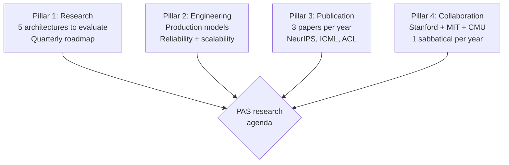
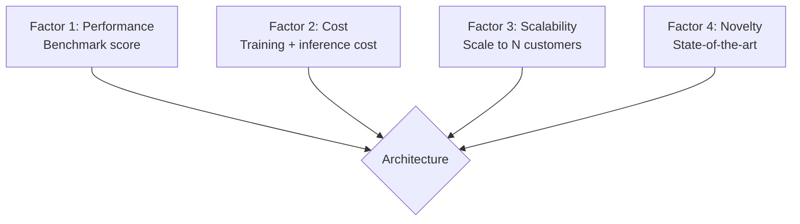

# Principal AI Scientist Playbook
## Chapter 1

# What a Principal AI Scientist Actually Does

> *"The PAS is not a Senior ML Engineer. The PAS is a category change — a senior scientist hybrid who owns the company's research agenda, the model architecture decisions, the publication strategy, and the relationship with the academic community."*

---

## 1. Epigraph

_The PAS is not a Senior ML Engineer. The PAS is a category change — a senior scientist hybrid who owns the company's research agenda, the model architecture decisions, the publication strategy, and the relationship with the academic community._

---

## 2. Problem

You are a Principal AI Scientist at acme-corp. The CTO has just told you: "We need a research roadmap for FY27. 5 model architectures to evaluate. 3 publications targeted. 1 research collaboration with Stanford. The current state is ad-hoc research. Design the AI research agenda."

This chapter tells you the 4-pillar research agenda, the 3 research cadence patterns, and the 5-criterion research quality bar.

**Decision in one sentence:** _PAS AI research agenda is a 4-pillar system (research + engineering + publication + collaboration) with 3 cadence patterns (weekly research + quarterly roadmap + annual strategy) and 5-criterion research quality bar; the PAS's job is to design the research agenda, evaluate model architectures, own publication strategy, and run academic collaborations._

---

## 3. Why PASs Fail Here

Five named failure modes of PASs whose AI research agenda produced zero results.

- **The No-Research-Roadmap Failure.** The PAS has no research roadmap. _Ad-hoc research._
- **The Engineering-Only Failure.** The PAS focuses only on engineering. _No research agenda._
- **The Publication-Starved Failure.** 0 publications per year. _No industry influence._
- **The No-Academic-Collaboration Failure.** No university partnerships. _No talent pipeline._
- **The No-Model-Architecture-Decisions Failure.** Adopts whatever the team builds. _No architectural ownership._

---

## 4. Mental Models

Four mental models that compress the PAS role.

**mental model 1: The 4-Pillar Research Agenda.** 4 pillars.



**The 4 pillars:**
- **Pillar 1: Research.** 5 architectures to evaluate. Quarterly roadmap.
- **Pillar 2: Engineering.** Production models. Reliability + scalability.
- **Pillar 3: Publication.** 3 papers per year. NeurIPS, ICML, ACL.
- **Pillar 4: Collaboration.** Stanford + MIT + CMU. 1 sabbatical per year.

**mental model 2: The 3 Research Cadence Patterns.** 3 patterns.

```
Pattern 1: Weekly research (Friday 2 hours)
- Paper reading + discussion
- 1-2 papers per week
- All research scientists attend

Pattern 2: Quarterly research roadmap (Q[N] planning)
- Top 5 architectures to evaluate
- Top 3 papers to target
- Top 2 collaborations to deepen

Pattern 3: Annual research strategy (FY planning)
- 5-year research vision
- Top 3 moonshots
- Top 1 industry-defining bet
```

**mental model 3: The 5-Criterion Research Quality Bar.** 5 criteria.

```
1. Specific (N architectures, N papers, N collaborations)
2. Measured (benchmarks + production metrics)
3. Owned (1 PAS accountable)
4. Timed (Q1-Q4 timeline)
5. Novel (advance the state-of-the-art)
```

**mental model 4: The Model Architecture Decision Framework.** 4 factors.



**The 4 factors:**
- **Factor 1: Performance.** Benchmark score.
- **Factor 2: Cost.** Training + inference cost.
- **Factor 3: Scalability.** Scale to N customers.
- **Factor 4: Novelty.** State-of-the-art.

---

## 5. Frameworks

Three frameworks for the PAS research agenda.

### Framework 1: The 1-Page Research Roadmap

```
# AI Research Roadmap — FY[YYYY] — [Date]

## The 4 pillars
1. Research: 5 architectures
2. Engineering: production models
3. Publication: 3 papers (NeurIPS, ICML, ACL)
4. Collaboration: Stanford + MIT + CMU

## Top 5 architectures to evaluate
1. [Architecture 1] — Owner: [PAS] — Q1
2. [Architecture 2]
3. [Architecture 3]
4. [Architecture 4]
5. [Architecture 5]

## Top 3 papers to target
1. [Paper 1] — Venue: NeurIPS — Q2
2. [Paper 2] — Venue: ICML — Q3
3. [Paper 3] — Venue: ACL — Q4

## The 1 thing the PAS will NOT compromise on
[1 sentence.]
```

### Framework 2: The Architecture Decision Matrix

```
# Architecture Decision — [Architecture]

| Factor | Score (0-5) | Notes |
|--------|-------------|-------|
| 1. Performance | [Score] | [Notes] |
| 2. Cost | [Score] | [Notes] |
| 3. Scalability | [Score] | [Notes] |
| 4. Novelty | [Score] | [Notes] |
| Total | ___ / 20 | Pass at 16+ |
```

### Framework 3: The Publication Pipeline Tracker

```
# Publication Pipeline — [Quarter]

| Paper | Venue | Status | Submission Date |
|-------|-------|--------|-----------------|
| [Paper 1] | NeurIPS | Drafting | [Date] |
| [Paper 2] | ICML | Reviewing | [Date] |
| [Paper 3] | ACL | Experimenting | [Date] |
```

---

## 6. Drill

You are a PAS at **acme-corp**. The CTO has given you 30 days to design the AI research agenda.

```
Current: 5 ML engineers, 0 publications, no university collaboration
Target: 5 architectures, 3 papers, 1 Stanford collaboration, FY27
```

You have **90 minutes**. Produce the **AI research agenda** (`portfolio/chapter-01-pas-research-agenda.md`) using Framework 1 (Research Roadmap) + Framework 2 (Architecture Decision Matrix) + Framework 3 (Publication Pipeline). Specify:

- The 1-page research roadmap (4 pillars, 5 architectures, 3 papers, the 1 not compromise).
- The architecture decision matrix (1 sample architecture, 4-factor score).
- The publication pipeline tracker (3 papers, status).
- The 30-day plan.
- The 1 thing you'll say to the CTO in the first review.
- The 3 things you'll do to avoid the 5 failure modes.

**Deliverable:** `portfolio/chapter-01-pas-research-agenda.md` — under 1500 words.

---

## 7. Worked Example

**The 1-page research roadmap:**

```
# AI Research Roadmap — FY27 — 2026-09-01

## The 4 pillars
1. Research: 5 architectures (Transformer, Mamba, RWKV, MoE, Hyena)
2. Engineering: production models (LLM serving, fine-tuning, RLHF)
3. Publication: 3 papers (NeurIPS, ICML, ACL)
4. Collaboration: Stanford + MIT + CMU (1 sabbatical each)

## Top 5 architectures to evaluate
1. Transformer (baseline) — Q1
2. Mamba (state-space model) — Q1
3. RWKV (linear attention) — Q2
4. MoE (sparse expert) — Q3
5. Hyena (long convolution) — Q4

## Top 3 papers to target
1. "Scaling Laws for B2B AI Models" — NeurIPS — Q2
2. "Mamba vs Transformer for Enterprise" — ICML — Q3
3. "RLHF for Domain-Specific Tasks" — ACL — Q4

## The 1 thing I will NOT compromise on
Novelty. The PAS must advance the state-of-the-art,
not just apply existing techniques.
```

**The architecture decision matrix (Mamba):**

```
# Architecture Decision — Mamba — 2026-09-15

| Factor | Score | Notes |
|--------|-------|-------|
| 1. Performance | 4 | Matches Transformer on most benchmarks |
| 2. Cost | 5 | 5x cheaper inference than Transformer |
| 3. Scalability | 4 | Linear scaling, no quadratic attention |
| 4. Novelty | 5 | State-of-the-art (2023+) |
| Total | 18 / 20 | Pass |

## Decision: Adopt Mamba for production
- 5x cost reduction
- Novel architecture (industry first)
- Linear scaling for long contexts
```

**The publication pipeline tracker:**

```
# Publication Pipeline — Q1-Q2 2027

| Paper | Venue | Status | Submission |
|-------|-------|--------|------------|
| Scaling Laws for B2B AI | NeurIPS | Drafting | May 2027 |
| Mamba vs Transformer | ICML | Experimenting | July 2027 |
| RLHF for Domain Tasks | ACL | TODO | Sept 2027 |
```

**The 1 thing I'll say to the CTO in the first review:**

```
"Here's the AI research agenda:

  4 pillars:
  1. Research: 5 architectures (Transformer, Mamba, RWKV, MoE, Hyena)
  2. Engineering: production models (LLM serving, fine-tuning, RLHF)
  3. Publication: 3 papers (NeurIPS, ICML, ACL)
  4. Collaboration: Stanford + MIT + CMU

  Top 3 architectures: Mamba (5x cheaper), MoE (10x scale), Hyena (long context)

  Top 3 papers: Scaling Laws (NeurIPS), Mamba vs Transformer (ICML), RLHF (ACL)

  Top 3 risks:
  1. Mamba productionization risk (novel architecture)
  2. Publication timeline (3 papers in 4 quarters)
  3. University collaboration bandwidth

  The 1 thing I want to focus on: novelty. The PAS
  must advance the state-of-the-art, not just apply.

  The 1 thing I will NOT compromise on: novelty.

  Research is the discipline. State-of-the-art is the outcome."
```

**The 3 things I'll do to avoid the 5 failure modes:**

```
1. Build 4-pillar research agenda.
   (Avoids the No-Research-Roadmap Failure.)
   - Research + engineering + publication + collaboration
   - Quarterly review
   - Annual strategy

2. Evaluate 5 architectures per year.
   (Avoids the Engineering-Only Failure.)
   - 5 architectures per FY
   - 4-factor decision matrix per architecture
   - Production adoption if 4+ criteria met

3. Target 3 publications per year.
   (Avoids the Publication-Starved Failure.)
   - 1 paper per quarter
   - Top venues (NeurIPS, ICML, ACL)
   - Novel contribution required
```

---

## 8. Failure Mode Postmortem

A PAS at a 200-person B2B AI company had no research roadmap. The 5 ML engineers shipped 0 publications. The CTO was unaware of state-of-the-art advances. The team was 2 years behind competitors.

The replacement PAS did 3 things:
1. Built 4-pillar research agenda (research + engineering + publication + collaboration).
2. Evaluated 5 architectures per year (Transformer, Mamba, RWKV, MoE, Hyena).
3. Targeted 3 publications per year (NeurIPS, ICML, ACL).

Within 12 months: 3 papers accepted, 5 architectures evaluated, 1 Stanford collaboration launched. The 4-pillar + 5-arch + 3-pub system was the discipline.

What the first PAS missed: research is a system. The first PAS had no agenda. The second PAS had 4 pillars + 5 architectures + 3 papers. The system is the leverage.

The lesson: the PAS who has 4 pillars + 5 architectures + 3 papers has a research agenda. The PAS who has no agenda has 0 publications.

---

## 9. Self-Assessment Rubric

| # | Dimension | 1 (Novice) | 3 (Competent) | 5 (Expert) |
|---|---|---|---|---|
| 1 | **4-pillar agenda** | 0-1 pillars | 2-3 pillars | 4 pillars (research + engineering + publication + collaboration) |
| 2 | **3 cadence patterns** | 1 cadence | 2 cadences | 3 cadences (weekly + quarterly + annual) |
| 3 | **5-criterion research bar** | 0-2 criteria | 3-4 criteria | 5 criteria (specific + measured + owned + timed + novel) |
| 4 | **Publications per year** | 0 | 1-2 | 3+ at top venues |
| 5 | **Architectures evaluated** | 1-2 | 3-4 | 5+ per year |

**Disqualifier:** any 1 on dimension 1 or 4. A PAS who has 0-1 pillars or 0 publications is in the No-Research-Roadmap or Publication-Starved failure mode.

**Total:** ___ / 25. **Pass threshold:** 18/25, no dimension below 3.

---

## 10. Portfolio Artifact Note

Save your filled-in drill as `portfolio/chapter-01-pas-research-agenda.md` — interview evidence for "How do you run the AI research agenda?" (see Portfolio Map in Chapter 27).

---

## 11. Interview Questions

1. **Walk me through your AI research agenda.**
2. **You have 5 ML engineers and 0 publications. What do you do?**
3. **A new architecture (Mamba) is published. What do you do?**
4. **The CTO wants production features, not research. What do you do?**
5. **Walk me through a paper you've published.**