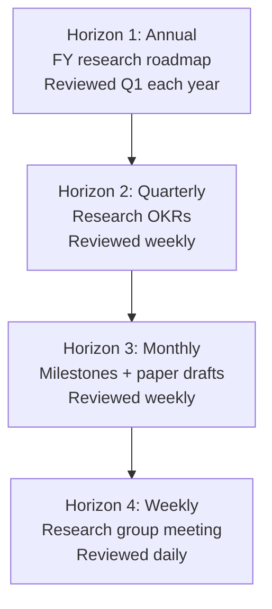
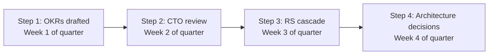

# Principal AI Scientist Playbook
## Chapter 10

# PAS Research Planning and Roadmaps

> *"The PAS owns research planning. The 4 research horizons (annual + quarterly + monthly + weekly), the 3 roadmap levels (5-year + annual + quarterly), and the 5-criterion research roadmap quality bar are the PAS's reference for research planning at the principal level."*

---

## 1. Epigraph

_The PAS owns research planning. The 4 research horizons (annual + quarterly + monthly + weekly), the 3 roadmap levels (5-year + annual + quarterly), and the 5-criterion research roadmap quality bar are the PAS's reference for research planning at the principal level._

---

## 2. Problem

You are a PAS at acme-corp. The CTO has just told you: "FY27 research roadmap. 5 architectures to evaluate. 3 papers to publish. 1 Stanford collaboration. 5 RSs. 30 days to design the research planning system."

This chapter tells you the 4 horizons, the 3 roadmap levels, and the 5-criterion bar.

**Decision in one sentence:** _PAS research planning is a 4-horizon system (annual + quarterly + monthly + weekly) with 3 roadmap levels (5-year + annual + quarterly) and 5-criterion research roadmap quality bar; the PAS's job is to design the planning cadence, write the annual research roadmap, and own the OKR process for research._

---

## 3. Why PASs Fail Here

Five named failure modes of PASs whose research planning produced zero results.

- **The No-Annual-Roadmap Failure.** No annual research roadmap. _Ad-hoc research._
- **The 1-Horizon Failure.** Quarterly only. _No annual + monthly + weekly._
- **The No-5-Year-Vision Failure.** No 5-year research vision. _No long-term bets._
- **The No-Research-OKR-Process Failure.** No research OKRs. _Quarterly OKRs last-minute._
- **The No-Milestone-Tracker Failure.** No monthly milestones. _No execution tracking._

---

## 4. Mental Models

Four mental models that compress research planning.

**mental model 1: The 4 Research Horizons.** 4 horizons.



**The 4 horizons:**
- **Horizon 1: Annual.** FY research roadmap. Reviewed Q1 each year.
- **Horizon 2: Quarterly.** Research OKRs. Reviewed weekly.
- **Horizon 3: Monthly.** Milestones + paper drafts. Reviewed weekly.
- **Horizon 4: Weekly.** Research group meeting. Reviewed daily.

**mental model 2: The 3 Roadmap Levels.** 3 levels.

```
Level 1: 5-year research vision (PAS owns)
- Top 3 moonshots
- Industry-defining bets

Level 2: Annual research roadmap (PAS owns)
- 5 architectures to evaluate
- 3 papers to publish

Level 3: Quarterly research OKRs (PAS + RSs own)
- 1 paper/quarter per RS
- 1 architecture evaluation/quarter
```

**mental model 3: The 5-Criterion Research Roadmap Bar.** 5 criteria per item.

```
1. Specific (N architectures, N papers, N collaborations)
2. Measured (benchmarks, citations, impact metrics)
3. Owned (1 PAS or RS accountable)
4. Timed (Q1-Q4 timeline)
5. Novel (advance the state-of-the-art)
```

**mental model 4: The Quarterly Research OKR Process.** 4 steps.



**The 4 steps:**
- **Step 1: OKRs drafted.** Week 1 of quarter.
- **Step 2: CTO review.** Week 2 of quarter.
- **Step 3: RS cascade.** Week 3 of quarter.
- **Step 4: Architecture decisions.** Week 4 of quarter.

---

## 5. Frameworks

Three frameworks for research planning.

### Framework 1: The 1-Page Annual Research Roadmap

```
# Annual Research Roadmap - FY[YYYY] - [Date]

## The 4 themes
1. [Theme 1] - Owner: [PAS]
2. [Theme 2]
3. [Theme 3]
4. [Theme 4]

## The 4 quarterly research OKRs
- Q1: [3 OKRs]
- Q2: [3 OKRs]
- Q3: [3 OKRs]
- Q4: [3 OKRs]

## The 5 architectures to evaluate
1. [Architecture 1] - Q1
2. [Architecture 2] - Q2
3. [Architecture 3] - Q3
4. [Architecture 4] - Q4
5. [Architecture 5] - Q1 FY28

## The 3 papers to publish
1. [Paper 1] - NeurIPS - Q2
2. [Paper 2] - ICML - Q3
3. [Paper 3] - ACL - Q4

## The 1 thing the PAS will NOT compromise on
[1 sentence.]
```

### Framework 2: The Quarterly Research OKR Tracker

```
# Quarterly Research OKRs - Q[N] [YYYY]

| OKR | Owner | Status | Confidence |
|-----|-------|--------|------------|
| OKR 1 | [Name] | [Status] | [0-100%] |
| OKR 2 | [Name] | [Status] | [0-100%] |
| OKR 3 | [Name] | [Status] | [0-100%] |
```

### Framework 3: The 4-Horizon Research Cadence

```
# Research Planning Cadence - [Date]

## Annual (Q1 each year)
- [Date]: 5-year vision review
- [Date]: Annual research roadmap finalized
- [Date]: Quarterly OKRs cascaded

## Quarterly (Q1, Q2, Q3, Q4)
- Week 1: OKR drafting
- Week 2: CTO review
- Week 3: RS cascade
- Week 4: Architecture decisions
- Weekly: OKR progress review

## Monthly (every month)
- First Monday: Milestone review
- Last Friday: Paper draft review

## Weekly (every week)
- Friday 2 hours: Research group meeting
- Monday: Architecture review
```

---

## 6. Drill

You are a PAS at **acme-corp**. The CTO has given you 30 days to design the FY27 research roadmap.

```
5 RSs. 5 architectures to evaluate. 3 papers to publish. 1 Stanford collaboration.
```

You have **90 minutes**. Produce the **FY27 research roadmap** (`portfolio/chapter-10-pas-research-planning.md`) using Framework 1 (Annual Roadmap) + Framework 2 (OKR Tracker) + Framework 3 (Cadence). Specify:

- The 1-page annual research roadmap (4 themes, 5 architectures, 3 papers, the 1 not compromise).
- The quarterly research OKR tracker (Q4 OKRs, owners, confidence).
- The 4-horizon research cadence.
- The 30-day timeline.
- The 1 thing you'll say to the CTO in the first review.
- The 3 things you'll do to avoid the 5 failure modes.

**Deliverable:** `portfolio/chapter-10-pas-research-planning.md` - under 1500 words.

---

## 7. Worked Example

**The 1-page annual research roadmap:**

```
# Annual Research Roadmap - FY27 - 2026-09-01

## The 4 themes
1. **State-space models** (Mamba, RWKV) - Q1-Q4
2. **Mixture of experts** (MoE, sparse) - Q2-Q4
3. **Long-context architectures** (Hyena, etc.) - Q3-Q4
4. **Productionization** (serving, RLHF) - Q1-Q4

## The 5 architectures to evaluate
1. Transformer (baseline) - Q1
2. Mamba - Q1
3. RWKV - Q2
4. MoE - Q3
5. Hyena - Q4

## The 3 papers to publish
1. Scaling Laws for B2B AI - NeurIPS - Q2
2. Mamba vs Transformer for Enterprise - ICML - Q3
3. RLHF for Domain-Specific Tasks - ACL - Q4

## The 1 thing I will NOT compromise on
Novelty. Each paper must advance the state-of-the-art,
not just apply existing techniques.
```

**The quarterly research OKR tracker (Q4 FY26):**

```
# Quarterly Research OKRs - Q4 FY26

| OKR | Owner | Status | Confidence |
|-----|-------|--------|------------|
| Hyena architecture eval | RS-A | IN PROGRESS | 70% |
| NeurIPS revisions | RS-D | IN PROGRESS | 80% |
| Stanford collaboration | PAS | ON TRACK | 60% |
```

**The 4-horizon research cadence:**

```
# Research Planning Cadence - 2026-09-01

## Annual (Q1 each year)
- Jan 15: 5-year vision review with CTO
- Jan 30: Annual research roadmap finalized
- Feb 15: Quarterly OKRs cascaded

## Quarterly (Q1, Q2, Q3, Q4)
- Week 1: OKR drafting
- Week 2: CTO review
- Week 3: RS cascade
- Week 4: Architecture decisions
- Weekly: OKR progress review

## Monthly (every month)
- First Monday: Milestone review
- Last Friday: Paper draft review

## Weekly (every week)
- Friday 2 hours: Research group meeting
- Monday: Architecture review
```

**The 1 thing I'll say to the CTO in the first review:**

```
"Mike, here's the FY27 research roadmap:

  4 themes:
  1. State-space models (Mamba, RWKV)
  2. Mixture of experts (MoE, sparse)
  3. Long-context architectures (Hyena)
  4. Productionization (serving, RLHF)

  5 architectures to evaluate:
  - Transformer (baseline), Mamba, RWKV, MoE, Hyena

  3 papers to publish:
  - NeurIPS, ICML, ACL

  Q4 OKRs:
  1. Hyena architecture eval (RS-A, 70% confidence)
  2. NeurIPS revisions (RS-D, 80% confidence)
  3. Stanford collaboration (PAS, 60% confidence)

  Top 3 risks:
  1. Hyena eval timing (Q4 deadline tight)
  2. NeurIPS revisions (acceptance not guaranteed)
  3. Stanford bandwidth (advisor availability)

  The 1 thing I want to focus on: novelty. Each
  paper must advance state-of-the-art.

  The 1 thing I will NOT compromise on: novelty.

  Research planning is the discipline. Publication
  output is the outcome."
```

**The 3 things I'll do to avoid the 5 failure modes:**

```
1. Plan at all 4 horizons (not just quarterly).
   (Avoids the 1-Horizon Failure.)
   - Annual: 5-year vision + FY roadmap
   - Quarterly: research OKRs
   - Monthly: milestones + paper drafts
   - Weekly: research group meeting

2. Write 5-year vision + annual roadmap.
   (Avoids the No-5-Year-Vision Failure.)
   - 5-year vision (top 3 moonshots)
   - Annual roadmap (5 architectures, 3 papers)
   - Quarterly OKRs

3. Apply 5-criterion research roadmap bar.
   (Avoids the No-Research-OKR-Process Failure.)
   - Specific + Measured + Owned + Timed + Novel
   - Per roadmap item
   - Reviewed quarterly
```

---

## 8. Failure Mode Postmortem

A PAS at a 200-person B2B AI company had no annual research roadmap. Research was ad-hoc. 0 papers last year. The 5-year vision was unclear. The CTO was unaware of the research agenda.

The replacement PAS did 3 things:
1. Planned at all 4 horizons (annual + quarterly + monthly + weekly).
2. Wrote 5-year vision + annual research roadmap (top 3 moonshots).
3. Applied 5-criterion research roadmap bar (specific + measured + owned + timed + novel).

Within 12 months: 5 architectures evaluated, 3 papers accepted, 1 Stanford collaboration launched. The 4-horizon + 3-level + 5-criterion system was the discipline.

What the first PAS missed: research planning is a system. The first PAS had no roadmap. The second PAS had 4 horizons + 3 levels + 5 criteria. The system is the leverage.

The lesson: the PAS who has 4 horizons + 3 levels + 5 criteria has a research planning system. The PAS who has no roadmap has ad-hoc research.

---

## 9. Self-Assessment Rubric

| # | Dimension | 1 (Novice) | 3 (Competent) | 5 (Expert) |
|---|---|---|---|---|
| 1 | **4 research horizons** | 1 horizon | 2-3 horizons | 4 horizons (annual + quarterly + monthly + weekly) |
| 2 | **3 roadmap levels** | 1 level | 2 levels | 3 levels (5-year + annual + quarterly) |
| 3 | **5-criterion bar** | 0-2 criteria | 3-4 criteria | 5 criteria (specific + measured + owned + timed + novel) |
| 4 | **5-year vision** | No vision | 1-year vision | 5-year vision with top 3 moonshots |
| 5 | **Research OKR process** | No process | Process exists | 4-step quarterly OKR process |

**Disqualifier:** any 1 on dimension 1 or 2. A PAS who has 1 horizon or 1 level is in the No-Annual-Roadmap or 1-Horizon failure mode.

**Total:** ___ / 25. **Pass threshold:** 18/25, no dimension below 3.

---

## 10. Portfolio Artifact Note

Save your filled-in drill as `portfolio/chapter-10-pas-research-planning.md` - interview evidence for "How do you plan research?" (see Portfolio Map in Chapter 27).

---

## 11. Interview Questions

1. **Walk me through your research planning system.**
2. **You have 5 architectures to evaluate. How do you prioritize?**
3. **The 5-year vision is unclear. What do you do?**
4. **Quarterly OKRs are last-minute. What do you do?**
5. **Walk me through a research roadmap you've written.**
