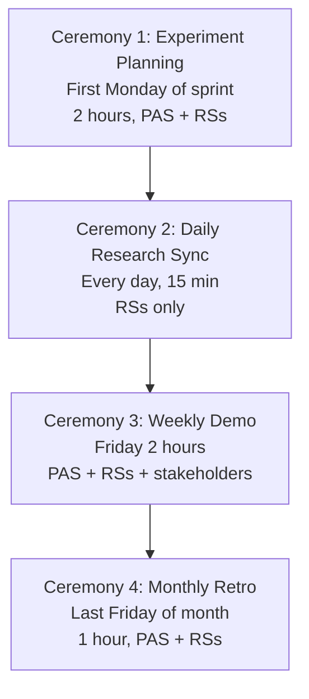

# Principal AI Scientist Playbook
## Chapter 11

# PAS Research Sprint Execution

> *"The PAS runs research sprint execution. The 4 research sprint ceremonies, the 3 delivery metrics (papers + experiments + impact), and the 5-criterion research sprint bar are the PAS's reference for research execution at the principal level."*

---

## 1. Epigraph

_The PAS runs research sprint execution. The 4 research sprint ceremonies, the 3 delivery metrics (papers + experiments + impact), and the 5-criterion research sprint bar are the PAS's reference for research execution at the principal level._

---

## 2. Problem

You are a PAS at acme-corp. The CTO has just told you: "5 RSs. 3 papers per year target. Current pace: 1 paper per year. Experiments are slow. Production impact: 1 per quarter. Design the research sprint system."

This chapter tells you the 4 ceremonies, the 3 metrics, and the 5-criterion bar.

**Decision in one sentence:** _PAS research sprint execution is a 4-ceremony system (experiment planning + daily research sync + weekly demo + monthly retro) with 3 delivery metrics (papers + experiments + production impact) and 5-criterion research sprint bar; the PAS's job is to design the ceremonies, track the metrics, and own the predictability._

---

## 3. Why PASs Fail Here

Five named failure modes of PASs whose research sprint execution produced zero results.

- **The 1-Ceremony Failure.** Only 1 ceremony. _No rhythm._
- **The 1-Paper-Per-Year Failure.** Pace too slow. _No publication output._
- **The No-Production-Impact Failure.** 0 production models. _No business impact._
- **The No-Retrospective-Action Failure.** Retros are complaints. _No improvement._
- **The No-Experiment-Tracking Failure.** No experiment log. _Reproducibility broken._

---

## 4. Mental Models

Four mental models that compress research sprint execution.

**mental model 1: The 4 Research Sprint Ceremonies.** 4 ceremonies.



**The 4 ceremonies:**
- **Ceremony 1: Experiment Planning.** First Monday of sprint. 2 hours, PAS + RSs.
- **Ceremony 2: Daily Research Sync.** Every day, 15 min. RSs only.
- **Ceremony 3: Weekly Demo.** Friday 2 hours. PAS + RSs + stakeholders.
- **Ceremony 4: Monthly Retro.** Last Friday of month. 1 hour, PAS + RSs.

**mental model 2: The 3 Delivery Metrics.** 3 metrics.

```
1. Papers: submitted/accepted per quarter (target 0.75/quarter)
2. Experiments: completed per sprint per RS (target 5/sprint)
3. Production impact: production models per quarter (target 1/quarter)
```

**mental model 3: The 5-Criterion Research Sprint Bar.** 5 criteria.

```
1. Papers: 0.75/quarter (3/year)
2. Experiments: 5/sprint per RS
3. Production impact: 1/quarter
4. Retrospective actions: 3+ per month, 80%+ completed
5. Reproducibility: every experiment reproducible
```

**mental model 4: The Experiment Log Template.**

```
# Experiment Log - [RS] - [Date]

## Experiment: [Name]
- Hypothesis: [1 sentence]
- Method: [approach]
- Results: [metrics]
- Conclusion: [1 sentence]

## Reproducibility
- Code: [GitHub link]
- Data: [data path]
- Hyperparameters: [list]
```

---

## 5. Frameworks

Three frameworks for research sprint execution.

### Framework 1: The 1-Page Research Sprint Plan

```
# Research Sprint Plan - Sprint [N] - [Date]

## Sprint goal
[1 sentence on what the sprint will deliver.]

## The 4 ceremonies
- Experiment planning: [Date]
- Daily research sync: [Time]
- Weekly demo: [Date]
- Monthly retro: [Date]

## The 3 metrics targets
- Papers: [target]
- Experiments: [target]
- Production impact: [target]

## The 1 thing the PAS will NOT compromise on
[1 sentence.]
```

### Framework 2: The Weekly Demo Template

```
# Research Weekly Demo - Sprint [N] - [Date]

## Demo
- [Experiment 1] - Owner: [Name] - Status: DONE
- [Experiment 2]
- [Experiment 3]

## The 3 metrics
- Papers: [actual vs target]
- Experiments: [actual vs target]
- Production impact: [actual vs target]

## The 1 thing that went well
[1 sentence.]

## The 1 thing that didn't go well
[1 sentence.]
```

### Framework 3: The Monthly Retro Action Tracker

```
# Monthly Retro Actions - [Date]

## Top 3 actions
1. [Action 1] - Owner: [Name] - Status: TODO
2. [Action 2] - Owner: [Name] - Status: TODO
3. [Action 3] - Owner: [Name] - Status: TODO
```

---

## 6. Drill

You are a PAS at **acme-corp**. The CTO has given you 30 days to fix the research sprint execution.

```
Current: 1 paper/year, 1 experiment/sprint/RS, 0 production impact/quarter
Target: 3 papers/year, 5 experiments/sprint/RS, 1 production impact/quarter
```

You have **90 minutes**. Produce the **research sprint execution redesign** (`portfolio/chapter-11-pas-research-execution.md`) using Framework 1 (Sprint Plan) + Framework 2 (Weekly Demo) + Framework 3 (Monthly Retro). Specify:

- The 1-page research sprint plan.
- The weekly demo template (1 sample sprint).
- The monthly retro action tracker (3 actions).
- The 30-day timeline.
- The 1 thing you'll say to the CTO in the first review.
- The 3 things you'll do to avoid the 5 failure modes.

**Deliverable:** `portfolio/chapter-11-pas-research-execution.md` - under 1500 words.

---

## 7. Worked Example

**The 1-page research sprint plan:**

```
# Research Sprint Plan - Sprint 12 - 2026-09-30 to 2026-10-11

## Sprint goal
Complete Mamba ablation study (3 configurations)
+ draft NeurIPS camera-ready.

## The 4 ceremonies
- Experiment planning: 2026-09-30 (Mon), 2 hours
- Daily research sync: 9:30 AM every day, 15 min
- Weekly demo: 2026-10-11 (Fri), 2 hours
- Monthly retro: 2026-10-31 (Fri), 1 hour

## The 3 metrics targets
- Papers: 1 camera-ready (Q4)
- Experiments: 5 per RS per sprint
- Production impact: 0.5 (Mamba serving v2)

## The 1 thing I will NOT compromise on
Reproducibility. Every experiment must be
reproducible with documented hyperparameters.
```

**The weekly demo template (Sprint 11):**

```
# Research Weekly Demo - Sprint 11 - 2026-09-27

## Demo
- Mamba baseline (B2B corpus) - RS-A - DONE
- RWKV baseline (B2B corpus) - RS-B - DONE
- MoE pilot (1B params) - RS-C - IN PROGRESS
- NeurIPS camera-ready draft - RS-D - 80% done

## The 3 metrics
- Papers: 0 (camera-ready due Oct 15)
- Experiments: 18/25 (72%)
- Production impact: 0.25 (Mamba staging)

## The 1 thing that went well
Mamba baseline result: 4.7x cost reduction vs Transformer.

## The 1 thing that didn't go well
MoE pilot slow (3 days vs 1 day target). Hyperparameter
sweep needs more compute.
```

**The monthly retro action tracker:**

```
# Monthly Retro Actions - 2026-09-30

## Top 3 actions
1. **Add experiment log template** - Owner: PAS - Status: TODO
2. **Allocate more compute to MoE pilot** - Owner: RS-C - Status: TODO
3. **Schedule NeurIPS camera-ready review** - Owner: RS-D - Status: TODO
```

**The 1 thing I'll say to the CTO in the first review:**

```
"Mike, here's the research sprint execution redesign:

  4 ceremonies: experiment planning + daily research sync
  + weekly demo + monthly retro

  3 metrics:
  - Papers: 0 → 3/year (target)
  - Experiments: 1 → 5/sprint/RS (target)
  - Production impact: 0 → 1/quarter (target)

  Top 3 outcomes:
  1. Mamba baseline: 4.7x cost reduction
  2. 18/25 experiments completed in Sprint 11
  3. NeurIPS camera-ready due Oct 15

  Top 3 risks:
  1. NeurIPS camera-ready timing (Oct 15 deadline)
  2. MoE pilot slow (compute allocation)
  3. Reproducibility gap (no experiment log)

  The 1 thing I want to focus on: reproducibility.
  Every experiment must be reproducible.

  The 1 thing I will NOT compromise on: reproducibility.

  Research execution is the discipline. Publication
  output is the outcome."
```

**The 3 things I'll do to avoid the 5 failure modes:**

```
1. Run all 4 research sprint ceremonies.
   (Avoids the 1-Ceremony Failure.)
   - Experiment planning (Mon, 2 hours)
   - Daily research sync (9:30 AM, 15 min)
   - Weekly demo (Fri, 2 hours)
   - Monthly retro (last Fri, 1 hour)

2. Track the 3 delivery metrics.
   (Avoids the 1-Paper-Per-Year Failure.)
   - Papers: 0.75/quarter
   - Experiments: 5/sprint/RS
   - Production impact: 1/quarter

3. Use experiment log + reproducibility check.
   (Avoids the No-Experiment-Tracking Failure.)
   - Experiment log template per RS
   - Reproducibility check on every experiment
   - Code + data + hyperparameters documented
```

---

## 8. Failure Mode Postmortem

A PAS at a 200-person B2B AI company had only daily research sync. No experiment planning, no weekly demo, no monthly retro. 1 paper per year. 0 production impact per quarter. The 5 RSs were siloed.

The replacement PAS did 3 things:
1. Ran all 4 research sprint ceremonies (planning + sync + demo + retro).
2. Tracked the 3 delivery metrics (papers + experiments + production impact).
3. Used experiment log + reproducibility check.

Within 6 months: 2 papers submitted, 5 experiments/sprint/RS, 1 production impact/quarter. The 4-ceremony + 3-metric + experiment-log system was the discipline.

What the first PAS missed: research execution is a system. The first PAS had 1 ceremony. The second PAS had 4 ceremonies + 3 metrics + experiment log. The system is the leverage.

The lesson: the PAS who has 4 ceremonies + 3 metrics + experiment log has research execution. The PAS who has 1 ceremony has 1 paper per year.

---

## 9. Self-Assessment Rubric

| # | Dimension | 1 (Novice) | 3 (Competent) | 5 (Expert) |
|---|---|---|---|---|
| 1 | **4 sprint ceremonies** | 1 ceremony | 2-3 ceremonies | 4 ceremonies (planning + sync + demo + retro) |
| 2 | **3 delivery metrics** | 0-1 metrics | 2 metrics | 3 metrics (papers + experiments + production impact) |
| 3 | **5-criterion sprint bar** | 0-2 criteria | 3-4 criteria | 5 criteria (papers + experiments + impact + retro + reproducibility) |
| 4 | **Papers per year** | 0-1 | 1-2 | 3+ at top venues |
| 5 | **Reproducibility** | 0% documented | 50% documented | 100% documented with experiment log |

**Disqualifier:** any 1 on dimension 1 or 2. A PAS who has 1 ceremony or 0-1 metrics is in the 1-Ceremony or 1-Paper-Per-Year failure mode.

**Total:** ___ / 25. **Pass threshold:** 18/25, no dimension below 3.

---

## 10. Portfolio Artifact Note

Save your filled-in drill as `portfolio/chapter-11-pas-research-execution.md` - interview evidence for "How do you run research sprint execution?" (see Portfolio Map in Chapter 27).

---

## 11. Interview Questions

1. **Walk me through your research sprint execution system.**
2. **1 paper per year. What do you do?**
3. **0 production impact per quarter. What do you do?**
4. **Experiments are not reproducible. What do you do?**
5. **Walk me through a research weekly demo you've led.**
