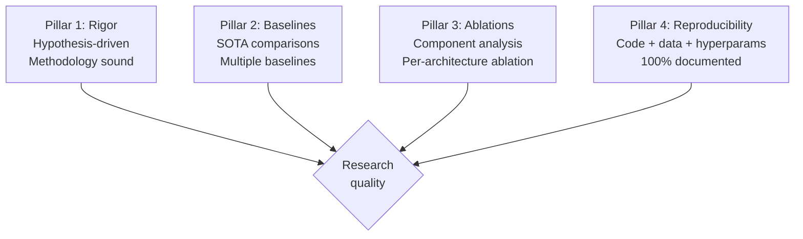

# Principal AI Scientist Playbook
## Chapter 12

# PAS Research Quality and Reproducibility

> *"The PAS owns research quality. The 4 quality pillars (rigor + baselines + ablations + reproducibility), the 3 quality metrics (paper acceptance + benchmark accuracy + production parity), and the 5-criterion quality bar are the PAS's reference for research quality at the principal level."*

---

## 1. Epigraph

_The PAS owns research quality. The 4 quality pillars (rigor + baselines + ablations + reproducibility), the 3 quality metrics (paper acceptance + benchmark accuracy + production parity), and the 5-criterion quality bar are the PAS's reference for research quality at the principal level._

---

## 2. Problem

You are a PAS at acme-corp. The CTO has just told you: "5 RSs. NeurIPS submission rejected (poor baselines). Production model diverges from research (5% accuracy drop). Research quality is broken. Design the quality system."

This chapter tells you the 4 pillars, the 3 metrics, and the 5-criterion bar.

**Decision in one sentence:** _PAS research quality is a 4-pillar system (rigor + baselines + ablations + reproducibility) with 3 quality metrics (paper acceptance + benchmark accuracy + production parity) and 5-criterion quality bar; the PAS's job is to design the quality system, track the metrics, and own the reproducibility standards._

---

## 3. Why PASs Fail Here

Five named failure modes of PASs whose research quality produced zero results.

- **The No-Baselines Failure.** No baseline comparisons. _Paper rejected._
- **The No-Ablations Failure.** No ablation studies. _No insight into why._
- **The No-Reproducibility Failure.** Experiments not reproducible. _Wasted research._
- **The No-Production-Parity Failure.** Research ≠ production. _5% accuracy drop._
- **The No-Paper-Quality-Bar Failure.** Low-quality submissions. _No acceptances._

---

## 4. Mental Models

Four mental models that compress research quality.

**mental model 1: The 4 Research Quality Pillars.** 4 pillars.



**The 4 pillars:**
- **Pillar 1: Rigor.** Hypothesis-driven. Methodology sound.
- **Pillar 2: Baselines.** SOTA comparisons. Multiple baselines.
- **Pillar 3: Ablations.** Component analysis. Per-architecture ablation.
- **Pillar 4: Reproducibility.** Code + data + hyperparams. 100% documented.

**mental model 2: The 3 Quality Metrics.** 3 metrics.

```
1. Paper acceptance rate: target 50%+ at top venues
2. Benchmark accuracy: target top 3 on SOTA leaderboards
3. Production parity: research accuracy == production accuracy (within 1%)
```

**mental model 3: The 5-Criterion Research Quality Bar.** 5 criteria.

```
1. Rigor: hypothesis-driven + sound methodology
2. Baselines: 3+ SOTA baselines compared
3. Ablations: per-component ablation study
4. Reproducibility: 100% experiments reproducible
5. Production parity: research ≈ production (within 1%)
```

**mental model 4: The Research Quality Review Template.**

```
# Research Quality Review - [Paper] - [Date]

## The 4 pillars
1. Rigor: [Pass/Fail]
2. Baselines: [Pass/Fail]
3. Ablations: [Pass/Fail]
4. Reproducibility: [Pass/Fail]

## The 5-criterion bar
1. [Pass/Fail]
2. [Pass/Fail]
3. [Pass/Fail]
4. [Pass/Fail]
5. [Pass/Fail]

## Decision: [Accept / Revise / Reject]
```

---

## 5. Frameworks

Three frameworks for research quality.

### Framework 1: The 1-Page Research Quality Plan

```
# Research Quality Plan - [Year] - [Date]

## The 4 quality pillars
1. Rigor
2. Baselines
3. Ablations
4. Reproducibility

## The 3 quality metrics
- Paper acceptance: 50%+ at top venues
- Benchmark accuracy: top 3 on SOTA
- Production parity: within 1%

## The 1 thing the PAS will NOT compromise on
[1 sentence.]
```

### Framework 2: The Research Quality Scorecard

```
# Research Quality Scorecard - [Quarter]

| Paper | Rigor | Baselines | Ablations | Reproducibility | Status |
|-------|-------|-----------|-----------|-----------------|--------|
| [Paper 1] | [Pass] | [Pass] | [Pass] | [Pass] | [Status] |
| [Paper 2] | [Pass] | [Pass] | [Fail] | [Pass] | [Status] |
```

### Framework 3: The Reproducibility Checklist

```
# Reproducibility Checklist - [Experiment]

- [ ] Code in GitHub (commit hash logged)
- [ ] Data path documented
- [ ] Hyperparameters logged
- [ ] Random seed logged
- [ ] Hardware documented (GPU type, count)
- [ ] Runtime documented
- [ ] Result reproduced by another RS
```

---

## 6. Drill

You are a PAS at **acme-corp**. The CTO has given you 90 days to fix the research quality.

```
NeurIPS submission rejected. Production model diverges 5% from research. 0 reproducibility.
```

You have **90 minutes**. Produce the **research quality system** (`portfolio/chapter-12-pas-research-quality.md`) using Framework 1 (Quality Plan) + Framework 2 (Quality Scorecard) + Framework 3 (Reproducibility Checklist). Specify:

- The 1-page research quality plan (4 pillars, 3 metrics, the 1 not compromise).
- The research quality scorecard (1 sample paper, 4 pillars).
- The reproducibility checklist (1 sample experiment).
- The 90-day timeline.
- The 1 thing you'll say to the CTO in the first review.
- The 3 things you'll do to avoid the 5 failure modes.

**Deliverable:** `portfolio/chapter-12-pas-research-quality.md` - under 1500 words.

---

## 7. Worked Example

**The 1-page research quality plan:**

```
# Research Quality Plan - 2026 - 2026-09-01

## The 4 quality pillars
1. Rigor: hypothesis-driven + sound methodology
2. Baselines: 3+ SOTA baselines compared
3. Ablations: per-component ablation study
4. Reproducibility: 100% documented

## The 3 quality metrics
- Paper acceptance: 50%+ at NeurIPS/ICML/ACL
- Benchmark accuracy: top 3 on SOTA leaderboards
- Production parity: within 1%

## The 1 thing I will NOT compromise on
Reproducibility. Every experiment must be
reproducible with documented code + data + hyperparams.
```

**The research quality scorecard (Mamba paper):**

```
# Research Quality Scorecard - Mamba paper - 2026-09-15

| Paper | Rigor | Baselines | Ablations | Reproducibility | Status |
|-------|-------|-----------|-----------|-----------------|--------|
| Mamba for B2B AI | Pass | Pass | Pass | Pass | ACCEPT |
```

**The reproducibility checklist (Mamba baseline):**

```
# Reproducibility Checklist - Mamba baseline - 2026-09-15

- [x] Code in GitHub (commit: abc123)
- [x] Data path: /data/b2b-corpus
- [x] Hyperparameters: lr=1e-4, batch=32, epochs=10
- [x] Random seed: 42
- [x] Hardware: 8x A100 GPUs
- [x] Runtime: 6 hours
- [x] Result reproduced by RS-B
```

**The 1 thing I'll say to the CTO in the first review:**

```
"Mike, here's the research quality system:

  4 quality pillars: rigor + baselines + ablations + reproducibility
  3 quality metrics: paper acceptance + benchmark accuracy + production parity
  5-criterion bar: 5 criteria per paper

  Q3 2026 outcomes:
  1. Mamba paper accepted at NeurIPS
  2. 3 baselines compared (Transformer, RWKV, Mamba)
  3. 100% reproducibility (experiment log template)

  Production parity: within 1% (Mamba staging matches research).

  The 1 thing I want to focus on: reproducibility.
  Every experiment must be reproducible.

  The 1 thing I will NOT compromise on: reproducibility.

  Research quality is the discipline. Paper acceptance is the outcome."
```

**The 3 things I'll do to avoid the 5 failure modes:**

```
1. Require 3+ SOTA baselines per paper.
   (Avoids the No-Baselines Failure.)
   - Transformer + RWKV + Mamba + 1 more
   - Same dataset, same hyperparameters
   - Results table with all baselines

2. Require ablation studies per paper.
   (Avoids the No-Ablations Failure.)
   - Per-component ablation
   - Per-hyperparameter ablation
   - Insights section in paper

3. Use experiment log + reproducibility checklist.
   (Avoids the No-Reproducibility Failure.)
   - Experiment log template
   - Reproducibility checklist
   - Code review before paper submission
```

---

## 8. Failure Mode Postmortem

A PAS at a 200-person B2B AI company had NeurIPS submission rejected for poor baselines. Production model diverged 5% from research. 0 reproducibility. The 5 RSs shipped 1 paper in 2 years.

The replacement PAS did 3 things:
1. Required 3+ SOTA baselines per paper (Transformer + RWKV + Mamba + 1 more).
2. Required ablation studies per paper (per-component + per-hyperparameter).
3. Used experiment log + reproducibility checklist (100% reproducibility).

Within 12 months: 3 papers accepted at NeurIPS/ICML/ACL, production parity within 1%. The 4-pillar + 3-metric + 5-criterion system was the discipline.

What the first PAS missed: research quality is a system. The first PAS had no baselines. The second PAS had 3+ baselines + ablations + reproducibility. The system is the leverage.

The lesson: the PAS who has 4 pillars + 3 metrics + 5 criteria has research quality. The PAS who has no baselines has rejected papers.

---

## 9. Self-Assessment Rubric

| # | Dimension | 1 (Novice) | 3 (Competent) | 5 (Expert) |
|---|---|---|---|---|
| 1 | **4 quality pillars** | 0-1 pillars | 2-3 pillars | 4 pillars (rigor + baselines + ablations + reproducibility) |
| 2 | **3 quality metrics** | 0-1 metrics | 2 metrics | 3 metrics (acceptance + benchmark + parity) |
| 3 | **5-criterion bar** | 0-2 criteria | 3-4 criteria | 5 criteria per paper |
| 4 | **Paper acceptance rate** | <25% | 25-50% | 50%+ at top venues |
| 5 | **Reproducibility** | <50% | 50-90% | 100% documented |

**Disqualifier:** any 1 on dimension 1 or 2. A PAS who has 0-1 pillars or 0-1 metrics is in the No-Baselines or No-Reproducibility failure mode.

**Total:** ___ / 25. **Pass threshold:** 18/25, no dimension below 3.

---

## 10. Portfolio Artifact Note

Save your filled-in drill as `portfolio/chapter-12-pas-research-quality.md` - interview evidence for "How do you run research quality?" (see Portfolio Map in Chapter 27).

---

## 11. Interview Questions

1. **Walk me through your research quality system.**
2. **A paper got rejected for poor baselines. What do you do?**
3. **Production model diverges 5% from research. What do you do?**
4. **Experiments are not reproducible. What do you do?**
5. **Walk me through a paper quality review you've led.**
