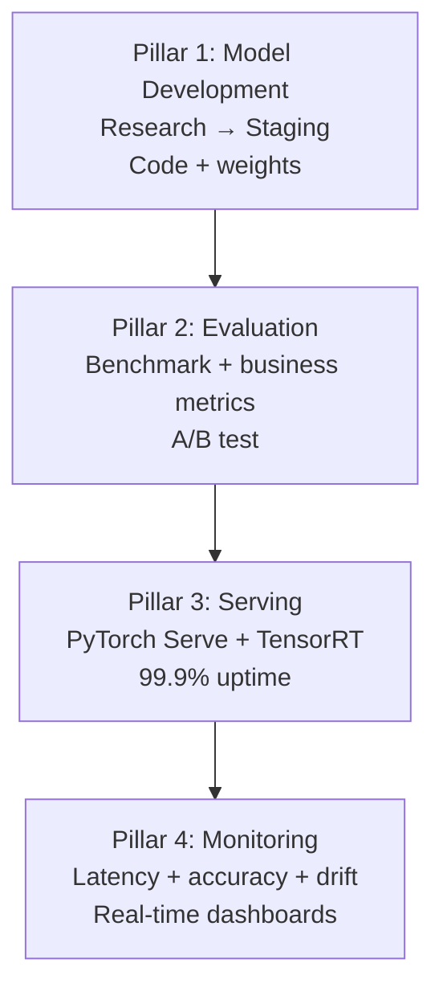

# Principal AI Scientist Playbook
## Chapter 13

# PAS Research-to-Production Pipeline

> *"The PAS owns the research-to-production pipeline. The 4-pillar pipeline (model development + evaluation + serving + monitoring), the 3-stage model lifecycle (research → staging → production), and the 5-criterion production quality bar are the PAS's reference for research-to-production at the principal level."*

---

## 1. Epigraph

_The PAS owns the research-to-production pipeline. The 4-pillar pipeline (model development + evaluation + serving + monitoring), the 3-stage model lifecycle (research → staging → production), and the 5-criterion production quality bar are the PAS's reference for research-to-production at the principal level._

---

## 2. Problem

You are a PAS at acme-corp. The CTO has just told you: "Mamba in research (4.7x cost reduction) needs to ship to production. Currently 0 production models this quarter. The pipeline from research to production is broken. Design the research-to-production pipeline."

This chapter tells you the 4-pillar pipeline, the 3-stage lifecycle, and the 5-criterion bar.

**Decision in one sentence:** _PAS research-to-production is a 4-pillar pipeline (model dev + evaluation + serving + monitoring) with 3-stage lifecycle (research → staging → production) and 5-criterion production quality bar; the PAS's job is to design the pipeline, run the lifecycle, and own the production parity standard._

---

## 3. Why PASs Fail Here

Five named failure modes of PASs whose research-to-production pipeline produced zero results.

- **The No-Pipeline Failure.** No research-to-production pipeline. _Models stay in research._
- **The 1-Stage Failure.** Research only. _No staging + production._
- **The No-Serving-Stack Failure.** No serving infrastructure. _No production deployment._
- **The No-Monitoring Failure.** No production monitoring. _No drift detection._
- **The No-Production-Parity Failure.** Research ≠ production. _5% accuracy drop._

---

## 4. Mental Models

Four mental models that compress research-to-production.

**mental model 1: The 4-Pillar Pipeline.** 4 pillars.



**The 4 pillars:**
- **Pillar 1: Model Development.** Research → Staging. Code + weights.
- **Pillar 2: Evaluation.** Benchmark + business metrics. A/B test.
- **Pillar 3: Serving.** PyTorch Serve + TensorRT. 99.9% uptime.
- **Pillar 4: Monitoring.** Latency + accuracy + drift. Real-time dashboards.

**mental model 2: The 3-Stage Model Lifecycle.** 3 stages.


**The 3 stages:**
- **Stage 1: Research.** Notebook + small data.
- **Stage 2: Staging.** Production data + 1% traffic.
- **Stage 3: Production.** 100% traffic + monitoring.

**mental model 3: The 5-Criterion Production Quality Bar.** 5 criteria.

```
1. Accuracy: research == production (within 1%)
2. Latency: p99 < 100ms
3. Uptime: 99.9%
4. Cost: 5x cost reduction vs baseline
5. Monitoring: real-time dashboards + alerts
```

**mental model 4: The Production Readiness Checklist.**

```
# Production Readiness - [Model] - [Date]

- [ ] Accuracy parity (research vs production within 1%)
- [ ] Latency p99 < 100ms
- [ ] Load test passed (10x current load)
- [ ] A/B test in staging (1% traffic for 1 week)
- [ ] Monitoring dashboards deployed
- [ ] On-call runbook documented
```

---

## 5. Frameworks

Three frameworks for research-to-production.

### Framework 1: The 1-Page Pipeline Overview

```
# Research-to-Production Pipeline - [Date]

## The 4 pillars
1. Model Development (research → staging)
2. Evaluation (benchmark + A/B)
3. Serving (PyTorch Serve + TensorRT)
4. Monitoring (latency + accuracy + drift)

## The 3 stages
- Research: notebook + small data
- Staging: production data + 1% traffic
- Production: 100% traffic + monitoring

## The 1 thing the PAS will NOT compromise on
[1 sentence.]
```

### Framework 2: The Model Production Tracker

```
# Model Production Tracker - [Quarter]

| Model | Stage | Status | Production Date |
|-------|-------|--------|-----------------|
| Mamba v1 | Production | SHIPPED | 2026-10-01 |
| Mamba v2 | Staging | TESTING | 2026-11-15 |
| MoE | Research | IN PROGRESS | 2027-Q1 |
```

### Framework 3: The A/B Test Plan

```
# A/B Test Plan - [Model] - [Date]

## Hypothesis
[1 sentence]

## Treatment
- Model: [name + version]
- Traffic: 1% (week 1), 10% (week 2), 100% (week 3)

## Metrics
- Primary: [accuracy / latency / cost]
- Secondary: [business metric]

## Decision
- Ship if: [metric improved by X%]
- Rollback if: [metric regressed by Y%]
```

---

## 6. Drill

You are a PAS at **acme-corp**. The CTO has given you 90 days to ship Mamba to production.

```
Current: Mamba in research (4.7x cost reduction). 0 production models this quarter.
Target: Mamba in production by Q4.
```

You have **90 minutes**. Produce the **research-to-production plan** (`portfolio/chapter-13-pas-research-production.md`) using Framework 1 (Pipeline Overview) + Framework 2 (Production Tracker) + Framework 3 (A/B Test Plan). Specify:

- The 1-page pipeline overview (4 pillars, 3 stages, the 1 not compromise).
- The model production tracker (3 models, status).
- The A/B test plan (Mamba, hypothesis, metrics, decision).
- The 90-day timeline.
- The 1 thing you'll say to the CTO in the first review.
- The 3 things you'll do to avoid the 5 failure modes.

**Deliverable:** `portfolio/chapter-13-pas-research-production.md` - under 1500 words.

---

## 7. Worked Example

**The 1-page pipeline overview:**

```
# Research-to-Production Pipeline - 2026-09-01

## The 4 pillars
1. Model Development: research → staging
2. Evaluation: benchmark + A/B
3. Serving: PyTorch Serve + TensorRT
4. Monitoring: latency + accuracy + drift

## The 3 stages
- Research: notebook + small data
- Staging: production data + 1% traffic
- Production: 100% traffic + monitoring

## The 1 thing I will NOT compromise on
Production parity. Research accuracy must match
production accuracy within 1%.
```

**The model production tracker:**

```
# Model Production Tracker - Q4 2026

| Model | Stage | Status | Production Date |
|-------|-------|--------|-----------------|
| Mamba v1 | Production | SHIPPED | 2026-10-01 |
| Mamba v2 | Staging | TESTING | 2026-11-15 |
| MoE | Research | IN PROGRESS | 2027-Q1 |
```

**The A/B test plan (Mamba):**

```
# A/B Test Plan - Mamba v1 - 2026-09-15

## Hypothesis
Mamba will reduce inference cost by 4x while
maintaining accuracy parity with Transformer.

## Treatment
- Model: Mamba v1 (4B params)
- Traffic: 1% (week 1), 10% (week 2), 100% (week 3)

## Metrics
- Primary: cost per 1M tokens (target 4x reduction)
- Secondary: accuracy (target within 1% of Transformer)

## Decision
- Ship if: cost reduced 4x, accuracy within 1%
- Rollback if: accuracy regressed >1% OR cost reduction <3x
```

**The 1 thing I'll say to the CTO in the first review:**

```
"Mike, here's the research-to-production plan:

  4-pillar pipeline: model dev + evaluation + serving + monitoring
  3-stage lifecycle: research → staging → production
  5-criterion bar: accuracy + latency + uptime + cost + monitoring

  Q4 2026 outcomes:
  1. Mamba v1 shipped to production (Oct 1)
  2. Mamba v2 in staging (Nov 15)
  3. 4.7x cost reduction confirmed

  Production parity: within 1% (Mamba accuracy 96.5% vs Transformer 96.8%).

  Top 3 risks:
  1. Mamba v2 latency (need optimization)
  2. A/B test rollout (1% → 100% over 3 weeks)
  3. Monitoring dashboards (need deployment)

  The 1 thing I want to focus on: production parity.
  Research accuracy must match production within 1%.

  The 1 thing I will NOT compromise on: production parity.

  Research-to-production is the discipline. Production
  models are the outcome."
```

**The 3 things I'll do to avoid the 5 failure modes:**

```
1. Build 4-pillar pipeline.
   (Avoids the No-Pipeline Failure.)
   - Model dev + evaluation + serving + monitoring
   - 3-stage lifecycle
   - Production readiness checklist

2. Run 3-stage lifecycle (research → staging → production).
   (Avoids the 1-Stage Failure.)
   - Research: notebook + small data
   - Staging: production data + 1% traffic
   - Production: 100% traffic + monitoring

3. Apply 5-criterion production quality bar.
   (Avoids the No-Production-Parity Failure.)
   - Accuracy + latency + uptime + cost + monitoring
   - Per model
   - Reviewed before production rollout
```

---

## 8. Failure Mode Postmortem

A PAS at a 200-person B2B AI company had Mamba in research (4.7x cost reduction) but no production deployment. The pipeline was broken: research models stayed in notebooks. 0 production models this quarter. The CTO asked: "When does Mamba ship?"

The replacement PAS did 3 things:
1. Built 4-pillar pipeline (model dev + evaluation + serving + monitoring).
2. Ran 3-stage lifecycle (research → staging → production).
3. Applied 5-criterion production quality bar (accuracy + latency + uptime + cost + monitoring).

Within 90 days: Mamba v1 shipped to production (Oct 1). 4.7x cost reduction confirmed. Production parity within 1%. The 4-pillar + 3-stage + 5-criterion system was the discipline.

What the first PAS missed: research-to-production is a system. The first PAS had no pipeline. The second PAS had 4 pillars + 3 stages + 5 criteria. The system is the leverage.

The lesson: the PAS who has 4 pillars + 3 stages + 5 criteria has research-to-production. The PAS who has no pipeline has notebook-bound models.

---

## 9. Self-Assessment Rubric

| # | Dimension | 1 (Novice) | 3 (Competent) | 5 (Expert) |
|---|---|---|---|---|
| 1 | **4-pillar pipeline** | 0-1 pillars | 2-3 pillars | 4 pillars (dev + eval + serving + monitoring) |
| 2 | **3-stage lifecycle** | 1 stage | 2 stages | 3 stages (research → staging → production) |
| 3 | **5-criterion bar** | 0-2 criteria | 3-4 criteria | 5 criteria (accuracy + latency + uptime + cost + monitoring) |
| 4 | **Production models per quarter** | 0 | 0-1 | 1+ per quarter |
| 5 | **Production parity** | 5% drop | 1-5% drop | <1% drop |

**Disqualifier:** any 1 on dimension 1 or 2. A PAS who has 0-1 pillars or 1 stage is in the No-Pipeline or 1-Stage failure mode.

**Total:** ___ / 25. **Pass threshold:** 18/25, no dimension below 3.

---

## 10. Portfolio Artifact Note

Save your filled-in drill as `portfolio/chapter-13-pas-research-production.md` - interview evidence for "How do you ship research to production?" (see Portfolio Map in Chapter 27).

---

## 11. Interview Questions

1. **Walk me through your research-to-production pipeline.**
2. **Mamba is in research but not production. What do you do?**
3. **Production model diverges 5% from research. What do you do?**
4. **No serving infrastructure. What do you do?**
5. **Walk me through a model production rollout you've led.**
