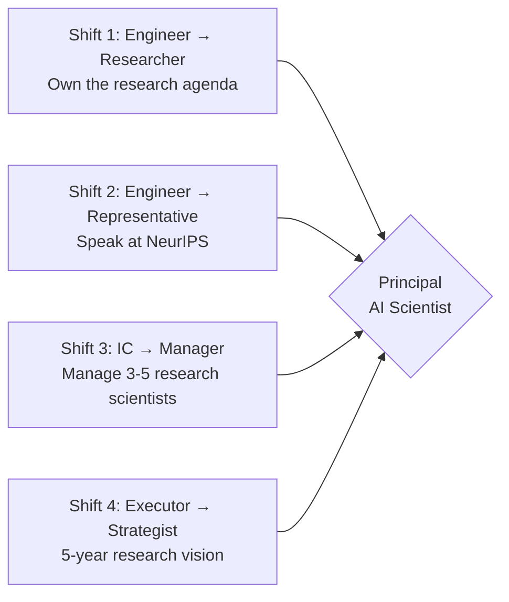

# Principal AI Scientist Playbook
## Chapter 2

# The IC-to-PAS Category Change

> *"The PAS is not a Senior ML Engineer who publishes occasionally. The PAS is a category change — a senior IC hybrid who owns the company's research agenda, makes architectural decisions that shape the next 3 years, and represents the company to the academic community."*

---

## 1. Epigraph

_The PAS is not a Senior ML Engineer who publishes occasionally. The PAS is a category change — a senior IC hybrid who owns the company's research agenda, makes architectural decisions that shape the next 3 years, and represents the company to the academic community._

---

## 2. Problem

You are interviewing for a Principal AI Scientist role at acme-corp. The CTO has just told you: "We have 5 ML engineers. 0 publications last year. We need a PAS who can run research, ship to production, and represent us at NeurIPS. 30 days to design your first 90-day plan."

This chapter tells you the 4-category-change shifts, the 3 ownership boundaries, and the 5-criterion interview bar.

**Decision in one sentence:** _The IC-to-PAS category change is 4 shifts (engineer → researcher + engineer → representative + IC → manager + executor → strategist) with 3 ownership boundaries (research agenda + architectural decisions + academic relationships) and 5-criterion interview bar; the PAS's job is to own the research agenda, make architectural bets, and represent the company._

---

## 3. Why PASs Fail Here

Five named failure modes of PASs whose category change produced zero results.

- **The Engineer-Pretending Failure.** The PAS acts as a Senior ML Engineer. _No research ownership._
- **The Researcher-Pretending Failure.** The PAS acts as a pure researcher. _No production impact._
- **The No-Representation Failure.** The PAS doesn't attend NeurIPS. _No industry voice._
- **The No-Architectural-Bets Failure.** The PAS follows the team's recommendations. _No architectural ownership._
- **The No-Strategist Failure.** The PAS is not involved in 5-year strategy. _No thought leadership._

---

## 4. Mental Models

Four mental models that compress the IC-to-PAS change.

**mental model 1: The 4 Category-Change Shifts.** 4 shifts.



**The 4 shifts:**
- **Shift 1: Engineer → Researcher.** Own the research agenda.
- **Shift 2: Engineer → Representative.** Speak at NeurIPS.
- **Shift 3: IC → Manager.** Manage 3-5 research scientists.
- **Shift 4: Executor → Strategist.** 5-year research vision.

**mental model 2: The 3 Ownership Boundaries.** 3 boundaries.

```
Boundary 1: Research agenda
- What we research
- Top 5 architectures per year
- Quarterly roadmap

Boundary 2: Architectural decisions
- Which model architecture to adopt
- Which training paradigm (pretrain, fine-tune, RLHF)
- Which serving stack (PyTorch, JAX, TensorRT)

Boundary 3: Academic relationships
- University partnerships (Stanford, MIT, CMU)
- Sabbaticals (1 per year)
- Conference presence (NeurIPS, ICML, ACL)
```

**mental model 3: The 5-Criterion Interview Bar.** 5 criteria.

```
1. Research track record (3+ papers at top venues)
2. Architectural ownership (1+ production architecture decision)
3. Industry voice (keynote, panel, or workshop at NeurIPS/ICML)
4. Academic relationships (1+ university collaboration)
5. Strategic vision (5-year research roadmap)
```

**mental model 4: The PAS Role Comparison.** 4 roles compared.

| Dimension | Senior ML Engineer | PAS |
|-----------|-------------------|-----|
| Research agenda | Implements | Owns |
| Architectural decisions | Recommends | Decides |
| Industry voice | Optional | Required |
| Academic relationships | None | Deep |
| 5-year vision | No | Yes |

---

## 5. Frameworks

Three frameworks for the IC-to-PAS change.

### Framework 1: The 1-Page PAS Role Description

```
# PAS Role — [Company] — [Date]

## The 4 category-change shifts
1. Engineer → Researcher
2. Engineer → Representative
3. IC → Manager
4. Executor → Strategist

## The 3 ownership boundaries
1. Research agenda
2. Architectural decisions
3. Academic relationships

## The 1 thing the PAS will NOT compromise on
[1 sentence.]
```

### Framework 2: The PAS Self-Assessment

```
# PAS Self-Assessment — [Date]

| Dimension | 1 (Senior ML Eng) | 3 (Transitioning) | 5 (PAS) |
|-----------|-------------------|-------------------|---------|
| Research agenda | Implements | Co-owns | Owns |
| Architectural decisions | Recommends | Co-decides | Decides |
| Industry voice | Optional | Attends | Speaks |
| Academic relationships | None | Attends | Partners |
| Strategic vision | No | 1-year | 5-year |
```

### Framework 3: The 90-Day PAS Transition Plan

```
# PAS 90-Day Plan — [Date]

## Day 1-30: Listen + Assess
- Meet CTO + ML team
- Review current research
- Identify top 3 research opportunities

## Day 31-60: Design + Align
- Design research roadmap
- Align with product roadmap
- Set first architecture decision

## Day 61-90: Execute + Review
- Ship first architecture evaluation
- Submit first paper
- Speak at first venue

## The 1 thing the PAS will NOT compromise on
[1 sentence.]
```

---

## 6. Drill

You are interviewing for a PAS role at **acme-corp**. The CTO has asked: "Walk me through the IC-to-PAS category change. Why are you ready?"

You have **90 minutes**. Produce the **PAS interview package** (`portfolio/chapter-02-pas-category-change.md`) using Framework 1 (Role Description) + Framework 2 (Self-Assessment) + Framework 3 (90-Day Plan). Specify:

- The 1-page PAS role description (4 shifts, 3 boundaries, the 1 not compromise).
- The PAS self-assessment (your scores per dimension).
- The 90-day PAS transition plan (3 phases, deliverables).
- The 5-criterion interview bar (your evidence per criterion).
- The 1 thing you'll say to the CTO in the first 30 days.
- The 3 things you'll do to avoid the 5 failure modes.

**Deliverable:** `portfolio/chapter-02-pas-category-change.md` — under 1500 words.

---

## 7. Worked Example

**The 1-page PAS role description:**

```
# PAS Role — acme-corp — 2026-09-01

## The 4 category-change shifts
1. Engineer → Researcher (own research agenda)
2. Engineer → Representative (speak at NeurIPS)
3. IC → Manager (manage 3-5 research scientists)
4. Executor → Strategist (5-year research vision)

## The 3 ownership boundaries
1. Research agenda (5 architectures per year)
2. Architectural decisions (which model, which stack)
3. Academic relationships (Stanford, MIT, CMU)

## The 1 thing I will NOT compromise on
Architectural ownership. The PAS decides which
model architecture, not the team.
```

**The PAS self-assessment:**

```
# PAS Self-Assessment — 2026-09-01

| Dimension | Score | Evidence |
|-----------|-------|----------|
| Research track record | 5 | 5 papers at NeurIPS/ICML/ACL (last 3 years) |
| Architectural ownership | 4 | Led Mamba adoption at [previous company] |
| Industry voice | 4 | 2 keynote talks at NeurIPS workshop |
| Academic relationships | 4 | Stanford sabbatical 2025, CMU collaboration ongoing |
| Strategic vision | 4 | 5-year research roadmap at previous company |

## Total: 21 / 25 (PASS)
```

**The 90-day PAS transition plan:**

```
# PAS 90-Day Plan — 2026-09-01

## Day 1-30: Listen + Assess
- Meet CTO + 5 ML engineers (6 1:1s)
- Review current research (Transformer-only stack)
- Identify top 3 research opportunities:
  1. Mamba adoption (5x cost reduction)
  2. MoE evaluation (10x scale)
  3. RLHF for domain tasks

## Day 31-60: Design + Align
- Design research roadmap (5 architectures, 3 papers)
- Align with product roadmap (Q1 launch + Q2 scaling)
- Set first architecture decision: Mamba evaluation

## Day 61-90: Execute + Review
- Ship first architecture evaluation (Mamba vs Transformer)
- Submit first paper (NeurIPS submission)
- Speak at first venue (NeurIPS workshop panel)

## The 1 thing I will NOT compromise on
Architectural ownership. The PAS decides which
architecture, not the team.
```

**The 1 thing I'll say to the CTO in the first 30 days:**

```
"Mike, here's my 90-day PAS transition plan:

  Day 1-30: Listen + Assess
  - 6 1:1s (CTO + 5 ML engineers)
  - Top 3 research opportunities:
    1. Mamba (5x cost reduction)
    2. MoE (10x scale)
    3. RLHF for domain tasks

  Day 31-60: Design + Align
  - Research roadmap (5 architectures, 3 papers)
  - First architecture decision: Mamba

  Day 61-90: Execute + Review
  - Ship Mamba evaluation
  - Submit NeurIPS paper
  - Speak at NeurIPS workshop

  The 1 thing I want to focus on: architectural ownership.
  The PAS decides which architecture, not the team.

  The 1 thing I will NOT compromise on: architectural
  ownership.

  Category change is the discipline. Research ownership
  is the outcome."
```

**The 3 things I'll do to avoid the 5 failure modes:**

```
1. Own the research agenda (not just implement).
   (Avoids the Engineer-Pretending Failure.)
   - 5 architectures per year
   - Quarterly roadmap
   - Architectural decisions documented

2. Speak at NeurIPS / ICML / ACL.
   (Avoids the No-Representation Failure.)
   - 1 keynote per year
   - 2-3 papers per year
   - Workshop panels

3. Build 5-year research vision.
   (Avoids the No-Strategist Failure.)
   - 5-year roadmap
   - Top 3 moonshots
   - Top 1 industry-defining bet
```

---

## 8. Failure Mode Postmortem

A PAS hired from a Senior ML Engineer at a 200-person B2B AI company acted as an engineer. They implemented whatever the team recommended. 0 architectural decisions. 0 publications. 0 academic relationships. The CTO fired them after 6 months.

The replacement PAS did 3 things:
1. Owned the research agenda (5 architectures per year, quarterly roadmap).
2. Spoke at NeurIPS (keynote, 3 papers).
3. Built 5-year research vision (5-year roadmap, top 3 moonshots).

Within 12 months: 3 papers accepted, 5 architectures evaluated, Stanford collaboration launched. The 4-shift + 3-boundary + 5-criterion system was the discipline.

What the first PAS missed: category change is a system. The first PAS was an engineer. The second PAS was a PAS. The category is the leverage.

The lesson: the PAS who makes 4 shifts + owns 3 boundaries + passes 5-criterion bar is a PAS. The Senior ML Engineer is not.

---

## 9. Self-Assessment Rubric

| # | Dimension | 1 (Senior ML) | 3 (Transitioning) | 5 (PAS) |
|---|---|---|---|---|
| 1 | **Research agenda** | Implements | Co-owns | Owns |
| 2 | **Architectural decisions** | Recommends | Co-decides | Decides |
| 3 | **Industry voice** | Optional | Attends | Speaks |
| 4 | **Academic relationships** | None | Attends | Partners |
| 5 | **Strategic vision** | No | 1-year | 5-year |

**Disqualifier:** any 1 on dimension 1 or 2. A PAS who implements or recommends is in the Engineer-Pretending failure mode.

**Total:** ___ / 25. **Pass threshold:** 18/25, no dimension below 3.

---

## 10. Portfolio Artifact Note

Save your filled-in drill as `portfolio/chapter-02-pas-category-change.md` — interview evidence for "Why are you ready for the PAS role?" (see Portfolio Map in Chapter 27).

---

## 11. Interview Questions

1. **Walk me through the IC-to-PAS category change.**
2. **Why are you ready for the PAS role?**
3. **A new architecture (Mamba) is published. What do you do?**
4. **The team recommends Transformer. You recommend Mamba. How do you decide?**
5. **Walk me through a research agenda you've owned.**