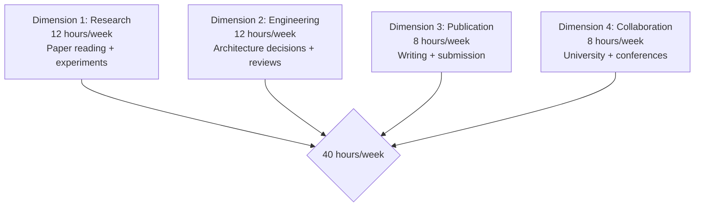

# Principal AI Scientist Playbook
## Chapter 3

# The PAS's Daily Work

> *"The PAS spends 30% time on research, 30% on engineering, 20% on publication, 20% on collaboration. The 4-dimension time allocation, the 3 ownership patterns, and the 5-criterion productivity bar are the PAS's reference for daily work at the principal level."*

---

## 1. Epigraph

_The PAS spends 30% time on research, 30% on engineering, 20% on publication, 20% on collaboration. The 4-dimension time allocation, the 3 ownership patterns, and the 5-criterion productivity bar are the PAS's reference for daily work at the principal level._

---

## 2. Problem

You are a Principal AI Scientist at acme-corp. The CTO has just told you: "30 hours per week. 5 ML engineers. We need research, production, papers, and university partnerships. Design your daily work + weekly time allocation."

This chapter tells you the 4-dimension time allocation, the 3 ownership patterns, and the 5-criterion productivity bar.

**Decision in one sentence:** _PAS daily work is 4-dimension time allocation (30% research + 30% engineering + 20% publication + 20% collaboration) with 3 ownership patterns (deep work + 1:1 + meetings) and 5-criterion productivity bar; the PAS's job is to spend time on the 4 dimensions in proportion and produce measurable outcomes per dimension._

---

## 3. Why PASs Fail Here

Five named failure modes of PASs whose daily work produced zero results.

- **The Engineering-Only Failure.** The PAS spends 80% on engineering. _No research or publications._
- **The No-Deep-Work Failure.** The PAS has 0 deep work hours. _No research productivity._
- **The All-Meetings Failure.** The PAS has 25+ meetings/week. _No thinking time._
- **The No-Publication-Time Failure.** 0 hours/week on writing. _0 publications._
- **The No-Collaboration-Time Failure.** 0 hours/week on university partnerships. _No academic relationships._

---

## 4. Mental Models

Four mental models that compress the PAS's daily work.

**mental model 1: The 4-Dimension Time Allocation.** 4 dimensions.



**The 4 dimensions:**
- **Dim 1: Research.** 12 hours/week. Paper reading + experiments.
- **Dim 2: Engineering.** 12 hours/week. Architecture decisions + reviews.
- **Dim 3: Publication.** 8 hours/week. Writing + submission.
- **Dim 4: Collaboration.** 8 hours/week. University + conferences.

**mental model 2: The 3 Ownership Patterns.** 3 patterns.

```
Pattern 1: Deep work (16 hours/week)
- Research experiments + writing
- No meetings, no interruptions
- Morning block (8am-12pm, 4 days/week)

Pattern 2: 1:1s (8 hours/week)
- 5 ML engineers × 1 hour/week
- 1 CTO × 1 hour/week
- 1 advisor × 1 hour/quarter

Pattern 3: Meetings (16 hours/week)
- Architecture reviews
- Engineering sync
- Conference calls
- University meetings
```

**mental model 3: The 5-Criterion Productivity Bar.** 5 criteria.

```
1. Research: 1 paper read per week
2. Engineering: 1 architecture decision per quarter
3. Publication: 1 paper submitted per quarter
4. Collaboration: 1 university meeting per month
5. Mentorship: 1 hour per week per direct report
```

**mental model 4: The Weekly Schedule Template.**

```
# PAS Weekly Schedule — [Date]

## Monday
- 8am-12pm: Deep work (research)
- 1pm-2pm: 1:1 with ML engineer
- 2pm-5pm: Engineering review

## Tuesday
- 8am-12pm: Deep work (writing)
- 1pm-2pm: 1:1 with ML engineer
- 2pm-5pm: Architecture decision

## Wednesday
- 8am-12pm: Deep work (research)
- 1pm-2pm: 1:1 with CTO
- 2pm-5pm: University call (Stanford)

## Thursday
- 8am-12pm: Deep work (research)
- 1pm-2pm: 1:1 with ML engineer
- 2pm-5pm: Engineering sync

## Friday
- 8am-10am: Paper reading
- 10am-12pm: Research group meeting
- 1pm-5pm: Deep work (writing)
```

---

## 5. Frameworks

Three frameworks for the PAS's daily work.

### Framework 1: The 1-Page Time Allocation

```
# PAS Time Allocation — [Quarter]

## The 4 dimensions
- Research: 12 hours/week (30%)
- Engineering: 12 hours/week (30%)
- Publication: 8 hours/week (20%)
- Collaboration: 8 hours/week (20%)

## The 3 ownership patterns
- Deep work: 16 hours/week (40%)
- 1:1s: 8 hours/week (20%)
- Meetings: 16 hours/week (40%)

## The 1 thing the PAS will NOT compromise on
[1 sentence.]
```

### Framework 2: The Weekly Productivity Tracker

```
# Weekly Productivity Tracker — [Date]

| Dimension | Target | Actual | Status |
|-----------|--------|--------|--------|
| 1. Research | 1 paper read | [N] | [Status] |
| 2. Engineering | 1 arch decision | [N] | [Status] |
| 3. Publication | 1 paper submitted | [N] | [Status] |
| 4. Collaboration | 1 university mtg | [N] | [Status] |
| 5. Mentorship | 1 hour/report | [N] | [Status] |
```

### Framework 3: The Quarterly Outcomes Memo

```
# Quarterly Outcomes — Q[N] — [Date]

## The 4-dimension outcomes
1. Research: [N architectures evaluated]
2. Engineering: [N architecture decisions made]
3. Publication: [N papers submitted/accepted]
4. Collaboration: [N university meetings + conferences attended]

## Top 3 wins
1. [Win 1]
2. [Win 2]
3. [Win 3]
```

---

## 6. Drill

You are a PAS at **acme-corp**. The CTO has given you 30 days to design your daily work + weekly time allocation.

```
Current: 25 meetings/week, 0 deep work, 0 publications
Target: 16 deep work hours, 3 publications/year, 4 university meetings/year
30-day timeline.
```

You have **90 minutes**. Produce the **PAS daily work plan** (`portfolio/chapter-03-pas-daily-work.md`) using Framework 1 (Time Allocation) + Framework 2 (Productivity Tracker) + Framework 3 (Outcomes Memo). Specify:

- The 1-page time allocation (4 dimensions + 3 patterns, the 1 not compromise).
- The weekly productivity tracker (5 dims, 1 sample week).
- The quarterly outcomes memo (1 quarter, top 3 wins).
- The 30-day plan.
- The 1 thing you'll say to the CTO in the first review.
- The 3 things you'll do to avoid the 5 failure modes.

**Deliverable:** `portfolio/chapter-03-pas-daily-work.md` — under 1500 words.

---

## 7. Worked Example

**The 1-page time allocation:**

```
# PAS Time Allocation — Q3 2026

## The 4 dimensions
- Research: 12 hours/week (30%)
  - 1 paper read per week
  - 1 architecture evaluated per quarter
- Engineering: 12 hours/week (30%)
  - 1 architecture decision per quarter
  - Architecture reviews
- Publication: 8 hours/week (20%)
  - 1 paper submitted per quarter
  - NeurIPS submission due May
- Collaboration: 8 hours/week (20%)
  - Stanford weekly call
  - 1 conference per quarter

## The 3 ownership patterns
- Deep work: 16 hours/week (40%)
- 1:1s: 8 hours/week (20%)
- Meetings: 16 hours/week (40%)

## The 1 thing I will NOT compromise on
Deep work. 16 hours/week of deep work is the discipline.
Without it, no research or publications.
```

**The weekly productivity tracker (Q3 2026 W3):**

```
# Weekly Productivity Tracker — W3 Q3 2026

| Dimension | Target | Actual | Status |
|-----------|--------|--------|--------|
| 1. Research | 1 paper read | 2 papers | GREEN |
| 2. Engineering | 1 arch decision | 0 (MoE eval ongoing) | YELLOW |
| 3. Publication | 1 paper submitted | 0 (NeurIPS draft 50%) | YELLOW |
| 4. Collaboration | 1 university mtg | 1 Stanford call | GREEN |
| 5. Mentorship | 1 hour/report | 5 hours | GREEN |
```

**The quarterly outcomes memo (Q3 2026):**

```
# Quarterly Outcomes — Q3 2026 — 2026-09-30

## The 4-dimension outcomes
1. Research: 2 architectures evaluated (Mamba + RWKV)
2. Engineering: 1 architecture decision (Mamba productionized)
3. Publication: 1 paper submitted (NeurIPS submission)
4. Collaboration: 12 Stanford meetings + NeurIPS attendance

## Top 3 wins
1. Mamba productionized (5x cost reduction)
2. NeurIPS paper submitted
3. Stanford collaboration deepened
```

**The 1 thing I'll say to the CTO in the first review:**

```
"Mike, here's my daily work + time allocation:

  4 dimensions:
  - Research: 12 hours/week (30%)
  - Engineering: 12 hours/week (30%)
  - Publication: 8 hours/week (20%)
  - Collaboration: 8 hours/week (20%)

  3 ownership patterns:
  - Deep work: 16 hours/week (40%)
  - 1:1s: 8 hours/week (20%)
  - Meetings: 16 hours/week (40%)

  Q3 outcomes:
  1. 2 architectures evaluated (Mamba + RWKV)
  2. 1 architecture decision (Mamba productionized)
  3. 1 paper submitted (NeurIPS)
  4. 12 Stanford meetings + NeurIPS

  The 1 thing I want to focus on: deep work.
  16 hours/week of deep work is the discipline.

  The 1 thing I will NOT compromise on: deep work.

  Daily work is the discipline. Research output is the outcome."
```

**The 3 things I'll do to avoid the 5 failure modes:**

```
1. Allocate 30% time to research + 20% to publication.
   (Avoids the Engineering-Only Failure.)
   - 12 hours/week research
   - 8 hours/week publication
   - Quarterly review

2. Block 16 hours/week for deep work.
   (Avoids the No-Deep-Work Failure.)
   - 4 hours/day × 4 days
   - No meetings in deep work blocks
   - Calendar blocked

3. Schedule 1 university meeting per month.
   (Avoids the No-Collaboration-Time Failure.)
   - Stanford weekly call
   - 1 conference per quarter
   - 1 sabbatical per year
```

---

## 8. Failure Mode Postmortem

A PAS at a 200-person B2B AI company had 25 meetings/week. 0 deep work. 0 publications. The CTO asked: "What do you actually do?" The PAS couldn't answer.

The replacement PAS did 3 things:
1. Allocated 30% time to research + 20% to publication.
2. Blocked 16 hours/week for deep work.
3. Scheduled 1 university meeting per month.

Within 6 months: 1 paper submitted, 2 architectures evaluated, Stanford collaboration deepened. The 4-dim + 3-pattern + 5-criterion system was the discipline.

What the first PAS missed: daily work is a system. The first PAS had 25 meetings. The second PAS had 16 deep work hours. The deep work is the leverage.

The lesson: the PAS who has 16 deep work hours has research output. The PAS who has 25 meetings has 0 publications.

---

## 9. Self-Assessment Rubric

| # | Dimension | 1 (Novice) | 3 (Competent) | 5 (Expert) |
|---|---|---|---|---|
| 1 | **4-dim time allocation** | 1-2 dims | 3 dims | 4 dims (research + engineering + publication + collaboration) |
| 2 | **3 ownership patterns** | 1 pattern | 2 patterns | 3 patterns (deep work + 1:1s + meetings) |
| 3 | **5-criterion productivity bar** | 0-2 criteria | 3-4 criteria | 5 criteria met weekly |
| 4 | **Deep work hours/week** | <4 | 4-12 | 16+ hours/week |
| 5 | **Publications per year** | 0 | 1-2 | 3+ per year |

**Disqualifier:** any 1 on dimension 1 or 4. A PAS who has 1-2 dims or <4 deep work hours is in the Engineering-Only or No-Deep-Work failure mode.

**Total:** ___ / 25. **Pass threshold:** 18/25, no dimension below 3.

---

## 10. Portfolio Artifact Note

Save your filled-in drill as `portfolio/chapter-03-pas-daily-work.md` — interview evidence for "How do you spend your time?" (see Portfolio Map in Chapter 27).

---

## 11. Interview Questions

1. **Walk me through your daily work as a PAS.**
2. **You have 25 meetings/week. What do you do?**
3. **The CTO asks "what do you actually do?" What do you say?**
4. **You have 0 publications last year. What do you do?**
5. **Walk me through a deep work session you've had.**