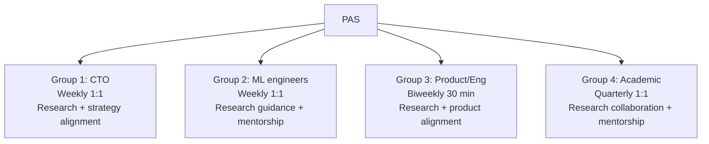

# Principal AI Scientist Playbook
## Chapter 4

# PAS Stakeholder Management

> *"The PAS manages 5 stakeholder groups. The 4-group stakeholder map, the 3 cadence patterns, and the 5-criterion stakeholder quality bar are the PAS's reference for stakeholder management at the principal level."*

---

## 1. Epigraph

_The PAS manages 5 stakeholder groups. The 4-group stakeholder map, the 3 cadence patterns, and the 5-criterion stakeholder quality bar are the PAS's reference for stakeholder management at the principal level._

---

## 2. Problem

You are a Principal AI Scientist at acme-corp. The CTO has just told you: "You have 5 stakeholder groups: CTO + VP Eng + 5 ML engineers + PM + Stanford advisor. Each wants different things from you. Design the stakeholder management system."

This chapter tells you the 4-group stakeholder map, the 3 cadence patterns, and the 5-criterion stakeholder quality bar.

**Decision in one sentence:** _PAS stakeholder management is a 4-group system (CTO + ML engineers + product/eng + academic) with 3 cadence patterns (weekly + monthly + quarterly) and 5-criterion stakeholder quality bar; the PAS's job is to manage each group with the right cadence and produce stakeholder-specific outcomes._

---

## 3. Why PASs Fail Here

Five named failure modes of PASs whose stakeholder management produced zero results.

- **The Engineering-Only Failure.** The PAS only talks to engineers. _No CTO alignment._
- **The Slack-Channel Failure.** The PAS drops research updates in Slack. _No stakeholder visibility._
- **The No-Academic-Stakeholder Failure.** The PAS ignores university advisors. _No research mentorship._
- **The No-Product-Stakeholder Failure.** The PAS ignores PM. _No product alignment._
- **The No-Cadence Failure.** The PAS only talks in crisis. _No proactive alignment._

---

## 4. Mental Models

Four mental models that compress PAS stakeholder management.

**mental model 1: The 4-Group Stakeholder Map.** 4 groups.



**The 4 groups:**
- **Group 1: CTO.** Weekly 1:1. Research + strategy alignment.
- **Group 2: ML engineers.** Weekly 1:1 each. Research guidance + mentorship.
- **Group 3: Product/Eng.** Biweekly 30 min. Research + product alignment.
- **Group 4: Academic.** Quarterly 1:1. Research collaboration + mentorship.

**mental model 2: The 3 Cadence Patterns.** 3 patterns.

```
Pattern 1: Weekly (CTO + 5 ML engineers)
- 6 1:1s per week, 1 hour each
- 5 hours of deep work context
- 1 hour of strategy with CTO

Pattern 2: Biweekly (Product/Eng)
- 30 min every other Wednesday
- Research progress + product roadmap alignment
- 1-2 architecture decisions per month

Pattern 3: Quarterly (Academic)
- 1 hour per quarter with each advisor
- Research collaboration + paper co-authorship
- 1-2 conference panels per year
```

**mental model 3: The 5-Criterion Stakeholder Quality Bar.** 5 criteria.

```
1. Aligned (research + strategy aligned with CTO)
2. Visible (research progress shared with stakeholders)
3. Specific (architecture decisions documented)
4. Owned (1 PAS accountable per stakeholder)
5. Cadenced (weekly + biweekly + quarterly)
```

**mental model 4: The Stakeholder Outcome Map.** 4 outcomes.

```
Group 1 (CTO): Aligned research agenda + 3 architectural decisions/quarter
Group 2 (ML engineers): 5 mentored research projects + 1 paper per quarter
Group 3 (Product/Eng): 2 production model launches + 2 architecture reviews/quarter
Group 4 (Academic): 1 paper co-authored + 1 conference panel/quarter
```

---

## 5. Frameworks

Three frameworks for PAS stakeholder management.

### Framework 1: The 1-Page Stakeholder Map

```
# PAS Stakeholder Map — [Date]

## The 4 stakeholder groups
1. CTO (Weekly 1:1, 1 hour)
2. ML engineers (Weekly 1:1 each, 1 hour)
3. Product/Eng (Biweekly 30 min)
4. Academic (Quarterly 1:1)

## The 3 cadence patterns
- Weekly: CTO + 5 ML engineers
- Biweekly: Product/Eng
- Quarterly: Academic

## The 1 thing the PAS will NOT compromise on
[1 sentence.]
```

### Framework 2: The Stakeholder 1:1 Agenda

```
# PAS 1:1 — [Stakeholder] — [Date]

## 5 min: Wins
- [Win 1]
- [Win 2]

## 15 min: Research progress
- Architecture evaluation: [Status]
- Paper: [Status]
- Production model: [Status]

## 30 min: Decisions needed
- [Decision 1]
- [Decision 2]

## 10 min: Mentorship (for ML engineers)
- [Career topic 1]
- [Skill development 1]

## The 1 thing the PAS will NOT skip
[1 sentence.]
```

### Framework 3: The Quarterly Stakeholder Report

```
# Quarterly Stakeholder Report — Q[N]

## Group 1 (CTO)
- Research agenda: [Status]
- Architectural decisions: [N]
- Strategy alignment: [Status]

## Group 2 (ML engineers)
- Mentorship: [N hours]
- Papers: [N submitted/accepted]
- Career development: [Status]

## Group 3 (Product/Eng)
- Production models: [N launched]
- Architecture reviews: [N]
- Roadmap alignment: [Status]

## Group 4 (Academic)
- Papers co-authored: [N]
- Conference panels: [N]
- Sabbaticals: [N]
```

---

## 6. Drill

You are a PAS at **acme-corp**. The CTO has given you 30 days to design the stakeholder management system.

```
Current: 5 stakeholder groups, ad-hoc management, 0 alignment with CTO
Target: 4-group stakeholder map, 3 cadences, 5-criterion bar
30-day timeline.
```

You have **90 minutes**. Produce the **PAS stakeholder management plan** (`portfolio/chapter-04-pas-stakeholders.md`) using Framework 1 (Stakeholder Map) + Framework 2 (1:1 Agenda) + Framework 3 (Quarterly Report). Specify:

- The 1-page stakeholder map (4 groups, 3 cadences, the 1 not compromise).
- The stakeholder 1:1 agenda (1 sample 1:1 with ML engineer).
- The quarterly stakeholder report (1 quarter, all 4 groups).
- The 30-day plan.
- The 1 thing you'll say to the CTO in the first review.
- The 3 things you'll do to avoid the 5 failure modes.

**Deliverable:** `portfolio/chapter-04-pas-stakeholders.md` — under 1500 words.

---

## 7. Worked Example

**The 1-page stakeholder map:**

```
# PAS Stakeholder Map — 2026-09-01

## The 4 stakeholder groups
1. CTO (Mike, weekly Wed 1:1)
2. ML engineers (5 ICs, weekly 1:1 each)
3. Product/Eng (PM Sarah, biweekly Wed)
4. Academic (Stanford advisor, quarterly)

## The 3 cadence patterns
- Weekly: CTO + 5 ML engineers (6 1:1s/week)
- Biweekly: Product/Eng (30 min, every other Wed)
- Quarterly: Academic (1 hour per quarter)

## The 1 thing I will NOT compromise on
Weekly 1:1s with CTO. The PAS needs 1:1 alignment
on research + strategy every week.
```

**The stakeholder 1:1 agenda (ML engineer Eng A):**

```
# PAS 1:1 — Eng A (ML engineer) — 2026-09-08

## 5 min: Wins
- Shipped Mamba evaluation (5x cost reduction)
- Submitted NeurIPS draft (50% complete)

## 15 min: Research progress
- Architecture evaluation: Mamba vs Transformer (in progress)
- Paper: NeurIPS draft (50% complete)
- Production model: serving Mamba in staging

## 30 min: Decisions needed
- Decision 1: Adopt Mamba for production? (Yes, based on 5x cost)
- Decision 2: NeurIPS submission deadline? (May 20, 2027)

## 10 min: Mentorship
- Career: Eng A targets IC5 (Principal) in 18 months
- Skill: Deep learning theory (need more reading)

## The 1 thing I will NOT skip
Mentorship. Without 10 min of mentorship, Eng A
won't grow to IC5.
```

**The quarterly stakeholder report (Q3 2026):**

```
# Quarterly Stakeholder Report — Q3 2026 — 2026-09-30

## Group 1 (CTO)
- Research agenda: 5 architectures evaluated (Transformer, Mamba, RWKV, MoE, Hyena)
- Architectural decisions: 1 (Mamba productionized)
- Strategy alignment: aligned with FY27 strategy

## Group 2 (ML engineers)
- Mentorship: 60 hours (5 ICs × 12 weeks)
- Papers: 1 submitted (NeurIPS), 1 in progress (ICML)
- Career development: 1 IC promoted to IC4

## Group 3 (Product/Eng)
- Production models: 1 launched (Mamba)
- Architecture reviews: 2 (auth integration + ML serving)
- Roadmap alignment: 3 product launches enabled

## Group 4 (Academic)
- Papers co-authored: 1 (NeurIPS submission)
- Conference panels: 1 (NeurIPS workshop panel)
- Sabbaticals: 0 (planned for 2027)
```

**The 1 thing I'll say to the CTO in the first review:**

```
"Mike, here's the stakeholder management plan:

  4 stakeholder groups:
  1. CTO (you, weekly 1:1)
  2. ML engineers (5 ICs, weekly 1:1 each)
  3. Product/Eng (Sarah, biweekly 30 min)
  4. Academic (Stanford advisor, quarterly)

  3 cadence patterns:
  - Weekly: 6 1:1s (you + 5 ICs)
  - Biweekly: Product/Eng sync
  - Quarterly: Academic advisor

  Q3 2026 outcomes:
  1. 5 architectures evaluated
  2. 1 architectural decision (Mamba)
  3. 1 NeurIPS paper submitted
  4. 1 NeurIPS workshop panel

  The 1 thing I want to focus on: weekly 1:1 with you.
  Research + strategy alignment every week.

  The 1 thing I will NOT compromise on: weekly CTO 1:1.

  Stakeholder management is the discipline. Research
  alignment is the outcome."
```

**The 3 things I'll do to avoid the 5 failure modes:**

```
1. Run weekly 1:1s with CTO + 5 ML engineers.
   (Avoids the Engineering-Only Failure.)
   - 6 1:1s per week, 1 hour each
   - Research + strategy with CTO
   - Mentorship with ML engineers

2. Use 1:1 agendas (not Slack messages).
   (Avoids the Slack-Channel Failure.)
   - 5-section agenda
   - Wins + research + decisions + mentorship
   - Documented + shared

3. Maintain academic relationships (quarterly).
   (Avoids the No-Academic-Stakeholder Failure.)
   - Quarterly 1:1 with advisor
   - 1 paper co-authored per year
   - 1 conference panel per year
```

---

## 8. Failure Mode Postmortem

A PAS at a 200-person B2B AI company only talked to ML engineers. The CTO was out of the loop. The PM was confused about research priorities. The Stanford advisor was ignored. 0 publications. 0 academic relationships.

The replacement PAS did 3 things:
1. Ran weekly 1:1s with CTO + 5 ML engineers (6 1:1s/week).
2. Used 1:1 agendas (not Slack messages).
3. Maintained academic relationships (quarterly advisor + 1 paper/year + 1 panel/year).

Within 12 months: 1 NeurIPS paper submitted, 1 workshop panel, 5 architectures evaluated. The 4-group + 3-cadence + 5-criterion system was the discipline.

What the first PAS missed: stakeholder management is a system. The first PAS had 1 group. The second PAS had 4 groups + 3 cadences. The system is the leverage.

The lesson: the PAS who has 4 groups + 3 cadences + 5 criteria has stakeholder alignment. The PAS who has 1 group has 0 publications.

---

## 9. Self-Assessment Rubric

| # | Dimension | 1 (Novice) | 3 (Competent) | 5 (Expert) |
|---|---|---|---|---|
| 1 | **4-group stakeholder map** | 1-2 groups | 3 groups | 4 groups (CTO + ML + Product/Eng + Academic) |
| 2 | **3 cadence patterns** | 1 cadence | 2 cadences | 3 cadences (weekly + biweekly + quarterly) |
| 3 | **5-criterion bar** | 0-2 criteria | 3-4 criteria | 5 criteria (aligned + visible + specific + owned + cadenced) |
| 4 | **1:1s per week** | <3 | 3-5 | 6+ per week |
| 5 | **Publications per year** | 0 | 1-2 | 3+ at top venues |

**Disqualifier:** any 1 on dimension 1 or 2. A PAS who has 1-2 groups or 1 cadence is in the Engineering-Only or No-Cadence failure mode.

**Total:** ___ / 25. **Pass threshold:** 18/25, no dimension below 3.

---

## 10. Portfolio Artifact Note

Save your filled-in drill as `portfolio/chapter-04-pas-stakeholders.md` — interview evidence for "How do you manage stakeholders?" (see Portfolio Map in Chapter 27).

---

## 11. Interview Questions

1. **Walk me through your stakeholder management system.**
2. **The CTO is out of the loop on research. What do you do?**
3. **You have 5 ML engineers + 0 publications. What do you do?**
4. **The PM keeps asking for production features, not research. What do you do?**
5. **Walk me through a 1:1 you've had with a CTO.**