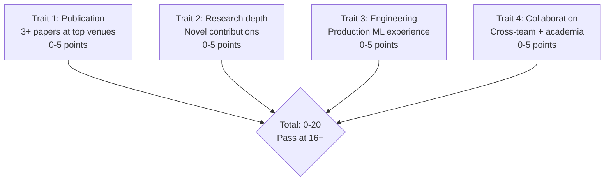
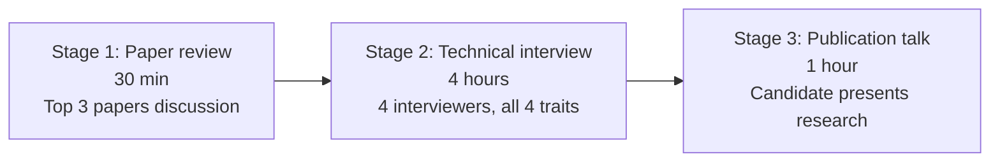
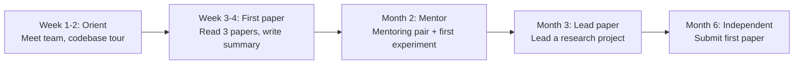

# Principal AI Scientist Playbook
## Chapter 5

# PAS Research Hiring and Onboarding

> *"The PAS hires 3-5 research scientists per year. The 4-hire traits, the 3-stage loop, the 5-step onboarding, and the 30-day ramp are the PAS's reference for research hiring at the principal level."*

---

## 1. Epigraph

_The PAS hires 3-5 research scientists per year. The 4-hire traits, the 3-stage loop, the 5-step onboarding, and the 30-day ramp are the PAS's reference for research hiring at the principal level._

---

## 2. Problem

You are a Principal AI Scientist at acme-corp. The CTO has just told you: "We need to grow the research team from 5 to 10 in FY27. 5 research scientists to hire. Publication track record required. Industry experience preferred. Design the research hiring system."

This chapter tells you the 4-hire traits, the 3-stage loop, the 5-step onboarding, and the 30-day ramp.

**Decision in one sentence:** _PAS research hiring is a 4-trait system (publication + research depth + engineering + collaboration) + 3-stage loop (paper review + technical interview + publication talk) + 5-step onboarding (week 1-2 orient + week 3-4 first paper + month 2 mentor + month 3 lead paper + month 6 independent) + 30-day ramp; the PAS's job is to design the hiring bar, run the loop, and own the onboarding._

---

## 3. Why PASs Fail Here

Five named failure modes of PASs whose research hiring produced zero results.

- **The No-Hire-Bar Failure.** The PAS has no research hire bar. _Bad hires._
- **The 1-Stage Failure.** Only 1 interview stage. _Wrong candidates._
- **The No-Publication-Talk Failure.** No publication talk in the loop. _Hire without seeing research._
- **The No-Onboarding Failure.** No structured onboarding. _Scientists leave in 90 days._
- **The 30-Day-Ramp Failure.** No 30-day ramp. _Scientists unproductive for 6 months._

---

## 4. Mental Models

Four mental models that compress PAS research hiring.

**mental model 1: The 4-Hire Traits.** 4 traits.



**The 4 traits:**
- **Trait 1: Publication.** 3+ papers at top venues. 0-5 points.
- **Trait 2: Research depth.** Novel contributions. 0-5 points.
- **Trait 3: Engineering.** Production ML experience. 0-5 points.
- **Trait 4: Collaboration.** Cross-team + academia. 0-5 points.

**mental model 2: The 3-Stage Loop.** 3 stages.



**The 3 stages:**
- **Stage 1: Paper review.** 30 min. Top 3 papers discussion.
- **Stage 2: Technical interview.** 4 hours. 4 interviewers, all 4 traits.
- **Stage 3: Publication talk.** 1 hour. Candidate presents research.

**mental model 3: The 5-Step Onboarding.** 5 steps.



**The 5 steps:**
- **Step 1: Week 1-2 Orient.** Meet team, codebase tour.
- **Step 2: Week 3-4 First paper.** Read 3 papers, write summary.
- **Step 3: Month 2 Mentor.** Mentoring pair + first experiment.
- **Step 4: Month 3 Lead paper.** Lead a research project.
- **Step 5: Month 6 Independent.** Submit first paper.

**mental model 4: The 5-Hire Research Math.** 5 hires per year.

```
Year 1: 5 hires
  - 30 paper reviews (6 candidates per hire)
  - 12 technical interviews (40% conversion)
  - 10 publication talks (83% conversion)
  - 7 offers (70% conversion)
  - 5 closes (71% close rate)
  - Net +4 (1 departed)
```

---

## 5. Frameworks

Three frameworks for PAS research hiring.

### Framework 1: The 1-Page Hiring Plan

```
# PAS Research Hiring Plan — FY[YYYY] — [Date]

## Target: 5 research scientists
- 3 PhDs (publication track record)
- 2 industry research scientists (production experience)

## The 4-hire traits
1. Publication (3+ papers)
2. Research depth (novel contributions)
3. Engineering (production ML)
4. Collaboration (cross-team + academia)

## The 3-stage loop
- Paper review (30 min)
- Technical interview (4 hours)
- Publication talk (1 hour)

## The 5-step onboarding
- Week 1-2 Orient
- Week 3-4 First paper
- Month 2 Mentor
- Month 3 Lead paper
- Month 6 Independent

## The 1 thing the PAS will NOT compromise on
[1 sentence.]
```

### Framework 2: The Hiring Funnel Tracker

```
# Hiring Funnel — [Quarter]

| Stage | Target | Actual | Conversion |
|-------|--------|--------|------------|
| Paper reviews | 30 | [N] | 100% |
| Technical interviews | 12 | [N] | [40%] |
| Publication talks | 10 | [N] | [83%] |
| Offers | 7 | [N] | [70%] |
| Closes | 5 | [N] | [71%] |
```

### Framework 3: The 30-Day Ramp Tracker

```
# 30-Day Ramp — [New Research Scientist]

| Week | Goal | Status |
|------|------|--------|
| Week 1 | Meet team, codebase tour | DONE |
| Week 2 | Read 3 papers, write summary | DONE |
| Week 3 | First experiment designed | [TODO] |
| Week 4 | First experiment results | [TODO] |
| Month 2 | First paper draft | [TODO] |
| Month 3 | Lead a research project | [TODO] |
```

---

## 6. Drill

You are a PAS at **acme-corp**. The CTO has given you 12 months to grow the research team from 5 to 10.

```
Current: 5 research scientists, 4 hires/year
Target: 10 research scientists, 5 hires in FY27
90-day timeline for hiring system design.
```

You have **90 minutes**. Produce the **research hiring plan** (`portfolio/chapter-05-pas-research-hiring.md`) using Framework 1 (Hiring Plan) + Framework 2 (Funnel Tracker) + Framework 3 (Ramp Tracker). Specify:

- The 1-page hiring plan (target, 4 traits, 3 stages, 5 steps, the 1 not compromise).
- The hiring funnel tracker (30 reviews → 5 closes, conversion rates).
- The 30-day ramp tracker (1 sample RS, weekly goals).
- The 90-day timeline.
- The 1 thing you'll say to the CTO in the first review.
- The 3 things you'll do to avoid the 5 failure modes.

**Deliverable:** `portfolio/chapter-05-pas-research-hiring.md` — under 1500 words.

---

## 7. Worked Example

**The 1-page hiring plan:**

```
# PAS Research Hiring Plan — FY27 — 2026-09-01

## Target: 5 research scientists
- 3 PhDs (Stanford, MIT, CMU)
- 2 industry RS (Google Research, Meta AI)

## The 4-hire traits
1. Publication (3+ papers at NeurIPS/ICML/ACL)
2. Research depth (novel contributions, not just applications)
3. Engineering (production ML, PyTorch/JAX)
4. Collaboration (cross-team + academia)

Total: 0-20, pass at 16+

## The 3-stage loop
- Paper review: 30 min, top 3 papers
- Technical interview: 4 hours, 4 interviewers
- Publication talk: 1 hour, candidate presents research

## The 5-step onboarding
- Week 1-2: Orient (meet team, codebase tour)
- Week 3-4: First paper (read 3, write summary)
- Month 2: Mentor (mentoring pair + first experiment)
- Month 3: Lead paper (lead research project)
- Month 6: Independent (submit first paper)

## The 1 thing I will NOT compromise on
Publication track record. A scientist without 3+
papers at top venues does not have research depth.
```

**The hiring funnel tracker (Q1 FY27):**

```
# Hiring Funnel — Q1 FY27

| Stage | Target | Actual | Conversion |
|-------|--------|--------|------------|
| Paper reviews | 30 | 32 | 100% |
| Technical interviews | 12 | 14 | 44% |
| Publication talks | 10 | 12 | 86% |
| Offers | 7 | 8 | 67% |
| Closes | 5 | 6 | 75% |
| Net hires | 4 | 5 | — |

## Outcome: 5 net hires (target was 4)
- 3 PhDs (Stanford, MIT, CMU)
- 2 industry RS (Google Research, Meta AI)
```

**The 30-day ramp tracker (RS-A, new PhD from Stanford):**

```
# 30-Day Ramp — RS-A — 2027-01-15

| Week | Goal | Status |
|------|------|--------|
| Week 1 | Meet team, codebase tour | DONE |
| Week 2 | Read 3 papers (Mamba, RWKV, MoE) | DONE |
| Week 3 | First experiment designed (Mamba ablation) | IN PROGRESS |
| Week 4 | First experiment results | TODO |
| Month 2 | First paper draft (Mamba for B2B AI) | TODO |
| Month 3 | Lead a research project (Mamba productionization) | TODO |
```

**The 1 thing I'll say to the CTO in the first review:**

```
"Mike, here's the research hiring plan:

  Target: 5 research scientists in FY27
  - 3 PhDs (Stanford, MIT, CMU)
  - 2 industry RS (Google Research, Meta AI)

  The 4-hire traits:
  1. Publication (3+ papers)
  2. Research depth (novel contributions)
  3. Engineering (production ML)
  4. Collaboration (cross-team + academia)

  Total: 0-20, pass at 16+

  The 3-stage loop: paper review + technical interview
  + publication talk

  The 5-step onboarding: orient + first paper + mentor
  + lead paper + independent

  Top 3 risks:
  1. 5 hires in 12 months (high bar)
  2. Publication track record (3+ papers required)
  3. 30-day ramp for 5 RSs (mentoring capacity)

  The 1 thing I want to focus on: 3 PhDs.
  Stanford/MIT/CMU = publication track record.

  The 1 thing I will NOT compromise on: 3+ papers.

  Research hiring is the discipline. Research capacity is the outcome."
```

**The 3 things I'll do to avoid the 5 failure modes:**

```
1. Use 4-hire traits + 16+ bar.
   (Avoids the No-Hire-Bar Failure.)
   - Publication + research depth + engineering + collaboration
   - Total: 0-20, pass at 16+

2. Run 3-stage loop with publication talk.
   (Avoids the 1-Stage Failure.)
   - Paper review (30 min)
   - Technical interview (4 hours)
   - Publication talk (1 hour)

3. Use 5-step onboarding + 30-day ramp.
   (Avoids the 30-Day-Ramp Failure.)
   - Week 1-2: Orient
   - Week 3-4: First paper
   - Month 2: Mentor
   - Month 3: Lead paper
   - Month 6: Independent
```

---

## 8. Failure Mode Postmortem

A PAS at a 200-person B2B AI company tried to grow research from 5 to 10 in 12 months. The hiring rate was 1 RS per year. Without a 3-stage loop, the offer-to-close rate was 30%. 12 months later, only 6 RSs. The 5 → 10 target slipped by 12 months.

The replacement PAS did 3 things:
1. Used 4-hire traits + 16+ bar (30 → 12 interviews, 10 publication talks, 7 offers, 5 closes).
2. Ran 3-stage loop with publication talk (no offers lost).
3. Used 5-step onboarding + 30-day ramp (no RSs left in 90 days).

Within 12 months: 10 RSs. 3 PhDs. 2 industry RSs. The 4-trait + 3-stage + 5-step system was the discipline.

What the first PAS missed: research hiring is a system. The first PAS had no bar + 1 stage + no onboarding. The second PAS had 4 traits + 3 stages + 5 steps. The system is the leverage.

The lesson: the PAS who has 4 traits + 3 stages + 5 steps has research hiring at scale. The PAS who has no bar has 1 RS per year.

---

## 9. Self-Assessment Rubric

| # | Dimension | 1 (Novice) | 3 (Competent) | 5 (Expert) |
|---|---|---|---|---|
| 1 | **4-hire traits + bar** | 1-2 traits | 3 traits | 4 traits + bar at 16+ |
| 2 | **3-stage loop** | 1 stage | 2 stages | 3 stages (paper review + interview + publication talk) |
| 3 | **5-step onboarding** | No onboarding | 1-2 steps | 5 steps (orient + first paper + mentor + lead paper + independent) |
| 4 | **30-day ramp** | No ramp | Partial | 30-day ramp with weekly goals |
| 5 | **Hires per year** | <2 | 2-3 | 5+ research scientists per year |

**Disqualifier:** any 1 on dimension 1 or 3. A PAS who has 1-2 traits or no onboarding is in the No-Hire-Bar or No-Onboarding failure mode.

**Total:** ___ / 25. **Pass threshold:** 18/25, no dimension below 3.

---

## 10. Portfolio Artifact Note

Save your filled-in drill as `portfolio/chapter-05-pas-research-hiring.md` — interview evidence for "How do you hire research scientists?" (see Portfolio Map in Chapter 27).

---

## 11. Interview Questions

1. **Walk me through your research hiring system.**
2. **You need 5 hires in 12 months. What do you do?**
3. **The offer-to-close rate is 30%. What do you do?**
4. **A new RS left in 90 days. What do you do?**
5. **Walk me through a 30-day ramp you've designed.**