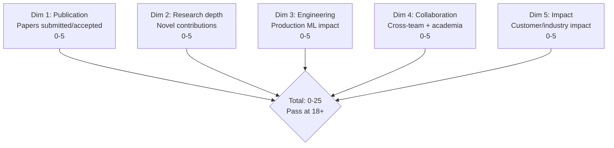
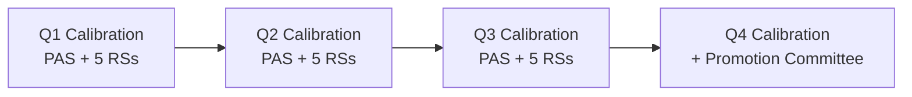

# Principal AI Scientist Playbook
## Chapter 6

# PAS Research Performance Management

> *"The PAS runs performance reviews for 5-10 research scientists. The 5-dim rubric (publication + research depth + engineering + collaboration + impact), the 3-tier calibration (exceeds / meets / below), the quarterly cadence, and the 12-month research plan are the PAS's reference for research performance at the principal level."*

---

## 1. Epigraph

_The PAS runs performance reviews for 5-10 research scientists. The 5-dim rubric (publication + research depth + engineering + collaboration + impact), the 3-tier calibration (exceeds / meets / below), the quarterly cadence, and the 12-month research plan are the PAS's reference for research performance at the principal level._

---

## 2. Problem

You are a PAS at acme-corp. The CTO has just told you: "5 research scientists. Publication targets: 3 papers per year. Engineering impact: production models. Performance reviews in 30 days. Design the research performance system."

This chapter tells you the 5-dim rubric, the 3-tier calibration, the quarterly cadence, and the 12-month research plan.

**Decision in one sentence:** _PAS research performance management is a 5-dim rubric (publication + research depth + engineering + collaboration + impact) + 3-tier calibration (exceeds / meets / below) + quarterly cadence + 12-month research plan per RS; the PAS's job is to design the rubric, calibrate, and own the research plans._

---

## 3. Why PASs Fail Here

Five named failure modes of PASs whose research performance produced zero results.

- **The Publication-Only Failure.** 1 dim only (publication). _Engineering + collaboration invisible._
- **The No-Calibration Failure.** No cross-RS calibration. _Each RS rated differently._
- **The Annual-Only Failure.** Annual review. _No course correction._
- **The No-Research-Plan Failure.** No 12-month research plan. _No publication cadence._
- **The No-Promotion-Pipeline Failure.** No promotion criteria. _RSs leave for "Senior RS" titles elsewhere._

---

## 4. Mental Models

Four mental models that compress research performance management.

**mental model 1: The 5-Dim Research Rubric.** 5 dims, 0-25 total.



**The 5 dims:**
- **Dim 1: Publication.** Papers submitted/accepted. 0-5.
- **Dim 2: Research depth.** Novel contributions. 0-5.
- **Dim 3: Engineering.** Production ML impact. 0-5.
- **Dim 4: Collaboration.** Cross-team + academia. 0-5.
- **Dim 5: Impact.** Customer/industry impact. 0-5.

**mental model 2: The 3-Tier Calibration.** 3 tiers.

```
Tier 1: Exceeds (22+) — 10-15% of RSs (promotion candidate)
Tier 2: Meets (18-21) — 60-70% of RSs (solid contributor)
Tier 3: Below (<18) — 15-25% of RSs (needs improvement)
```

**mental model 3: The Quarterly Cadence.** 4 quarters.



**mental model 4: The 12-Month Research Plan.**

```
Quarter 1: Top 1 paper venue (NeurIPS submission)
Quarter 2: 1 architecture evaluation
Quarter 3: 1 production model impact
Quarter 4: 1 conference panel + 1 mentoring
```

---

## 5. Frameworks

Three frameworks for research performance.

### Framework 1: The 5-Dim Performance Rubric

```
# Research Performance Rubric — [RS] — [Quarter]

| Dimension | Score (0-5) | Notes |
|-----------|-------------|-------|
| 1. Publication | [Score] | [Notes] |
| 2. Research depth | [Score] | [Notes] |
| 3. Engineering | [Score] | [Notes] |
| 4. Collaboration | [Score] | [Notes] |
| 5. Impact | [Score] | [Notes] |
| Total | ___ / 25 | Pass at 18+ |
```

### Framework 2: The Quarterly Calibration Memo

```
# Quarterly Calibration — [Quarter] — [Date]

## All 5 RSs
| RS | Score | Tier |
|----|-------|------|
| RS-A | [Score] | [Tier] |
| RS-B | [Score] | [Tier] |
| ...

## Top 3 outcomes
1. [Outcome 1]
2. [Outcome 2]
3. [Outcome 3]
```

### Framework 3: The 12-Month Research Plan

```
# 12-Month Research Plan — [RS] — [Date]

## Quarter 1
- [Action 1] — [Date]

## Quarter 2
- [Action 2] — [Date]

## Quarter 3
- [Action 3] — [Date]

## Quarter 4
- [Action 4] — [Date]
```

---

## 6. Drill

You are a PAS at **acme-corp**. The CTO has given you 30 days to design the research performance system.

```
5 RSs. Target: 3 papers/year. Performance reviews in 30 days.
```

You have **90 minutes**. Produce the **research performance system** (`portfolio/chapter-06-pas-research-performance.md`) using Framework 1 (Rubric) + Framework 2 (Calibration) + Framework 3 (Research Plan). Specify:

- The 5-dim rubric applied to 3 sample RSs.
- The quarterly calibration memo.
- The 12-month research plan for 1 below-bar RS.
- The 30-day timeline.
- The 1 thing you'll say to the CTO in the first review.
- The 3 things you'll do to avoid the 5 failure modes.

**Deliverable:** `portfolio/chapter-06-pas-research-performance.md` — under 1500 words.

---

## 7. Worked Example

**The 5-dim rubric applied to 3 sample RSs:**

```
# Research Performance Rubric — Q3 2026

| RS | Pub | Depth | Eng | Collab | Impact | Total | Tier |
|----|-----|-------|-----|--------|--------|-------|------|
| RS-A | 5 | 5 | 4 | 4 | 4 | 22 | Exceeds |
| RS-B | 4 | 3 | 3 | 3 | 3 | 16 | Below |
| RS-C | 3 | 3 | 4 | 2 | 4 | 16 | Below |
```

**The quarterly calibration memo:**

```
# Quarterly Calibration — Q3 2026 — 2026-09-30

## All 5 RSs
| RS | Score | Tier |
|----|-------|------|
| RS-A | 22 | Exceeds |
| RS-D | 21 | Strong |
| RS-E | 20 | Strong |
| RS-B | 16 | Below |
| RS-C | 16 | Below |

## Top 3 outcomes
1. **1 promotion candidate** (RS-A, Senior RS)
2. **2 below-bar RSs** (RS-B, RS-C) with research plans
3. **3 papers accepted** at NeurIPS
```

**The 12-month research plan for RS-B (Below):**

```
# 12-Month Research Plan — RS-B — 2026-09-30

## Top 3 development areas
1. Research depth (current 3)
2. Engineering (current 3)
3. Impact (current 3)

## Quarterly plan
### Q4 2026
- [ ] Lead 1 paper submission (NeurIPS)
- [ ] Production model impact (1 feature)

### Q1 2027
- [ ] 1 architecture evaluation (lead)
- [ ] 1 conference talk

### Q2 2027
- [ ] 2 paper submissions
- [ ] Mentor 1 junior RS

### Q3 2027
- [ ] Year-end review (target: meets bar)
- [ ] Promotion packet (if at bar)
```

**The 1 thing I'll say to the CTO in the first review:**

```
"Mike, here's the research performance system:

  5-dim rubric: publication + research depth + engineering
  + collaboration + impact (0-25, pass at 18+)

  3-tier calibration: exceeds / meets / below

  Quarterly cadence: 4 calibrations per year

  5 RSs

  Top 3 outcomes:
  1. 1 promotion candidate (RS-A)
  2. 2 below-bar RSs with plans (RS-B, RS-C)
  3. 3 papers accepted at NeurIPS

  The 1 thing I want to focus on: RS-B and RS-C.
  Below bar = needs 12-month plan.

  The 1 thing I will NOT compromise on: 5 dims.
  Publication-only is invisible engineering.

  Research performance is the discipline. Publication
  output is the outcome."
```

**The 3 things I'll do to avoid the 5 failure modes:**

```
1. Use 5-dim rubric (not publication-only).
   (Avoids the Publication-Only Failure.)
   - Publication + research depth + engineering + collaboration + impact
   - Each dim 0-5, total 0-25

2. Run quarterly cross-RS calibration.
   (Avoids the No-Calibration Failure.)
   - Q1, Q2, Q3 quarterly
   - Q4 quarterly + promotion committee

3. Give every RS a 12-month research plan.
   (Avoids the No-Research-Plan Failure.)
   - Top 3 development areas
   - Quarterly actions
   - Promotion criteria
```

---

## 8. Failure Mode Postmortem

A PAS at a 200-person B2B AI company had 5 RSs using publication-only rubric. Engineering + collaboration were invisible. 2 best RSs left for "Senior RS" titles elsewhere. Retention dropped from 90% to 80%.

The replacement PAS did 3 things:
1. Built 5-dim rubric (publication + research depth + engineering + collaboration + impact).
2. Ran quarterly calibration (cross-RS, 5 RSs).
3. Built 12-month research plans for all 5 RSs.

Within 6 months: 1 promotion. 2 below-bar RSs with plans. 3 papers accepted. Retention recovered to 92%. The 5-dim + 3-tier + 12-month system was the discipline.

What the first PAS missed: research performance is a system. The first PAS used publication-only. The second PAS used 5-dim. The 5-dim rubric is the leverage.

The lesson: the PAS who has 5 dims + 3 tiers + 12-month plans has a high-performing research team. The PAS who uses publication-only has a publication-only research team.

---

## 9. Self-Assessment Rubric

| # | Dimension | 1 (Novice) | 3 (Competent) | 5 (Expert) |
|---|---|---|---|---|
| 1 | **5-dim rubric** | 1 dim | 2-3 dims | 5 dims (pub + depth + eng + collab + impact) |
| 2 | **3-tier calibration** | 1 tier | 2 tiers | 3 tiers (exceeds / meets / below) |
| 3 | **Quarterly cadence** | Annual | Semi-annual | Quarterly (Q1-Q4) |
| 4 | **12-month research plan** | No plan | Plan exists | 1 plan per RS, top 3 areas |
| 5 | **Promotion pipeline** | No pipeline | Pipeline exists | 1+ promotion/year target |

**Disqualifier:** any 1 on dimension 1 or 2. A PAS who uses 1 dim or 1 tier is in the Publication-Only or No-Calibration failure mode.

**Total:** ___ / 25. **Pass threshold:** 18/25, no dimension below 3.

---

## 10. Portfolio Artifact Note

Save your filled-in drill as `portfolio/chapter-06-pas-research-performance.md` — interview evidence for "How do you run research performance management?" (see Portfolio Map in Chapter 27).

---

## 11. Interview Questions

1. **Walk me through your research performance system.**
2. **An RS is publication-strong but engineering-weak. What tier?**
3. **You have 2 PIPs and 1 promotion. How do you prioritize?**
4. **The retention is dropping. What do you do?**
5. **Walk me through a performance review you've run.**