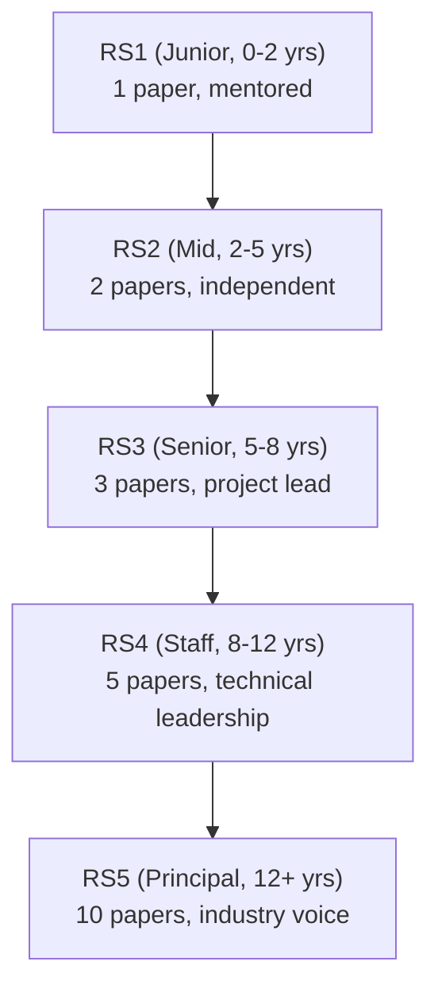

# Principal AI Scientist Playbook
## Chapter 7

# PAS Research Career Ladder

> *"The PAS designs the research career ladder. The 5-level RS ladder, the 5-criterion promotion packet, and the 12-month cadence are the PAS's reference for research careers at the principal level."*

---

## 1. Epigraph

_The PAS designs the research career ladder. The 5-level RS ladder, the 5-criterion promotion packet, and the 12-month cadence are the PAS's reference for research careers at the principal level._

---

## 2. Problem

You are a PAS at acme-corp. The CTO has just told you: "5 RSs. RS ladder unclear. Promotion pipeline broken. RSs leaving for 'Senior RS' titles elsewhere. Design the research career ladder."

This chapter tells you the 5-level RS ladder, the 5-criterion promotion packet, and the 12-month cadence.

**Decision in one sentence:** _PAS research career ladder is a 5-level RS ladder (RS1-RS5) with 5-criterion promotion packet (papers + novelty + engineering + collaboration + impact) and 12-month promotion cadence; the PAS's job is to design the ladder, document the criteria, and own the promotion process._

---

## 3. Why PASs Fail Here

Five named failure modes of PASs whose research career ladder produced zero results.

- **The Vague-Criteria Failure.** Criteria unclear. _Promotions are surprises._
- **The No-Research-Track Failure.** RSs go to engineering track. _No research depth._
- **The 3-Year-Stall Failure.** RSs stall at same level. _No growth._
- **The No-Promotion-Packet Failure.** No packet format. _Promotion committee can't decide._
- **The 0-Promotion Failure.** 0 promotions per year. _RSs leave._

---

## 4. Mental Models

Four mental models that compress research career ladder.

**mental model 1: The 5-Level RS Ladder.** 5 levels.



**The 5 levels:**
- **RS1 (Junior, 0-2 yrs).** 1 paper, mentored.
- **RS2 (Mid, 2-5 yrs).** 2 papers, independent.
- **RS3 (Senior, 5-8 yrs).** 3 papers, project lead.
- **RS4 (Staff, 8-12 yrs).** 5 papers, technical leadership.
- **RS5 (Principal, 12+ yrs).** 10 papers, industry voice.

**mental model 2: The 5-Criterion Promotion Packet.** 5 elements.

```
1. Papers: N papers at top venues
2. Novelty: novel contributions (not just applications)
3. Engineering: production ML impact
4. Collaboration: cross-team + academia
5. Impact: customer/industry impact
```

**mental model 3: The 12-Month Promotion Cadence.** 12 months per level.

```
Year 1: 1-2 criteria for NEXT level
Year 2: 1-2 more criteria (3-4 total)
Year 3: promotion review (3+ criteria hit + packet)
```

**mental model 4: The Promotion Pipeline.** 1+ promotion per year.

```
Year 1: 1 promotion target
Year 2: 2 promotion target
Year 3: 3 promotion target
```

---

## 5. Frameworks

Three frameworks for research career ladder.

### Framework 1: The 1-Page RS Ladder Map

```
# Research Career Ladder — [Date]

## The 5 levels
- RS1 (Junior): 1 paper, mentored
- RS2 (Mid): 2 papers, independent
- RS3 (Senior): 3 papers, project lead
- RS4 (Staff): 5 papers, technical leadership
- RS5 (Principal): 10 papers, industry voice

## The 1 thing the PAS will NOT compromise on
[1 sentence.]
```

### Framework 2: The Promotion Packet Template

```
# Promotion Packet — [RS] — [Level] — [Date]

## The 5 elements
1. Papers: [N papers, venues]
2. Novelty: [novel contributions]
3. Engineering: [production impact]
4. Collaboration: [cross-team + academia]
5. Impact: [customer/industry impact]
```

### Framework 3: The 12-Month Promotion Roadmap

```
# 12-Month Promotion Roadmap — [RS] — [Level]

## Quarter 1: Criteria hit #1
- [Action] — [Date]

## Quarter 2: Criteria hit #2
- [Action] — [Date]

## Quarter 3: Criteria hit #3
- [Action] — [Date]

## Quarter 4: Promotion packet
- [Action: packet]
- [Action: committee]
```

---

## 6. Drill

You are a PAS at **acme-corp**. The CTO has given you 90 days to redesign the research career ladder.

```
5 RSs. 0-1 promotions/year. RSs leaving for "Senior RS" titles elsewhere.
```

You have **90 minutes**. Produce the **research career ladder redesign** (`portfolio/chapter-07-pas-research-career.md`) using Framework 1 (Ladder Map) + Framework 2 (Promotion Packet) + Framework 3 (Promotion Roadmap). Specify:

- The 1-page RS ladder map (5 levels, the 1 not compromise).
- The promotion packet template (1 sample RS, 5 elements).
- The 12-month promotion roadmap (1 RS RS3 → RS4).
- The 90-day timeline.
- The 1 thing you'll say to the CTO in the first review.
- The 3 things you'll do to avoid the 5 failure modes.

**Deliverable:** `portfolio/chapter-07-pas-research-career.md` — under 1500 words.

---

## 7. Worked Example

**The 1-page RS ladder map:**

```
# Research Career Ladder — 2026-09-01

## The 5 levels
- RS1 (Junior): 1 paper at top venue
- RS2 (Mid): 2 papers, 1 lead author
- RS3 (Senior): 3 papers, project lead
- RS4 (Staff): 5 papers, technical leadership
- RS5 (Principal): 10 papers, industry voice

## The 1 thing I will NOT compromise on
Promotion criteria clarity. Every level must have
3-5 measurable criteria.
```

**The promotion packet template (RS-A, RS3 → RS4):**

```
# Promotion Packet — RS-A — RS3 → RS4 (Staff) — 2026-09-01

## The 5 elements
1. Papers: 6 papers at NeurIPS/ICML (3 as lead author)
2. Novelty: Mamba for B2B AI (novel contribution)
3. Engineering: Mamba productionized (5x cost reduction)
4. Collaboration: Stanford collaboration, 1 joint paper
5. Impact: $500K ARR enabled (Mamba for B2B AI)
```

**The 12-month promotion roadmap:**

```
# 12-Month Promotion Roadmap — RS-A — RS3 → RS4 — 2026-09-01

## Q4 2026
- [x] 2 papers submitted
- [x] 1 architecture evaluation led

## Q1 2027
- [ ] 2 more papers
- [ ] 1 industry talk

## Q2 2027
- [ ] 1 production model impact
- [ ] 1 mentoring pair

## Q3 2027: Promotion packet
- [ ] Packet drafted
- [ ] Promotion committee
```

**The 1 thing I'll say to the CTO in the first review:**

```
"Mike, here's the research career ladder:

  5-level RS ladder:
  - RS1 (Junior) → RS2 (Mid) → RS3 (Senior)
  - RS4 (Staff) → RS5 (Principal)

  12-month promotion cadence per level
  5-criterion promotion packet:
  - Papers + Novelty + Engineering + Collaboration + Impact

  Target: 1+ promotion/year

  Top 3 outcomes:
  1. RS-A promotion packet (RS3 → RS4)
  2. Career ladder documented
  3. RS ladder shared with all 5 RSs

  The 1 thing I want to focus on: criteria clarity.
  Every level has 3-5 measurable criteria.

  The 1 thing I will NOT compromise on: criteria clarity.

  Research ladder is the discipline. RS retention is the outcome."
```

**The 3 things I'll do to avoid the 5 failure modes:**

```
1. Document 3-5 criteria per RS level.
   (Avoids the Vague-Criteria Failure.)
   - RS1-RS5: 3-5 criteria each

2. Maintain research track (not engineering track).
   (Avoids the No-Research-Track Failure.)
   - 5-level RS ladder
   - RSs stay on research track
   - Engineering + academia as side contributions

3. Run 12-month cadence + 5-criterion packet.
   (Avoids the 0-Promotion Failure.)
   - 12-month cadence per level
   - 5-criterion packet
   - 1+ promotion/year target
```

---

## 8. Failure Mode Postmortem

A PAS at a 200-person B2B AI company had RS ladder with vague criteria. 0-1 promotions/year. 2 best RSs left for "Senior RS" titles elsewhere.

The replacement PAS did 3 things:
1. Documented 3-5 criteria per RS level.
2. Maintained research track (5-level RS ladder).
3. Ran 12-month cadence + 5-criterion packet.

Within 12 months: 2 promotions (RS-A, RS-D). 5 RSs stayed. The 5-level + 5-criterion + 12-month system was the discipline.

What the first PAS missed: research career ladder is a system. The first PAS had vague criteria. The second PAS had measurable criteria. The measurability is the leverage.

The lesson: the PAS who has 5 levels + 5 criteria + 12-month cadence has a research career ladder. The PAS who has vague criteria has RS turnover.

---

## 9. Self-Assessment Rubric

| # | Dimension | 1 (Novice) | 3 (Competent) | 5 (Expert) |
|---|---|---|---|---|
| 1 | **5-level RS ladder** | 3-4 levels | 4 levels | 5 levels (RS1-RS5) |
| 2 | **5-criterion packet** | 1-2 elements | 3-4 elements | 5 elements (papers + novelty + eng + collab + impact) |
| 3 | **12-month cadence** | No cadence | Cadence exists | 12-month promotion cycle |
| 4 | **Promotion rate** | 0/year | 0-1/year | 1+/year |
| 5 | **Criteria clarity** | Vague | Partial | 3-5 measurable criteria per level |

**Disqualifier:** any 1 on dimension 1 or 2. A PAS who has 3-4 levels or 1-2 elements is in the Vague-Criteria or No-Research-Track failure mode.

**Total:** ___ / 25. **Pass threshold:** 18/25, no dimension below 3.

---

## 10. Portfolio Artifact Note

Save your filled-in drill as `portfolio/chapter-07-pas-research-career.md` — interview evidence for "How do you design research career ladders?" (see Portfolio Map in Chapter 27).

---

## 11. Interview Questions

1. **Walk me through your research career ladder.**
2. **An RS has been at RS3 for 4 years. What do you do?**
3. **Your best RS leaves for a "Senior RS" title. What do you do?**
4. **The promotion packet format is unclear. What do you do?**
5. **Walk me through a promotion packet you've reviewed.**