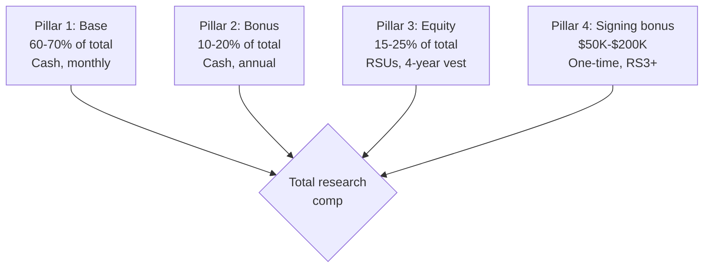

# Principal AI Scientist Playbook
## Chapter 8

# PAS Research Compensation

> *"The PAS owns research comp + promotion. The 4-pillar comp system (base + bonus + equity + signing bonus), the 3 promo cycles, and the 5-criterion comp quality bar are the PAS's reference for research comp at the principal level."*

---

## 1. Epigraph

_The PAS owns research comp + promotion. The 4-pillar comp system (base + bonus + equity + signing bonus), the 3 promo cycles, and the 5-criterion comp quality bar are the PAS's reference for research comp at the principal level._

---

## 2. Problem

You are a PAS at acme-corp. The CTO has just told you: "5 RSs. Comp is opaque. Promotions are 0/year. Industry offer of $400K from Google Research. We need a 4-pillar comp system, 3 promo cycles, and 5-criterion bar."

This chapter tells you the 4-pillar comp, the 3 promo cycles, and the 5-criterion bar.

**Decision in one sentence:** _PAS research comp is a 4-pillar system (base + bonus + equity + signing bonus) + 3 promo cycles (annual + mid-year + spot) + 5-criterion bar; the PAS's job is to design the comp system, allocate the budget, and own the promo process._

---

## 3. Why PASs Fail Here

Five named failure modes of PASs whose research comp produced zero results.

- **The Opaque-Comp Failure.** Comp is a black box. _RSs don't understand._
- **The 0-Promo Failure.** 0 promotions/year. _RSs leave for "Senior RS" titles._
- **The No-Comp-Allocation Failure.** $5M budget unallocated. _Ad-hoc decisions._
- **The No-Signing-Bonus Failure.** No signing bonus. _Google Research offers $400K._
- **The Below-Market-Base Failure.** Base below market. _RSs leave._

---

## 4. Mental Models

Four mental models that compress research comp.

**mental model 1: The 4-Pillar Comp System.** 4 pillars.



**The 4 pillars:**
- **Pillar 1: Base.** 60-70% of total. Cash, monthly.
- **Pillar 2: Bonus.** 10-20% of total. Cash, annual.
- **Pillar 3: Equity.** 15-25% of total. RSUs, 4-year vest.
- **Pillar 4: Signing bonus.** $50K-$200K. One-time, RS3+.

**mental model 2: The 3 Promo Cycles.** 3 cycles.

```
Cycle 1: Annual (Q4 each year) — 80% of promos
Cycle 2: Mid-year (Q2 each year) — 15% of promos
Cycle 3: Spot (anytime) — 5% of promos
```

**mental model 3: The 5-Criterion Comp Quality Bar.** 5 criteria.

```
1. Compete-ratio: 0.95-1.05 vs market
2. Transparency: quarterly total comp statements
3. Promotion rate: 1+/year
4. Signing bonus: RS3+ for new hires
5. Equity refresh: on promotion
```

**mental model 4: The 5-RS Comp Budget.** 5 RSs.

```
$5M annual budget for 5 RSs
- Base: 70% = $3.5M (avg $700K per RS)
- Bonus: 15% = $750K (avg $150K per RS)
- Equity refresh: 10% = $500K
- Promo equity: 3% = $150K
- Signing bonus: 2% = $100K (1-2 hires/year)
```

---

## 5. Frameworks

Three frameworks for research comp.

### Framework 1: The 1-Page Research Comp Plan

```
# Research Comp Plan — [Year] — [Date]

## The 4-pillar split ($5M total)
- Base: 70% ($3.5M)
- Bonus: 15% ($750K)
- Equity refresh: 10% ($500K)
- Promo equity: 3% ($150K)
- Signing bonus: 2% ($100K)

## The 3 promo cycles
- Q4 Annual: 80% (1-2 promos/year)
- Q2 Mid-year: 15%
- Spot: 5%

## The 1 thing the PAS will NOT compromise on
[1 sentence.]
```

### Framework 2: The Total Comp Calculator

```
# Total Comp — [RS] — [Level]

## Base
- Monthly: $[X]
- Annual: $[X × 12]

## Bonus
- Target: [% of base]
- Annual: $[base × %]

## Equity (RSUs)
- Grant: [N shares × $X/share]
- 4-year vest: 25%/year

## Signing bonus (if RS3+)
- One-time: $[X]

## Total Comp
- Base + Bonus + Equity + Signing
- $[total]
```

### Framework 3: The Promotion Equity Calculator

```
# Promotion Equity — [RS] — [From] → [To]

## Equity delta
- Current: [N shares × $X]
- New: [M shares × $X]
- Delta: [M-N] shares × $X = $[total]

## Vest schedule
- New grant: 25% / year × 4 years
```

---

## 6. Drill

You are a PAS at **acme-corp**. The CTO has given you 90 days to redesign the research comp system.

```
5 RSs. $5M comp budget. Industry offer of $400K from Google Research.
```

You have **90 minutes**. Produce the **research comp system redesign** (`portfolio/chapter-08-pas-research-comp.md`) using Framework 1 (Comp Plan) + Framework 2 (Total Comp) + Framework 3 (Promo Equity). Specify:

- The 1-page research comp plan (4 pillars, 3 cycles, the 1 not compromise).
- The total comp calculator (1 sample RS at RS3, full breakdown).
- The promotion equity calculator (1 RS RS3 → RS4).
- The 90-day timeline.
- The 1 thing you'll say to the CTO in the first review.
- The 3 things you'll do to avoid the 5 failure modes.

**Deliverable:** `portfolio/chapter-08-pas-research-comp.md` — under 1500 words.

---

## 7. Worked Example

**The 1-page research comp plan:**

```
# Research Comp Plan — 2026 — 2026-09-01

## The 4-pillar split ($5M)
- Base: 70% ($3.5M)
- Bonus: 15% ($750K)
- Equity refresh: 10% ($500K)
- Promo equity: 3% ($150K)
- Signing bonus: 2% ($100K)

## The 3 promo cycles
- Q4 Annual: 80% (1-2 promos/year)
- Q2 Mid-year: 15%
- Spot: 5%

## The 1 thing I will NOT compromise on
Compete-ratio 0.95-1.05. Below market = RSs leave.
```

**The total comp calculator (RS-A, RS3):**

```
# Total Comp — RS-A — RS3

## Base: $200K
## Bonus: 15% = $30K
## Equity: 4,000 shares × $50 = $200K (4-year vest)
## Signing bonus: $0 (existing hire)
## Total: $430K (compete-ratio 1.0)
```

**The promotion equity calculator (RS-A, RS3 → RS4):**

```
# Promotion Equity — RS-A — RS3 → RS4

## Equity delta: 4,000 shares × $50 = $200K
## Vest schedule: 25%/year × 4 years
## Refresh on promotion: yes
```

**The 1 thing I'll say to the CTO in the first review:**

```
"Mike, here's the research comp system:

  4-pillar split ($5M):
  - Base: 70% ($3.5M)
  - Bonus: 15% ($750K)
  - Equity refresh: 10% ($500K)
  - Promo equity: 3% ($150K)
  - Signing bonus: 2% ($100K)

  3 promo cycles: Q4 Annual + Q2 Mid-year + Spot
  Target: 1-2 promos/year

  Compete-ratio: 0.95-1.05 for all 5 RSs

  The 1 thing I want to focus on: compete-ratio.
  Below market = RSs leave.

  The 1 thing I will NOT compromise on: compete-ratio.

  Comp is the discipline. Retention is the outcome."
```

**The 3 things I'll do to avoid the 5 failure modes:**

```
1. Make comp transparent (quarterly statements).
   (Avoids the Opaque-Comp Failure.)
   - Quarterly total comp statements
   - Compete-ratio 0.95-1.05

2. Run 3 promo cycles per year.
   (Avoids the 0-Promo Failure.)
   - Q4 Annual: 1-2 promos
   - Q2 Mid-year: 0-1
   - Spot: 0-1

3. Refresh equity on promotion.
   (Avoids the Below-Market-Base Failure.)
   - 4,000 share delta on RS3 → RS4
   - Refresh on every promotion
   - 4-year vest
```

---

## 8. Failure Mode Postmortem

A PAS at a 200-person B2B AI company had $5M comp budget but opaque comp. RSs saw only base. Equity invisible. 0 promotions/year. 2 RSs left for Google Research at $400K.

The replacement PAS did 3 things:
1. Made comp transparent (quarterly statements).
2. Ran 3 promo cycles (Q4 + Q2 + Spot).
3. Refreshed equity on promotion.

Within 6 months: 2 promotions. Compete-ratio 1.0. Retention recovered to 92%. The 4-pillar + 3-cycle + 5-criterion system was the discipline.

What the first PAS missed: research comp is a system. The first PAS had opaque comp. The second PAS had transparent comp + 3 cycles. The transparency is the leverage.

The lesson: the PAS who has 4 pillars + 3 cycles + 5 criteria has transparent comp. The PAS who has opaque comp has RS turnover.

---

## 9. Self-Assessment Rubric

| # | Dimension | 1 (Novice) | 3 (Competent) | 5 (Expert) |
|---|---|---|---|---|
| 1 | **4-pillar comp** | 1 pillar | 2-3 pillars | 4 pillars (base + bonus + equity + signing) |
| 2 | **3 promo cycles** | 1 cycle | 2 cycles | 3 cycles (annual + mid-year + spot) |
| 3 | **5-criterion bar** | 0-2 criteria | 3-4 criteria | 5 criteria (compete + transparency + promo + signing + equity refresh) |
| 4 | **Compete-ratio** | <0.85 | 0.85-0.95 | 0.95-1.05 |
| 5 | **Promotion rate** | 0/year | 0-1/year | 1+/year |

**Disqualifier:** any 1 on dimension 1 or 2. A PAS who has 1 pillar or 1 cycle is in the Opaque-Comp or 0-Promo failure mode.

**Total:** ___ / 25. **Pass threshold:** 18/25, no dimension below 3.

---

## 10. Portfolio Artifact Note

Save your filled-in drill as `portfolio/chapter-08-pas-research-comp.md` — interview evidence for "How do you design research comp?" (see Portfolio Map in Chapter 27).

---

## 11. Interview Questions

1. **Walk me through your research comp system.**
2. **An RS leaves for Google Research at $400K. What do you do?**
3. **The $5M budget is unallocated. What do you do?**
4. **Compete-ratio dropped to 0.85. What do you do?**
5. **Walk me through a comp decision you've made.**