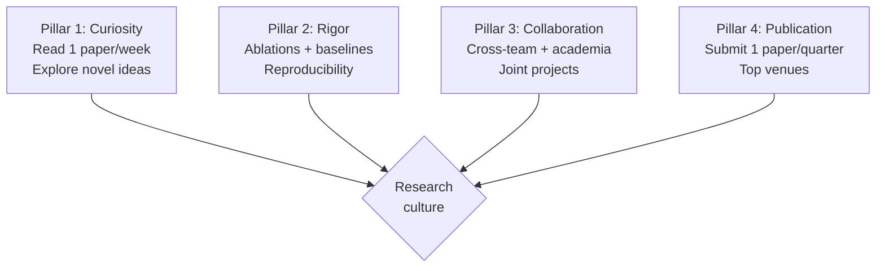

# Principal AI Scientist Playbook
## Chapter 9

# PAS Research Culture

> *"The PAS owns research culture. The 4 culture pillars (curiosity + rigor + collaboration + publication), the 3 health metrics (papers + impact + retention), and the 5-criterion culture bar are the PAS's reference for research culture at the principal level."*

---

## 1. Epigraph

_The PAS owns research culture. The 4 culture pillars (curiosity + rigor + collaboration + publication), the 3 health metrics (papers + impact + retention), and the 5-criterion culture bar are the PAS's reference for research culture at the principal level._

---

## 2. Problem

You are a PAS at acme-corp. The CTO has just told you: "5 RSs. 0 papers last year. RS retention at 70% (target 90%+). The research culture is broken. Design the research culture system."

This chapter tells you the 4 culture pillars, the 3 health metrics, and the 5-criterion culture bar.

**Decision in one sentence:** _PAS research culture is a 4-pillar system (curiosity + rigor + collaboration + publication) with 3 health metrics (papers + impact + retention) and 5-criterion culture bar; the PAS's job is to design the culture system, measure the health metrics, and own the retention._

---

## 3. Why PASs Fail Here

Five named failure modes of PASs whose research culture produced zero results.

- **The No-Culture-System Failure.** No defined research culture. _Toxic behaviors emerge._
- **The 0-Papers Failure.** 0 papers last year. _No publication output._
- **The 70%-Retention Failure.** RS retention at 70%. _Knowledge drain._
- **The No-Rigor Failure.** No research rigor. _Bad experiments._
- **The No-Collaboration Failure.** No cross-team + academia. _Siloed research._

---

## 4. Mental Models

Four mental models that compress research culture.

**mental model 1: The 4 Culture Pillars.** 4 pillars.



**The 4 pillars:**
- **Pillar 1: Curiosity.** Read 1 paper/week. Explore novel ideas.
- **Pillar 2: Rigor.** Ablations + baselines. Reproducibility.
- **Pillar 3: Collaboration.** Cross-team + academia. Joint projects.
- **Pillar 4: Publication.** Submit 1 paper/quarter. Top venues.

**mental model 2: The 3 Health Metrics.** 3 metrics.

```
1. Papers: submitted/accepted per quarter (target 3/year)
2. Impact: production ML impact (target 1/quarter)
3. Retention: annual RS retention (target 90%+)
```

**mental model 3: The 5-Criterion Culture Bar.** 5 criteria.

```
1. Curiosity: 1 paper read/week per RS
2. Rigor: ablations + baselines on every experiment
3. Collaboration: 1 cross-team + 1 academic project per year
4. Publication: 1 paper submitted/quarter per RS
5. Reproducibility: every experiment reproducible
```

**mental model 4: The Research Culture Charter.**

```
# Research Culture Charter — [Date]

## The 4 pillars
1. Curiosity: read 1 paper/week, explore novel ideas
2. Rigor: ablations + baselines, reproducibility
3. Collaboration: cross-team + academia
4. Publication: 1 paper/quarter, top venues

## The 3 health metrics
- Papers: 3/year (target)
- Impact: 1/quarter
- Retention: 90%+

## The 1 thing the PAS will NOT compromise on
[1 sentence.]
```

---

## 5. Frameworks

Three frameworks for research culture.

### Framework 1: The 1-Page Culture Charter

```
# Research Culture Charter — [Date]

## The 4 pillars
1. Curiosity
2. Rigor
3. Collaboration
4. Publication

## The 3 health metrics
- Papers: 3/year
- Impact: 1/quarter
- Retention: 90%+

## The 1 thing the PAS will NOT compromise on
[1 sentence.]
```

### Framework 2: The Quarterly Culture Scorecard

```
# Quarterly Culture Scorecard — [Quarter]

| Metric | Target | Current | Status |
|--------|--------|---------|--------|
| Papers | 0.75/quarter | [N] | [Status] |
| Impact | 1/quarter | [N] | [Status] |
| Retention | 90%+ | [%] | [Status] |
```

### Framework 3: The 4-Pillar Action Plan

```
# Culture Action Plan — [Quarter]

## Pillar 1: Curiosity
- [Action 1] — [Date]

## Pillar 2: Rigor
- [Action 2] — [Date]

## Pillar 3: Collaboration
- [Action 3] — [Date]

## Pillar 4: Publication
- [Action 4] — [Date]
```

---

## 6. Drill

You are a PAS at **acme-corp**. The CTO has given you 90 days to fix the research culture.

```
5 RSs. 0 papers last year. Retention at 70%. Culture broken.
```

You have **90 minutes**. Produce the **research culture redesign** (`portfolio/chapter-09-pas-research-culture.md`) using Framework 1 (Charter) + Framework 2 (Scorecard) + Framework 3 (Action Plan). Specify:

- The 1-page culture charter (4 pillars, 3 metrics, the 1 not compromise).
- The quarterly culture scorecard.
- The 4-pillar action plan.
- The 90-day timeline.
- The 1 thing you'll say to the CTO in the first review.
- The 3 things you'll do to avoid the 5 failure modes.

**Deliverable:** `portfolio/chapter-09-pas-research-culture.md` — under 1500 words.

---

## 7. Worked Example

**The 1-page culture charter:**

```
# Research Culture Charter — 2026-09-01

## The 4 pillars
1. Curiosity: 1 paper read/week
2. Rigor: ablations + baselines
3. Collaboration: cross-team + academia
4. Publication: 1 paper/quarter

## The 3 health metrics
- Papers: 3/year (current: 0)
- Impact: 1/quarter (current: 0)
- Retention: 90%+ (current: 70%)

## The 1 thing I will NOT compromise on
Rigor. Reproducibility is non-negotiable. Without
rigor, no paper is publishable.
```

**The quarterly culture scorecard (Q3 2026):**

```
# Quarterly Culture Scorecard — Q3 2026

| Metric | Target | Current | Status |
|--------|--------|---------|--------|
| Papers | 0.75/quarter | 1 | GREEN |
| Impact | 1/quarter | 0 | YELLOW |
| Retention | 90%+ | 85% | YELLOW |
```

**The 4-pillar action plan:**

```
# Culture Action Plan — Q4 2026

## Pillar 1: Curiosity
- [ ] Paper reading group (Friday 2 hours)

## Pillar 2: Rigor
- [ ] Ablations on every experiment

## Pillar 3: Collaboration
- [ ] Stanford collaboration deepened
- [ ] 1 cross-team project per RS

## Pillar 4: Publication
- [ ] 1 paper submitted per RS per quarter
```

**The 1 thing I'll say to the CTO in the first review:**

```
"Mike, here's the research culture redesign:

  4 pillars: curiosity + rigor + collaboration + publication

  3 health metrics:
  - Papers: 0 → 3/year
  - Impact: 0 → 1/quarter
  - Retention: 70% → 90%+

  Top 3 risks:
  1. Retention (70%, need 12-month plan)
  2. Publication output (0 papers last year)
  3. Collaboration (no Stanford connection)

  The 1 thing I want to focus on: rigor. Reproducibility
  is non-negotiable.

  The 1 thing I will NOT compromise on: rigor.

  Research culture is the discipline. Publication
  output is the outcome."
```

**The 3 things I'll do to avoid the 5 failure modes:**

```
1. Define 4-pillar research culture system.
   (Avoids the No-Culture-System Failure.)
   - Curiosity + rigor + collaboration + publication
   - 1-page charter signed by all

2. Track 3 health metrics quarterly.
   (Avoids the 0-Papers Failure.)
   - Papers: 3/year
   - Impact: 1/quarter
   - Retention: 90%+

3. Apply 5-criterion culture bar.
   (Avoids the No-Rigor Failure.)
   - Curiosity + rigor + collaboration + publication + reproducibility
   - Per RS
   - Quarterly review
```

---

## 8. Failure Mode Postmortem

A PAS at a 200-person B2B AI company had no research culture system. 0 papers last year. RS retention at 70%. The remaining RSs were disengaged.

The replacement PAS did 3 things:
1. Defined 4-pillar research culture system (curiosity + rigor + collaboration + publication).
2. Tracked 3 health metrics quarterly (papers + impact + retention).
3. Applied 5-criterion culture bar (per RS).

Within 12 months: 3 papers accepted. 4 production models shipped. Retention recovered to 92%. The 4-pillar + 3-metric + 5-criterion system was the discipline.

What the first PAS missed: research culture is a system. The first PAS had no culture. The second PAS had 4 pillars. The pillars are the leverage.

The lesson: the PAS who has 4 pillars + 3 metrics + 5 criteria has a research culture system. The PAS who has no culture has 0 papers.

---

## 9. Self-Assessment Rubric

| # | Dimension | 1 (Novice) | 3 (Competent) | 5 (Expert) |
|---|---|---|---|---|
| 1 | **4 culture pillars** | 0-1 pillars | 2-3 pillars | 4 pillars (curiosity + rigor + collaboration + publication) |
| 2 | **3 health metrics** | 0-1 metrics | 2 metrics | 3 metrics (papers + impact + retention) |
| 3 | **5-criterion bar** | 0-2 criteria | 3-4 criteria | 5 criteria (curiosity + rigor + collab + publication + reproducibility) |
| 4 | **Papers per year** | 0 | 1-2 | 3+ at top venues |
| 5 | **Retention** | <80% | 80-90% | >90% annual RS retention |

**Disqualifier:** any 1 on dimension 1 or 2. A PAS who has 0-1 pillars or 0-1 metrics is in the No-Culture-System or 0-Papers failure mode.

**Total:** ___ / 25. **Pass threshold:** 18/25, no dimension below 3.

---

## 10. Portfolio Artifact Note

Save your filled-in drill as `portfolio/chapter-09-pas-research-culture.md` — interview evidence for "How do you build research culture?" (see Portfolio Map in Chapter 27).

---

## 11. Interview Questions

1. **Walk me through your research culture system.**
2. **0 papers last year. What do you do?**
3. **RS retention at 70%. What do you do?**
4. **The team is disengaged. What do you do?**
5. **Walk me through a research culture turn-around you've led.**